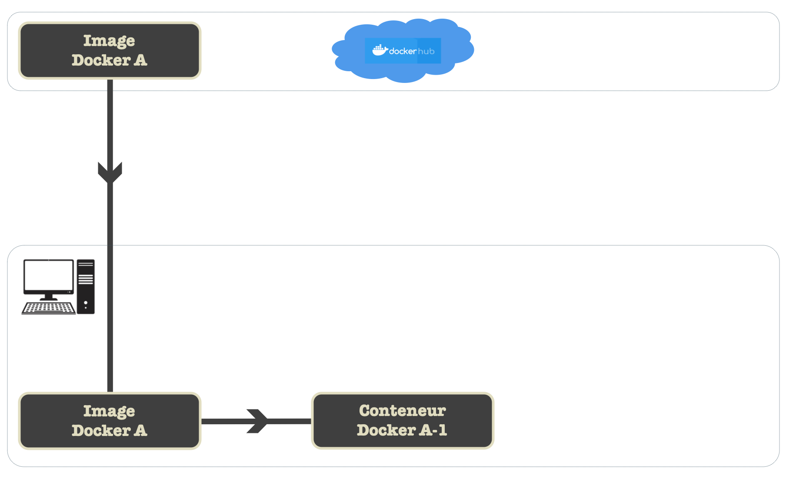
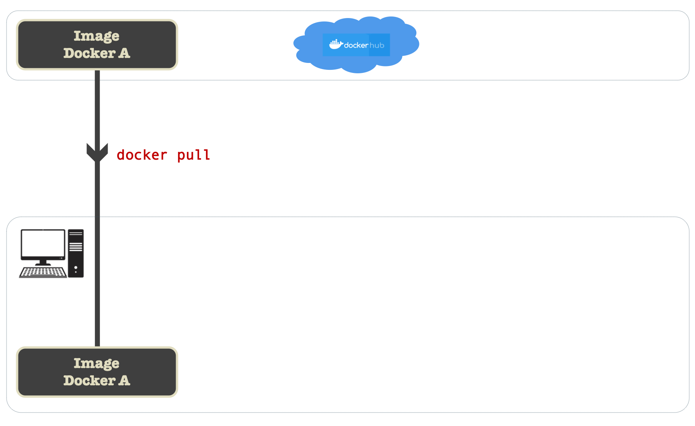
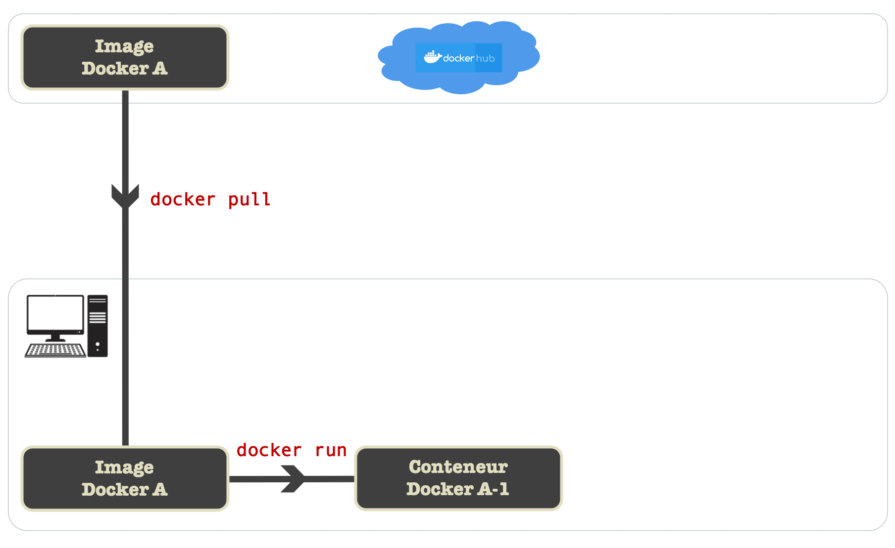
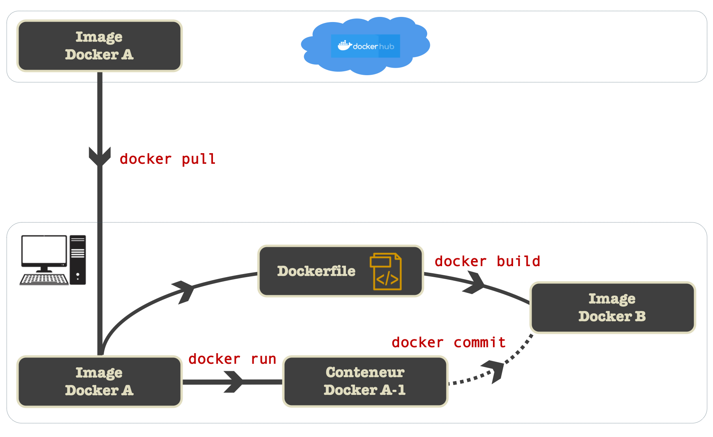
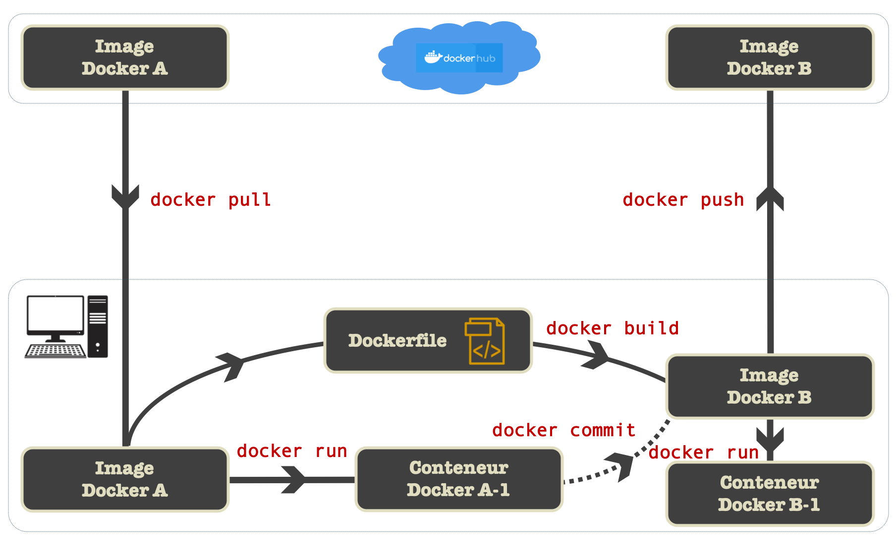
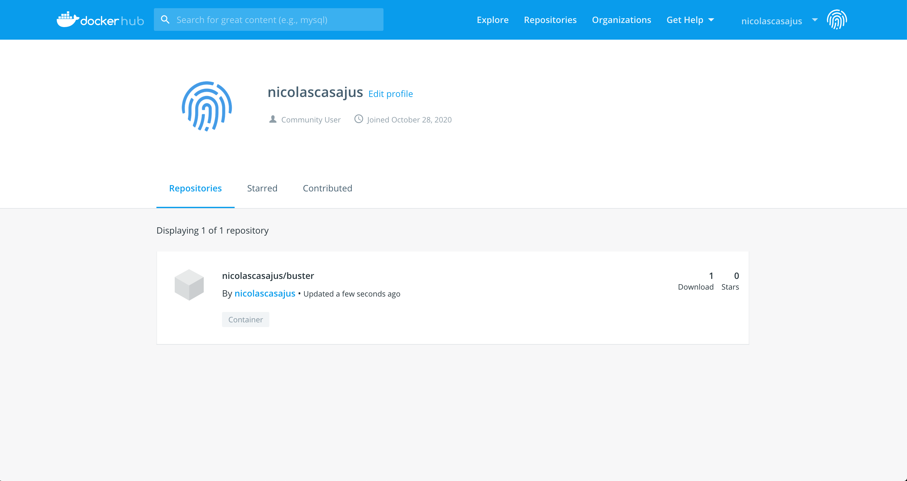
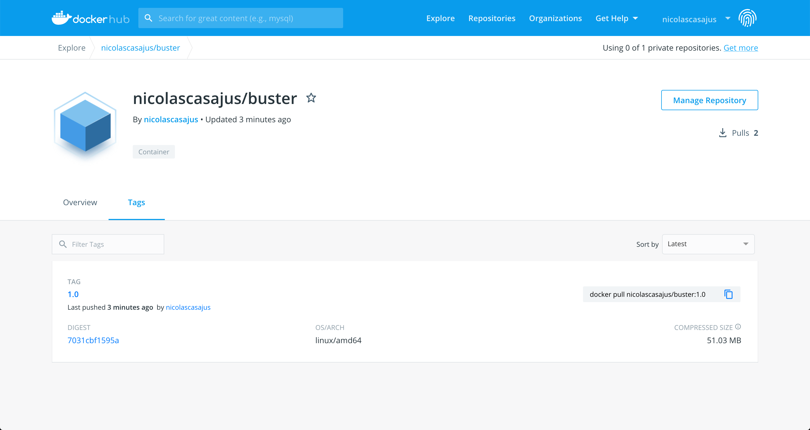
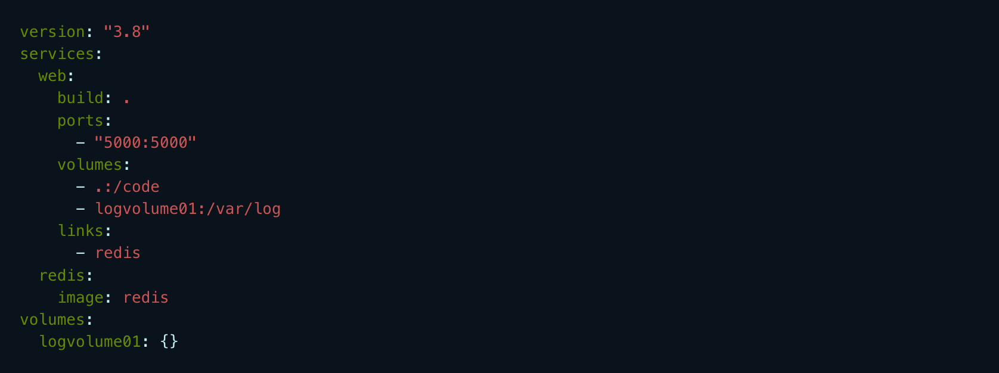

class: inverse, center, middle

## C'est parti !

<br />


---

## Il était une fois...

--

**... un étudiant qui a passé plusieurs mois à analyser ses données. Comme il a tout
compris à la vie, il travaille sous GNU/Linux. Son code est complexe et repose sur
de nombreux logiciels et librairies système. Arrive le temps de partager son code avec
ses collaborateurs. Mais, un de ses collaborateurs le contacte en lui disant que son code
ne fonctionne pas. Ce dernier est sous Windows (_no comment_). Après plusieurs
tentatives, il apparait que cela n'a rien à voir avec le code : c'est un problème
d'environnement de travail.**

--

Que faire `r icon::fa("question-circle", color = "#3f3f3f")`


.center[]

---

## Option 1


`r icon::fa("hand-point-right", color = "#3f3f3f")` &nbsp;Ecrire des tutoriels pour
chaque OS (et version d'OS) pour installer toutes les dépendances système requises
pour que le code fonctionne à peu près n'importe où

--

  > **Mouais, bof...**
  >
  > J'ai autre chose à faire. En plus, j'ai pas accès à tous les OS...
  >
  > Et quid des futurs OS ?

---

## Option 2 - Virtualisation

`r icon::fa("hand-point-right", color = "#3f3f3f")` &nbsp;Fixer le type d'OS (et
sa version) et utiliser une machine virtuelle dans lequel il s'exécutera

.center[]

--

C'est une solution qui marche et qui est encore utilisée.

--

Le collaborateur devra alors :

1. Installer un logiciel de virtualisation (par ex. Oracle Virtual Box)
2. Télécharger l'ISO de l'OS (par ex. Ubuntu Focal Fossa 20.04 LTS)
3. Installer l'OS dans la machine virtuelle
4. Configurer la machine virtuelle (création de volumes de persistence)
5. Télécharger et configurer toutes les dépendances
6. Lancer le projet dans l'OS virtualisé

--

**N.B.** Certaines étapes peuvent être automatisées (par ex. avec [**Vagrant**](https://www.vagrantup.com/))

---

## Option 2 - Virtualisation

`r icon::fa("hand-point-right", color = "#3f3f3f")` &nbsp;Problèmes :
1. c'est compliqué à mettre en place,
1. c'est lourd (plusieurs Go juste pour l'OS et les dépendances),
1. c'est gourmand en ressources (RAM, CPU).


---

## Option 3 - Conteneurisation

`r icon::fa("hand-point-right", color = "#3f3f3f")` &nbsp;**Solution :** s'orienter vers des solutions de **conteneurisation** telles que [**Docker**](https://www.docker.com/)&nbsp;
`r icon::fa("docker")`&nbsp;
`r icon::fa("docker")`&nbsp;
`r icon::fa("docker")`&nbsp;

<br /><br />


---

## Virtualisation


---

## Virtualisation _vs._ Conteneurisation


--

`r icon::fa("hand-point-right", color = "#3f3f3f")` &nbsp;**Avantages de la conteneurisation :**

- Extrêmement léger (exploitation du noyau Linux)
- Utilisation réduite de ressources (RAM, CPU)
- Partage des ressources ente les instances
- Déploiement simple et instantané


---

## Docker en bref

.center[]

`r icon::fa("hand-point-right", color = "#3f3f3f")` &nbsp;Plateforme open source permettant de :

- empaqueter une application avec toutes ses dépendances système
- partager facilement un environnement de travail complet
- déployer rapidement une application en production

--

`r icon::fa("hand-point-right", color = "#3f3f3f")` &nbsp;Un conteneur est _isolé_ du système hôte : Docker permet donc de :

- tester des choses sans crainte d'endommager son système hôte
- garder son système hôte propre, en installant tout sur Docker
- utiliser différentes versions d'une librairie, d'un serveur, etc.

--

`r icon::fa("exclamation-triangle", color = "#3f3f3f")` &nbsp;Idéal pour créer un environnement
de developpement (basé sur Linux)

---

## La notion d'Image

`r icon::fa("hand-point-right", color = "#3f3f3f")` &nbsp;Ca a l'air super, mais concrètement, comment je crée un conteneur `r icon::fa("question-circle", color = "#3f3f3f")`

--


Tout conteneur est basé sur une image que l'on crée soi-même ou qu'on récupère depuis un site d'archivage (comme le CRAN pour `r icon::fa("r-project")`)

--

<br />

`r icon::fa("hand-point-right", color = "#3f3f3f")` &nbsp;Une **image `r icon::fa("docker")`** est une sorte de conteneur figé : c'est un template **fixe** (une recette de cuisine) à partir duquel on créera un
ou des conteneurs. Une image est `immuable`.

--

`r icon::fa("hand-point-right", color = "#3f3f3f")` &nbsp;Un **conteneur `r icon::fa("docker")`** est donc une instance (exécution) d'une image qui pourra être utilisée/modifiée une fois créée


---

## La notion d'Image

_Prenons un exemple tiré par les cheveux._

--

_Quand je lance RStudio (équivalent à une image `r icon::fa("docker")` dans notre exemple),
j'ouvre une instance RStudio (équivalent, dans notre exemple, à un conteneur).
Si je clique une seconde fois sur l'exécutable de RStudio, j'ouvre une seconde
instance (un second conteneur) indépendante de la première._

_Tout ce que je fais dans la première instance n'est pas répercuté dans la seconde. Et vice versa._

_Plus important encore, ces modifications ne se répercutent pas dans l'exécutable de RStudio._

C'est la même logique avec les images et conteneurs `r icon::fa("docker")`.


---

## Docker Hub

`r icon::fa("hand-point-right", color = "#3f3f3f")` &nbsp;Où trouver des images `r icon::fa("docker")` ?
Sur un site d'archivage officiel [**Docker Hub**](https://hub.docker.com).
C'est une sorte de CRAN (publique) pour `r icon::fa("docker")`.


---

class: inverse, center, middle

## Installation de Docker

---

## Installation

`r icon::fa("hand-point-right", color = "#3f3f3f")` &nbsp;Docker s'installe sur GNU/Linux, et depuis peu, sur macOS et Windows 10 (installation différente selon l'édition, e.g. Home vs. Pro). Rendez-vous sur cette [**page **](https://docs.docker.com/get-docker/) et suivez les instructions.

--

<br />

`r icon::fa("hand-point-right", color = "#3f3f3f")` &nbsp;Une autre façon d'accéder
à Docker sans l'installer en local est d'utiliser la plateforme [**Play with Docker**](https://labs.play-with-docker.com/)
(identifiant Docker requis)

.pull-left[]

.pull-right[
C'est une plateforme qui donne accès à un serveur Alpine Linux sur lequel Docker et
d'autres utilitaires (git, serveur ssh) sont préinstallés.
La session dure 4h et on peut démarrer plusieurs instances.

`r icon::fa("hand-point-right", color = "#3f3f3f")` &nbsp;Durant l'exercice, on verra
comment récupérer les données depuis ce serveur (ssh _vs._ git).
]

---

## Play with Docker - Navigateur


---

## Play with Docker - Accès SSH


---

class: inverse, center, middle

## Création d'un conteneur

---

## Création d'un conteneur


---

## Création d'un conteneur


---

## Mon premier conteneur

**Je ne connais pas du tout GNU/Linux, mais j'aimerais bien l'essayer !**

--

`r icon::fa("hand-point-right", color = "#3f3f3f")` &nbsp;Qu'à cela ne tienne : nous allons télécharger une image `r icon::fa("docker")` de Debian.
Allons faire un tour sur [**Docker Hub**](https://hub.docker.com/search?q=debian&type=image).


---

## Mon premier conteneur

`r icon::fa("hand-point-right", color = "#3f3f3f")` &nbsp;On peut également chercher une image `r icon::fa("docker")`
depuis le terminal

```sh
docker search debian
```

```
NAME      DESCRIPTION                                       STARS   OFFICIAL
ubuntu    Ubuntu is a Debian-based Linux operating sys...   11465   [OK]
debian    Debian is a Linux distribution that's compos...   3635    [OK]
...       ...                                               ...
```

--

`r icon::fa("hand-point-right", color = "#3f3f3f")` &nbsp;Pour télécharger l'image `r icon::fa("docker")`, on peut lancer la commande suivante :

```sh
docker pull debian
```

`r icon::fa("exclamation-triangle", color = "#3f3f3f")` &nbsp;Cependant, en procédant ainsi nous téléchargerons la dernière version de Debian.
Afin d'être reproductible, nous fixerons une version particulière (appelée **tag** sous `r icon::fa("docker")`).

--

`r icon::fa("hand-point-right", color = "#3f3f3f")` &nbsp;
Téléchargeons l'image `r icon::fa("docker")` de Debian 10 (appelée Buster).

```sh
docker pull debian:buster                            # ou, docker pull debian:10
```

---

## Mon premier conteneur

`r icon::fa("hand-point-right", color = "#3f3f3f")` &nbsp;Listons les images `r icon::fa("docker")` présentes en local :


```sh
docker images                                        # ou, docker image ls
```

```
REPOSITORY      TAG         IMAGE ID          CREATED           SIZE
debian          buster      1510e8501783      2 weeks ago       114MB
```

--

<br />

**Deux choses importantes sont à noter :**

1. Chaque image `r icon::fa("docker")` dispose d'un identifiant unique (**IMAGE ID**)
2. La taille de l'image `r icon::fa("docker")` **!!!**

--

<br />

`r icon::fa("hand-point-right", color = "#3f3f3f")` &nbsp;Pour supprimer une image :

```sh
docker rmi 1510e8501783
```

---

## Mon premier conteneur

`r icon::fa("hand-point-right", color = "#3f3f3f")` &nbsp;Créons notre conteneur, c'est-à-dire une
instance de notre image `r icon::fa("docker")`.

```sh
docker run -it debian:buster                  # ou, docker run -it 1510e8501783
```

--

<br />

Notre prompt vient de changer :

```
root@ea8d63136eef:/#
```

--

<br />

Nous sommes dans notre conteneur `r icon::fa("docker")` !
Le prompt nous dit que nous sommes connectés en tant qu'utilisateur `root` sur
le conteneur dont l'identifiant est `ea8d63136eef` (différent de l'ID de l'image !)

--

Vous ne me croyez pas ?


```sh
cat /etc/issue
```

```
Debian GNU/Linux 10
```

---

## Mon premier conteneur

Revenons sur la commande `docker run -it debian:buster`

--

1. L'instruction `docker run` exécute une instance de l'image `r icon::fa("docker")` **debian** portant le tag **buster**.
Il faut noter que si cette image est absente de notre machine, alors `r icon::fa("docker")` essaiera de la
télécharger depuis Docker Hub. Donc, cette commande fait également un `docker pull` si besoin est.

--

1. Le double drapeau `-it` indique que l'on souhaite interagir avec le conteneur.
En général, les images `r icon::fa("docker")` ne contenant qu'un OS (pas d'application)
retournent toujours un shell (invite de commandes), mais pour y accéder, il faut demander
l'accès (avec le drapeau `-it`).

--

<br />

Pour être certain d'interagir avec le shell, nous aurions pu indiquer la commande devant
être exécutée au lancement du conteneur (ici, `bash`, le shell par défaut sous Debian)

```sh
docker run -it debian:buster bash
```

---

## Mon premier conteneur

`r icon::fa("hand-point-right", color = "#3f3f3f")` &nbsp;Si jamais nous avions oublié le drapeau
`-it`, ce n'est pas grave. Nous avons toujours la possibilité de rentrer dans le conteneur avec :


```sh
docker exec –it ea8d63136eef bash
```

`r icon::fa("exclamation-triangle", color = "#3f3f3f")` &nbsp;Lorsqu'on quitte le conteneur avec la commande
`exit`, celui-ci est stoppé si on est rentré dans le conteneur avec la commande `docker run`.
Mais il n'est pas stoppé si on a accédé au shell avec `docker exec bash`.

--

<br />

Par défaut, Docker donne un nom aléatoire à un nouveau conteneur (notre conteneur
a été nommé `magical_lehmann`). Mais, on peut lui en attribuer un de notre choix
avec le drapeau `--name` :

```sh
docker run -it --name "debbie" debian:buster
```

---

class: inverse, center, middle

## Gestion des conteneurs


---

## Gestion des conteneurs

`r icon::fa("hand-point-right", color = "#3f3f3f")` &nbsp;Pour lister les conteneurs (processus) actifs :

```sh
docker ps
```

```
CONTAINER ID   IMAGE           COMMAND   CREATED     STATUS     PORTS   NAMES
ea8d63136eef   debian:buster   "bash"    2 min ago   Up 2 min           magical_lehmann
```

--

`r icon::fa("hand-point-right", color = "#3f3f3f")` &nbsp;Pour arrêter un conteneur :

```sh
docker stop ea8d63136eef                    # ou, docker stop magical_lehmann
```

`r icon::fa("hand-point-right", color = "#3f3f3f")` &nbsp;Pour démarrer un conteneur :

```sh
docker start ea8d63136eef                   # ou, docker start magical_lehmann
```

--

`r icon::fa("hand-point-right", color = "#3f3f3f")` &nbsp;Pour supprimer un conteneur :

```sh
docker rm ea8d63136eef                      # après un docker stop
docker rm -f ea8d63136eef                   # si le conteneur est actif
```


---

## Gestion des conteneurs

`r icon::fa("hand-point-right", color = "#3f3f3f")` &nbsp;Pour lister les conteneurs (processus) actifs et arrêtés :

```sh
docker ps -a
```

```
CONTAINER ID   IMAGE           COMMAND   CREATED     STATUS             NAMES
ea8d63136eef   debian:buster   "bash"    2 min ago   Up 2 min           magical_lehmann
178b8649b677   debian:buster   "bash"    9 hours ago Exited (0) 2s ago  debbie
```
--


`r icon::fa("hand-point-right", color = "#3f3f3f")` &nbsp;Enfin, pour connaitre les ressources consommées par les conteneurs
actifs :

```sh
docker stats
```

```
CONTAINER ID   NAME              CPU %  MEM USAGE / LIMIT   MEM %
ea8d63136eef   magical_lehmann   0.00%  788KiB / 1.944GiB   0.04%
```

--

<br />

`r icon::fa("exclamation-triangle", color = "#3f3f3f")` &nbsp;Après un reboot de la machine, les conteneurs
actifs et stoppés existent toujours. Mais, ceux qui ont été supprimés avec `docker rm`, eux, n'existent plus.


---

class: inverse, center, middle

## Persistance


---

## Persistance des conteneurs

`r icon::fa("hand-point-right", color = "#3f3f3f")` &nbsp;Mais si un conteneur est isolé,
comment je récupère mes données qui sont à l'intérieur ? Et, comment je donne accès aux
données stockées sur ma machine à mon conteneur ?

--
<br />

En effet, un conteneur n'est pas persistant : tout ce qui est ajouté à l'intérieur (fichiers, logiciels, etc.)
n'est pas accessible depuis l'extérieur. Et lorsque celui-ci est détruit,
tout est perdu ! Ce qui est un avantage pour bidouiller le contenu, mais un inconvénient
lorsqu'on veut travailler sérieusement.


--
<br />

`r icon::fa("hand-point-right", color = "#3f3f3f")` &nbsp;Pour les données, on créera des **volumes**

`r icon::fa("hand-point-right", color = "#3f3f3f")` &nbsp;Pour les logiciels, on créera une nouvelle **image** `r icon::fa("docker")`

---

## Volumes de persistance

`r icon::fa("hand-point-right", color = "#3f3f3f")` &nbsp;
Un volume<sup>*****</sup> est un dossier. L'idée est de créer un pont entre un dossier du conteneur et un dossier
de notre machine. On parle de **volumes mapping**

.footnote[
***** Ce n'est pas tout à fait vrai, et un volume peut avoir un autre sens avec Docker, mais faisons simple...
]
--

Ainsi, un fichier/dossier créé dans le volume de la machine sera accessible par le conteneur via
le volume lié. Et vice-versa.

Le volume local (celui sur la machine) sera persistant même après
la suppression du conteneur (et de son volume persistant).

--

`r icon::fa("hand-point-right", color = "#3f3f3f")` &nbsp;
C'est cela qu'on appelle la **persistance**


---

## Volumes de persistance

Soit le dossier `projet/`
présent dans mon dossier personnel (noté `~` sous Unix) de ma machine (macOS). Celui-ci contient le dossier
`data/`, un fichier `.csv` à l'intérieur et le fichier `README.md` :

```
projet
├── README.md
└── data
    └── data-1.csv
```

--

Je souhaite mapper ce volume à un dossier de mon **nouveau** conteneur, par ex.
le dossier personnel de l'utilisateur **root** : `/root/`

--


`r icon::fa("hand-point-right", color = "#3f3f3f")` &nbsp;
Pour cela, lorsque je créerai un nouveau conteneur basé sur l'image `debian:buster` avec
la commande `docker run`, je rajouterai le drapeau `--volume` (ou `-v`) de la manière suivante :

```sh
-v chemin_absolu_vers_dossier_local:chemin_absolu_vers_dossier_conteneur
```

--

`r icon::fa("exclamation-triangle", color = "#3f3f3f")` &nbsp;
Les volumes mentionnés doivent exister tant sur la machine locale et dans le conteneur
et il faut mentionner le chemin absolu vers ces dossiers.

---

## Volumes de persistance

`r icon::fa("hand-point-right", color = "#3f3f3f")` &nbsp;
Ce qui nous donne :

```sh
docker run -it --name "debbie" -v ~/projet:/root debian:buster
```

--
<br />
Maintenant, si j'affiche le contenu du dossier `/root/` de mon conteneur

```sh
ls /root
```

```
README.md  data
```

```sh
ls /root/data/
```

```
data-1.csv
```

--
<br />
Créons un second fichier `README-2.md` dans mon conteneur

```sh
echo "Cree dans le conteneur" > /root/README-2.md
```

---

## Volumes de persistance

Vérifions qu'il a bien été créé depuis le conteneur :

```sh
ls /root
```

```
README-2.md  README.md	data
```

Affichons son contenu

```sh
cat /root/README-2.md
```
```
Cree dans le conteneur
```

--

<br />

`r icon::fa("hand-point-right", color = "#3f3f3f")` &nbsp;
Qu'en est-il sur ma machine ?

```sh
tree ~/projet
```

```
projet
├── README-2.md
├── README.md
└── data
    └── data-1.csv
```


---

## Volumes de persistance

`r icon::fa("hand-point-right", color = "#3f3f3f")` &nbsp;
Et si je supprime le conteneur, que deviendra mon dossier sur ma machine ?

--

```sh
docker stop debbie
docker rm debbie
```

--

```sh
tree ~/projet
```

```
projet
├── README-2.md
├── README.md
└── data
    └── data-1.csv
```

--

<br />
`r icon::fa("hand-point-right", color = "#3f3f3f")` &nbsp;
Les données ont été persistées **!!!**


---

class: inverse, center, middle

## Création d'une image

---

## Ajout d'outils

`r icon::fa("hand-point-right", color = "#3f3f3f")` &nbsp;
Que se passe-t-il si mon conteneur ne contient pas tous les outils (librairies, logiciels, etc.) dont j'ai besoin ?

--

<br />

`r icon::fa("hand-point-right", color = "#3f3f3f")` &nbsp;**Option 1** : la méthode **sale**

L'idée est de rentrer dans un conteneur, d'installer les outils manquants (`apt-get install`) et
d'enregistrer le nouvel état du conteneur vers une nouvelle image (avec `docker commit`). A titre
informatif (uniquement) :

```sh
docker commit id_image nom_nouvelle_image
```

--

C'est **très très sale** : les outils sont installés à la volée (depuis le conteneur) et
on ne garde aucune trace des changements apportés. Niveau sécurité, c'est pas top... Et en plus,
on n'est pas à l'abri de faire des mauvaises manip' et de compromettre la future image `r icon::fa("docker")`

--

<br />

`r icon::fa("hand-point-right", color = "#3f3f3f")` &nbsp;**Option 2** : le `Dockerfile`

---

## Création d'image - Dockerfile

`r icon::fa("hand-point-right", color = "#3f3f3f")` &nbsp;Le `Dockerfile` est la recette qui va
créer une nouvelle image `r icon::fa("docker")`

C'est un simple fichier texte (**sans extension**) qui fournit une suite d'instructions amenant
à la construction de la future image. Chaque instruction va créer une couche dans l'image (système de Lego) : plus
il y aura de couches, plus l'image sera lourde.

--

<br />

De plus, il est rare de construire une image _from scratch_ : on se base très souvent
sur une (seule) image existante.

--

`r icon::fa("hand-point-right", color = "#3f3f3f")` &nbsp;Ainsi, le processus de création
d'une image est **incrémental** et peut être comparé à un `git pull`

Lors de la construction de l'image, si l'image de référence est présente sur la machine,
pas besoin de la télécharger (à l'instar, lors d'un `git pull`, on ne télécharge pas
l'ensemble de l'historique, juste les dernières modifications).


---

## Création d'image - Dockerfile

`r icon::fa("hand-point-right", color = "#3f3f3f")` &nbsp;**Objectif** : nous allons
améliorer l'image `debian:buster` en lui ajoutant quelques utilitaires manquants :

- `htop` : outil de monitoring du système
- `nano` : éditeur de texte simple en ligne de commandes
- `tree` : outil d'arborescence
- `wget` : programme de téléchargement de fichiers

--

Sur notre machine locale, nous allons créer un dossier, par ex. `mydebbie/`
dans lequel nous allons créer un fichier qu'on va nommer `Dockerfile` et
dans lequel nous écrire ces lignes.

--

```docker
FROM debian:buster

MAINTAINER Nicolas Casajus <nicolas.casajus@fondationbiodiversite.fr>
```

--

- La clause `FROM` permet de définir l'image de base (et sa version) sur laquelle on va bâtir
la nouvelle image.

- La clause `MAINTAINER` indique le créateur de l'image ainsi que le moyen de
le contacter.

---

## Création d'image - Dockerfile

`r icon::fa("hand-point-right", color = "#3f3f3f")` &nbsp;Tel quel, ce `Dockerfile`
construira une image identique à l'image `debian:buster`

--

Rajoutons les instructions qui permettront d'installer les utilitaires requis

```docker
FROM debian:buster

MAINTAINER Nicolas Casajus <nicolas.casajus@fondationbiodiversite.fr>

RUN apt-get update -yq
RUN apt-get install -yq --no-install-recommends htop nano tree wget
```
--

- La clause `RUN` permet de passer des commandes Linux classiques. Elle ajoute
une couche supplémentaire à notre image, ce qui l'alourdi. Il est donc
recommendé de limiter ces clauses et de les fusionner.

--

```docker
FROM debian:buster

MAINTAINER Nicolas Casajus <nicolas.casajus@fondationbiodiversite.fr>

RUN apt-get update -yq \
  && apt-get install -yq --no-install-recommends htop nano tree wget
```


---

## Création d'image - Dockerfile

`r icon::fa("hand-point-right", color = "#3f3f3f")` &nbsp;
On peut réduire encore la taille de la future image en supprimant le cache du gestionnaire
`apt` qui contient les archives des utilitaires téléchargés.

```docker
FROM debian:buster

MAINTAINER Nicolas Casajus <nicolas.casajus@fondationbiodiversite.fr>

RUN apt-get update -yq \
  && apt-get install -yq --no-install-recommends htop nano tree wget \
  && apt-get clean \
  && rm -rf /var/lib/apt/lists/
```

---

## Création d'image - Dockerfile

`r icon::fa("hand-point-right", color = "#3f3f3f")` &nbsp;
Nous pouvons aussi créer un répertoire avec la commande Unix `mkdir`

```docker
FROM debian:buster

MAINTAINER Nicolas Casajus <nicolas.casajus@fondationbiodiversite.fr>

RUN apt-get update -yq \
  && apt-get install -yq --no-install-recommends htop nano tree wget \
  && apt-get clean \
  && rm -rf /var/lib/apt/lists/ \
  && mkdir -p /root/data
```
---

## Création d'image - Dockerfile

`r icon::fa("hand-point-right", color = "#3f3f3f")` &nbsp;
Améliorons encore notre recette en définissant le répertoire par défaut
du conteneur, par ex. `/root/data` (celui dans lequel on se retrouvera lorsqu'on rentrera dans le
conteneur) avec la clause `WORKDIR`

```docker
FROM debian:buster

MAINTAINER Nicolas Casajus <nicolas.casajus@fondationbiodiversite.fr>

RUN apt-get update -yq \
  && apt-get install -yq --no-install-recommends htop nano tree wget \
  && apt-get clean \
  && rm -rf /var/lib/apt/lists/ \
  && mkdir -p /root/data

WORKDIR /root/data
```
---

## Création d'image - Dockerfile

`r icon::fa("hand-point-right", color = "#3f3f3f")` &nbsp;
J'ai du écrire deux fois `/root/data` : en programmation, c'est jamais bon...
Heureusement, Docker offre la possibilité de manipuler des variables
d'environnement avec la clause `ENV`. Optimisons donc le code.

```docker
FROM debian:buster

MAINTAINER Nicolas Casajus <nicolas.casajus@fondationbiodiversite.fr>

ENV FOLDER="/root/data"

RUN apt-get update -yq \
  && apt-get install -yq --no-install-recommends htop nano tree wget \
  && apt-get clean \
  && rm -rf /var/lib/apt/lists/ \
  && mkdir -p "$FOLDER"

WORKDIR "$FOLDER"
```
---

## Création d'image - Dockerfile

`r icon::fa("hand-point-right", color = "#3f3f3f")` &nbsp;
Je voudrais copier un fichier que j'ai en local (et dans le même dossier dans l'exemple) dans l'image,
afin qu'il soit présent dans mes futurs conteneurs. Pour cela, j'ai la clause
`COPY`

```docker
FROM debian:buster

MAINTAINER Nicolas Casajus <nicolas.casajus@fondationbiodiversite.fr>

ENV FOLDER="/root/data"

RUN apt-get update -yq \
  && apt-get install -yq --no-install-recommends htop nano tree wget \
  && apt-get clean \
  && rm -rf /var/lib/apt/lists/ \
  && mkdir -p "$FOLDER"

COPY README.md "$FOLDER"

WORKDIR "$FOLDER"
```

---

## Création d'image - Dockerfile

`r icon::fa("hand-point-right", color = "#3f3f3f")` &nbsp;
Finalement, je peux aussi définir une commande par défaut qui sera exécutée lors
du lancement d'un conteneur. Ici, ouvrons un shell `BASH`


```docker
FROM debian:buster

MAINTAINER Nicolas Casajus <nicolas.casajus@fondationbiodiversite.fr>

ENV FOLDER="/root/data"

RUN apt-get update -yq \
  && apt-get install -yq --no-install-recommends htop nano tree wget \
  && apt-get clean \
  && rm -rf /var/lib/apt/lists/ \
  && mkdir -p "$FOLDER"

COPY README.md "$FOLDER"

WORKDIR "$FOLDER"

CMD ["bash"]
```

La clause `CMD` s'écrit toujours sous la forme d'un array (une sorte de liste) :
`CMD ["executable", "param1", "param2", "..."]`

---

## Le .dockerignore

`r icon::fa("hand-point-right", color = "#3f3f3f")` &nbsp;Tout comme `r icon::fa("git")`
et `r icon::fa("r-project")`, `r icon::fa("docker")` est capable d'ignorer certains
fichiers/dossiers lors de la construction d'une image grâce à un `.dockerignore`

Cela est particulièrement important lorsque la clause `COPY` copie des dossiers entiers.

--

<br />
Etant sous macOS, je vais ignorer les fameux fichiers `.DS_Store` et pourquoi pas les fichiers
et dossiers cachés de `r icon::fa("git")` (ça grossirait l'image pour rien)

```sh
echo ".DS_Store" > .dockerignore
echo ".git" >> .dockerignore
echo ".gitignore" >> .dockerignore
```


---

## Build de l'image

`r icon::fa("hand-point-right", color = "#3f3f3f")` &nbsp;
Nous sommes prêt pour construire (builder) notre image à partir du `Dockerfile`.
Pour cela, je vais utiliser la commande `docker build` avec le drapeau `-t` pour
donner un nom à mon image. Je dois aussi spécifier le répertoire contenant ma recette.
Ici, c'est le dossier dans lequel je vais lancer la commande, donc je peux écrire `.`

```sh
docker build -t buster .
```

--

Après quelques minutes, l'image est construite sur ma machine et a rejoint ma collection.

```sh
docker images
```

```
REPOSITORY          TAG           IMAGE ID            CREATED             SIZE
buster              latest        dd48c15a9389        46 minutes ago      121MB
debian              buster        1510e8501783        2 weeks ago         114MB
```

--

`r icon::fa("hand-point-right", color = "#3f3f3f")` &nbsp;
Ma nouvelle image est légèrement plus grosse que celle d'origine : nous n'avons pas abusé des clauses `RUN`.

`r icon::fa("hand-point-right", color = "#3f3f3f")` &nbsp;
Par défaut, la tag `latest` a été ajouté à la nouvelle image.


---

## Utilisation de l'image

`r icon::fa("hand-point-right", color = "#3f3f3f")` &nbsp;Nous revoilà revenu au point de départ. Mais,
avec une toute nouvelle image, faite maison qui plus est ! Créons-nous un conteneur pour l'fun

```docker
docker run -it --name "buster-1" buster
```

--

<br />

Et tapons quelques commandes :

```sh
pwd                                          # Répertoire de travail
```

```
/root/data
```

--

<br />

```sh
tree ../                                     # Utilisation du nouvel utilitaire
```

```
.
└── data
    └── README.md
```

---

## Résumé...



---

## Résumé...



---

## Résumé...


---

## Résumé...



---

## Résumé...


---

## Résumé...




---

class: inverse, center, middle

## Partage d'une image

---

## Publier sur le Docker Hub

`r icon::fa("hand-point-right", color = "#3f3f3f")` &nbsp;
Nous allons voir qu'il est facile de publier une image `r icon::fa("docker")` sur le
[**Docker Hub**](https://hub.docker.com). Pour cela, il nous faut tout d'abord nous créer
un identifiant Docker en se rendant sur cette [**page**](https://hub.docker.com/signup).
Une fois créé, nous devons stocker notre Docker ID sur notre machine local grâce
à la commande suivante (nous devrons saisir l'ID et son mot de passe)

```docker
docker login
```

--
<br />

`r icon::fa("hand-point-right", color = "#3f3f3f")` &nbsp;
Nous allons déposer notre image sur Docker Hub dans notre repository personnel (publique).
Cependant, nous avons un problème, car pour ce faire, le nom de notre image doit
contenir notre identifiant Docker : `docker_id/image`.

Pas de soucis : nous n'avons qu'à créer une nouvelle image à partir de notre
`Dockerfile`. Comme elle sera identique, cela prendre 1s.

```docker
docker build -t nicolascasajus/buster .
```

---

## Publier sur le Docker Hub

Vérifions :

```docker
docker images
```

```
REPOSITORY              TAG        IMAGE ID         CREATED          SIZE
buster                  latest     b389eba1f1c9     2 hours ago      121MB
nicolascasajus/buster   latest     b389eba1f1c9     2 hours ago      121MB
debian                  buster     1510e8501783     2 weeks ago      114MB
```

--

`r icon::fa("hand-point-right", color = "#3f3f3f")` &nbsp;
Docker lui a attribué la version
`latest`. Pour publier sur le Hub, il est préférable de lui attribuer un autre tag,
plus parlant. Allons-y


```docker
docker tag nicolascasajus/buster nicolascasajus/buster:1.0
```

Vérifions :

```docker
docker images
```

```
REPOSITORY              TAG        IMAGE ID         CREATED          SIZE
nicolascasajus/buster   1.0        b389eba1f1c9     2 hours ago      121MB
```


---

## Publier sur le Docker Hub

`r icon::fa("hand-point-right", color = "#3f3f3f")` &nbsp;
Il est temps de pusher !

```sh
docker push nicolascasajus/buster:1.0
```

---

## Publier sur le Docker Hub



---

## Publier sur le Docker Hub


---

## Publier sur le Docker Hub




---

## Publier sur le Docker Hub


---

## Partager le Dockerfile


---

class: inverse, center, middle

## `r icon::fa("r-project")` & `r icon::fa("docker")`


---

## Initiative Rocker

Si on se rappelle la définition d'un conteneur, celui-ci contient un environnement
de travail mais aussi, et surtout, une application. Or, il nous manque l'application.
Et idéalement, une application développée sous `r icon::fa("r-project")`...

--


`r icon::fa("hand-point-right", color = "#3f3f3f")` &nbsp;
[**L'initiative Rocker**](https://www.rocker-project.org/)

.center[]

---

## Initiative Rocker

.center[]


`r icon::fa("hand-point-right", color = "#3f3f3f")` &nbsp;Ressources:&nbsp;
[**GitHub**](https://github.com/rocker-org/rocker-versioned2) &nbsp;|&nbsp;
[**Docker**](https://hub.docker.com/r/rocker/r-ver)

---

class: inverse, center, middle

## Demo

<br />

[**{sfrocker}**](https://github.com/ahasverus/sfrocker)


---

## Pour aller plus loin...

`r icon::fa("hand-point-right", color = "#3f3f3f")` &nbsp;
[**Docker-compose**](https://docs.docker.com/compose/) - L'orchestrateur ultime


<br />

.center[]
