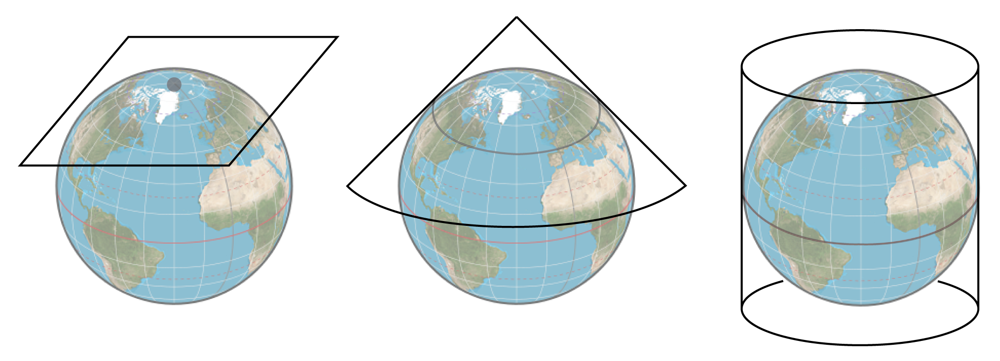

## Qu'est-ce qu'un objet spatial ?

`r icon::fa("hand-point-right", size = 1)` &nbsp;Deux catégories :

**1)** Les données vectorielles

 

.center[]

---

## Qu'est-ce qu'un objet spatial ?

`r icon::fa("hand-point-right", size = 1)` &nbsp;Deux catégories :

**2)** Les données matricielles

 

.center[]

---

## Le système de coordonnées

`r icon::fa("hand-point-right", size = 1)` &nbsp;Un objet spatial se représente
dans l'espace selon un référentiel spatial : le **système de coordonnées** (**CRS** pour _Coordinates Reference System_)

`r icon::fa("hand-point-right", size = 1)` &nbsp;Deux types de systèmes de coordonnées existent  :

**1)** Les systèmes géographiques (ou non projetés) [en degrés]

.center[]

---

## Le système de coordonnées

`r icon::fa("hand-point-right", size = 1)` &nbsp;Un objet spatial se représente
dans l'espace selon un référentiel spatial : le **système de coordonnées** (**CRS** pour _Coordinates Reference System_)

`r icon::fa("hand-point-right", size = 1)` &nbsp;Deux types de systèmes de coordonnées existent :

**2)** Les systèmes projetés [en mètres]

.center[]

--

`r icon::fa("hand-point-right", color = "#3f3f3f")` &nbsp;Le choix du CRS peut être crucial et dépend souvent de l'information que l'on souhaite représenter

---

## Le système de coordonnées

Sous `r icon::fa("r-project")` le CRS s'exprime selon le standard `proj4string` défini par le projet [**PROJ**](https://proj.org/)

.small[`+proj=longlat +datum=WGS84 +no_defs +ellps=WGS84 +towgs84=0,0,0`]

--

 

Chaque CRS possède un **SRID** (_Spatial Reference Identifier_) ou **EPSG**
(_European Petroleum Survey Group_) : un identifiant unique qui nous évite de
devoir écrire à la main le CRS au format `proj4string`

`+init=epsg:4326` est l'identifiant du CRS ci-dessus

.small[`+init=epsg:4326 +proj=longlat +datum=WGS84 +no_defs +ellps=WGS84 +towgs84=0,0,0`]

 

--

`r icon::fa("hand-point-right", color = "#3f3f3f")` &nbsp;Où trouver le bon CRS ? Réponse : [**Spatial Reference**](https://spatialreference.org/)
