```{r global_options, include=FALSE}
knitr::opts_chunk$set(fig.path = 'assets/chunks/', cache.path = "assets/cache/", dpi = 300)
library(tidyverse)
theme_set(theme_grey(base_size = 16))
library(emo)
```

# Credits

- Garrett Grolemund [RStudio webinar](https://github.com/garrettgman/webinars/tree/master/12-Getting-started-with-R-Markdown)


- Ulrik Lyngs [workshop material](https://github.com/ulyngs/rmarkdown-workshop-2019)


---
class: inverse, center, middle
# Motivation

---
<iframe width="1300" height="600" src="https://www.youtube.com/embed/s3JldKoA0zw" frameborder="0" allow="accelerometer; autoplay; encrypted-media; gyroscope; picture-in-picture" allowfullscreen></iframe>

Credit: [Ignasi Bartomeus, PhD](https://bartomeuslab.com/)

---
#

.center[]

---
# How can you reproduce results?

.center[]


---
# What do we need to make research reproducible?

- Something to integrate text, figures and code
     * `R`, `Python`, etc


- Something that can be continuously edited and updated
     * Living or dynamic document


- Something that can be easily used in versioning tools
     * Git

---

.center[]


---
# R Markdown workflow

.center[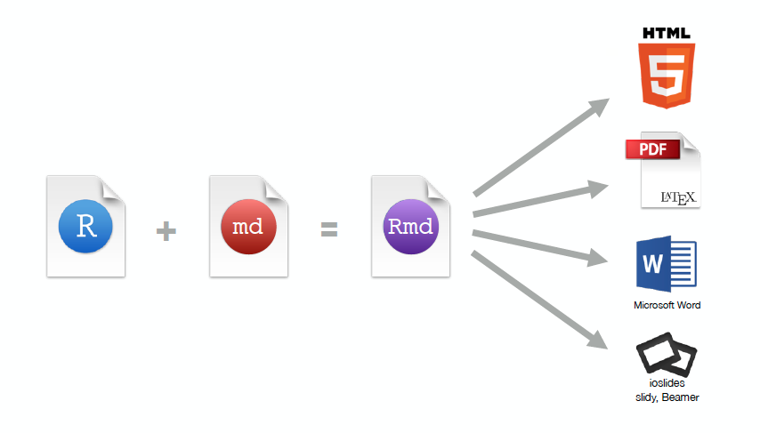]


---
# Structure of a R Markdown document
.center[
https://yongfu.name/2019-fju-rmd-talk/slide/#1
]


---
class: inverse, center, middle
# Demo

Open RStudio

Create a new Rmd file

Identify 3 components (frontmatter, content, chunks)

---

.center[]

---

.center[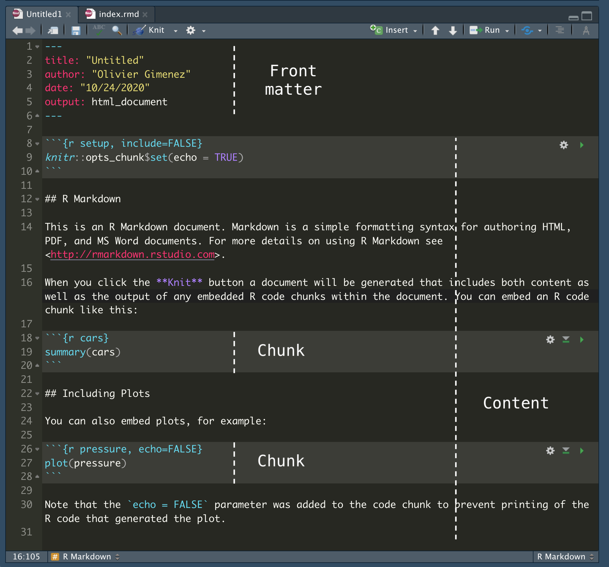]


---
# Structure of a R Markdown document
.center[]


---
# Structure of a R Markdown document
.center[]


---
class: inverse, center, middle
# Format your text with Markdown

---
# What is Markdown?

- A way to write stuff
- Mostly plain words, with some formating

.center[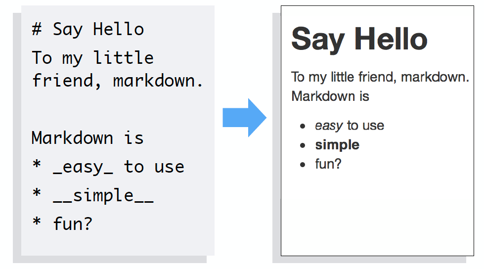]

---
# Websites that use Markdown

- GitHub <https://github.com/>
- StackOverflow <https://stackoverflow.com/>
- HackMD <https://hackmd.io>
- Many more


---
# Headers

- Use # to create headers
- Multiple #'s create lower level headers

.center[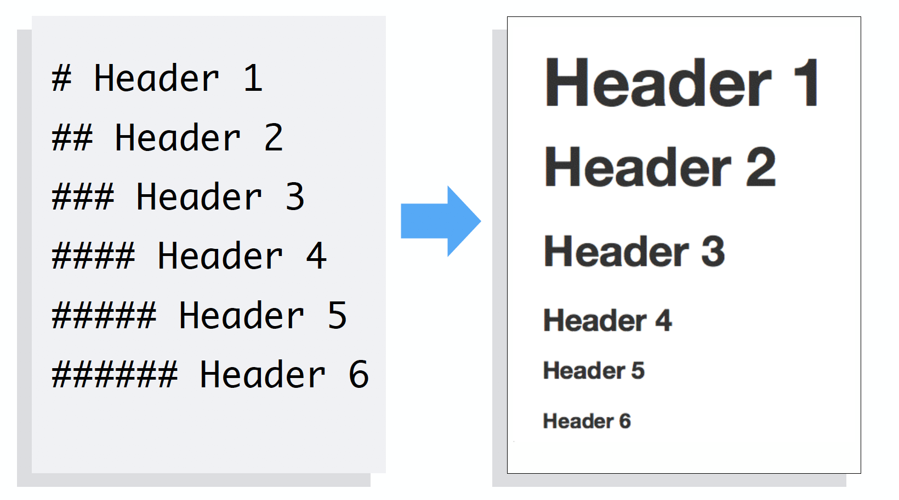]


---
# Text

- Text is rendered as plain text

.center[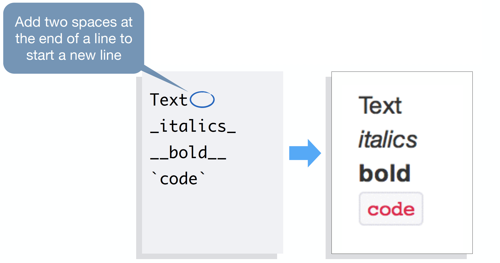]


---
# Lists

- Use asterisks to make bullet points
- Use numbers to make numbered lists
- Use 4 spaces or 1 tab for indentation

.center[]


---
# Hyperlinks

- To add a hyperlink, put your text between brackets
- Then place the URL between parentheses

.center[]

---
# Equations

- Write equations with Latex syntax

.center[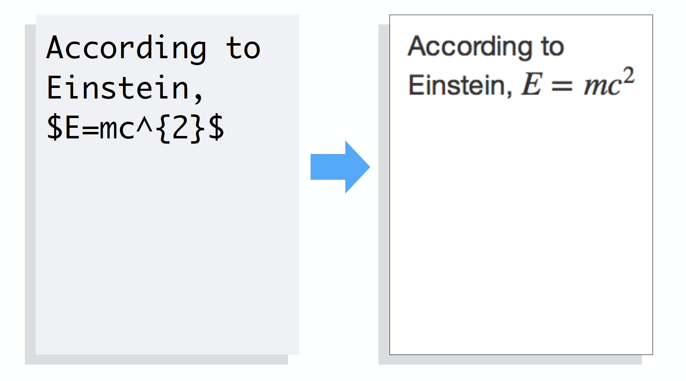]

---
# Equation blocks

.center[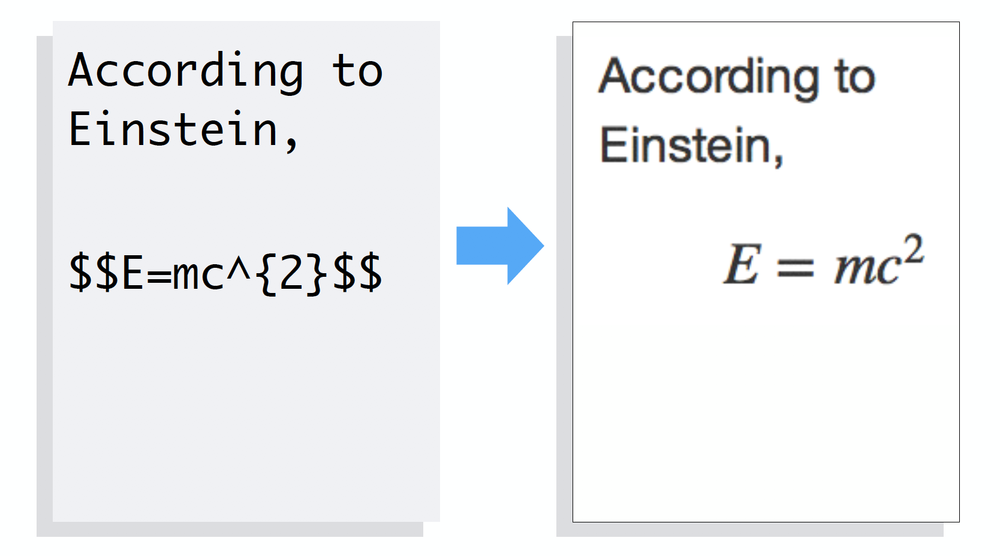]

---
# Images

- Use a link preceded by an ! to insert an image
- The link text should be
    - a URL if the image is hosted online
    - a file path if the image is saved on your computer

.center[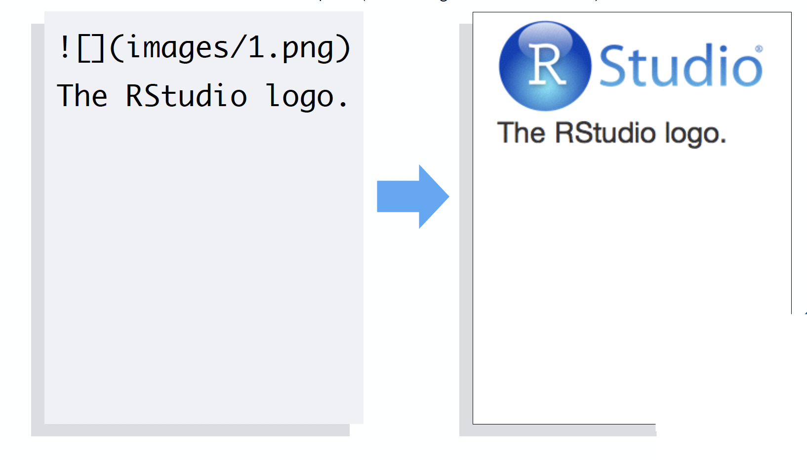]


---
# Tables

```{md}
| header A | header B |
|---------:|:---------|
| data     | data     |

Table:title

```

- A bit of a hassle...


- Use a [generator of Tables for Markdown](https://www.tablesgenerator.com/markdown_tables)


- Wait for next section to learn how to generate tables from `R`

---
# R Markdown Reference Guide

<https://rstudio.com/wp-content/uploads/2015/03/rmarkdown-reference.pdf>

.center[]


---
# Structure of a R Markdown document
.center[]


---
# Structure of a R Markdown document
.center[]


---
class: inverse, center, middle
## Code, figures and tables


---
# Embed code

- Insert chunk of `R` code
- R Markdown runs code and includes results.

.center[]

---
# Inline code

- Place code in a sentence with `r #code`
- R Markdown replaces code with results

.center[]

---
# Chunk options

- By default, R markdown includes both code and results

.center[]

---
# echo

- Add options between brackets after `r`.
- `echo = FALSE` hides code.

.center[]

---
# echo

- Add options between brackets after `r`.
- `echo = FALSE` hides code.

.center[]

---
# eval

- `eval = FALSE` prevents code from being run
- No results is displayed, only code

.center[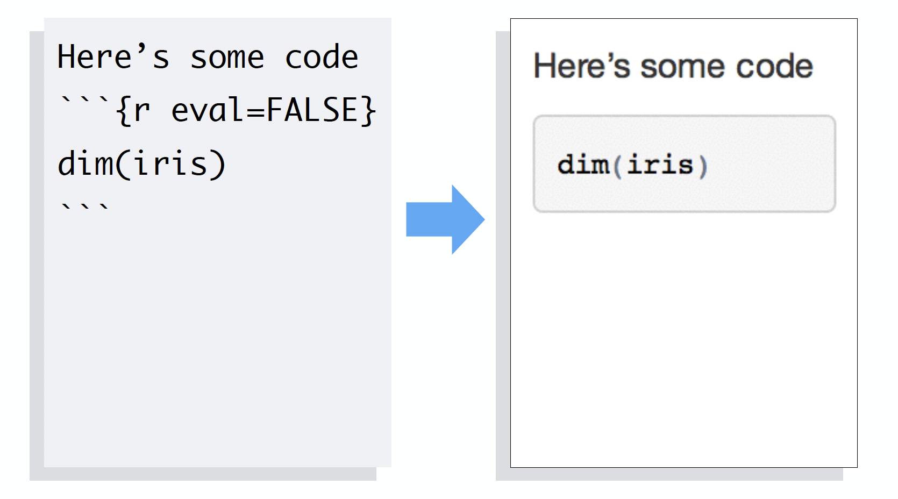]

---
# fig.height, fig.width

- Specify dimension of plots (in inches) with fig.width and fig.height
- Separate multiple arguments with commas.

.center[]


---
# message

- `message = FALSE` prevents messages from appearing
in output

.center[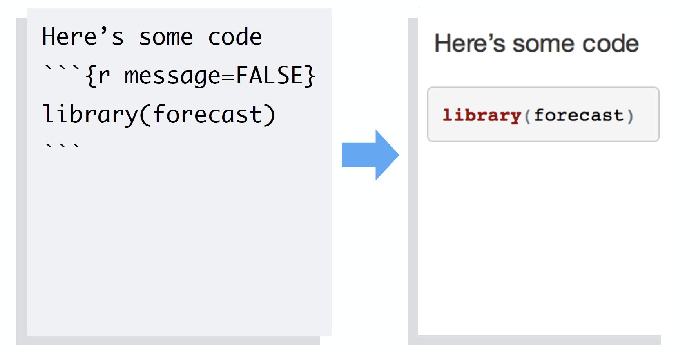]


---
# Default chunk options

- Repeating chunk options can be painful


- If you have `echo = FALSE` in every single chunk, how to set the default chunk option to `echo = FALSE` ?


- Use `knitr::opts_chunk$set(echo = FALSE)`


- You may overwrite the default for each chunk


- For chunk options, check out <https://yihui.name/knitr/options/>


---
# Including tables

```{r}
# cars is a built-in-to-R data set of cars
# and their stopping distances
cars %>%
  head(5) %>%
  knitr::kable(format = "html", caption = "A kable table")
```

- The [`kable`](https://www.rdocumentation.org/packages/knitr/versions/1.21/topics/kable) package is often used with the [`kableExtra`](https://cran.r-project.org/web/packages/kableExtra/vignettes/awesome_table_in_html.html) package
- A number of other packages are available for making pretty tables, see [rmarkdown.rstudio.com](https://rmarkdown.rstudio.com/lesson-7.html)


---
# R Markdown Reference Guide

<https://rstudio.com/wp-content/uploads/2015/03/rmarkdown-reference.pdf>

.center[]


---
# Structure of a R Markdown document
.center[]


---
# Structure of a R Markdown document
.center[]


---
class: inverse, center, middle
# YAML Yet Another Markup Language

---
# YAML in brief

- Contains the metadata of the document

- Starts and ends by three dashes

- Comes first in the document

---
# Simplest example

.center[]


---
# Output formats

.center[]


---
# Knit

<div style="width:100%;height:0;padding-bottom:61%;position:relative;"><iframe src="https://giphy.com/embed/3oEhmHmWP3Y9wQxoli" width="100%" height="100%" style="position:absolute" frameBorder="0" class="giphy-embed" allowFullScreen></iframe></div><p>


---
# Output formats

.center[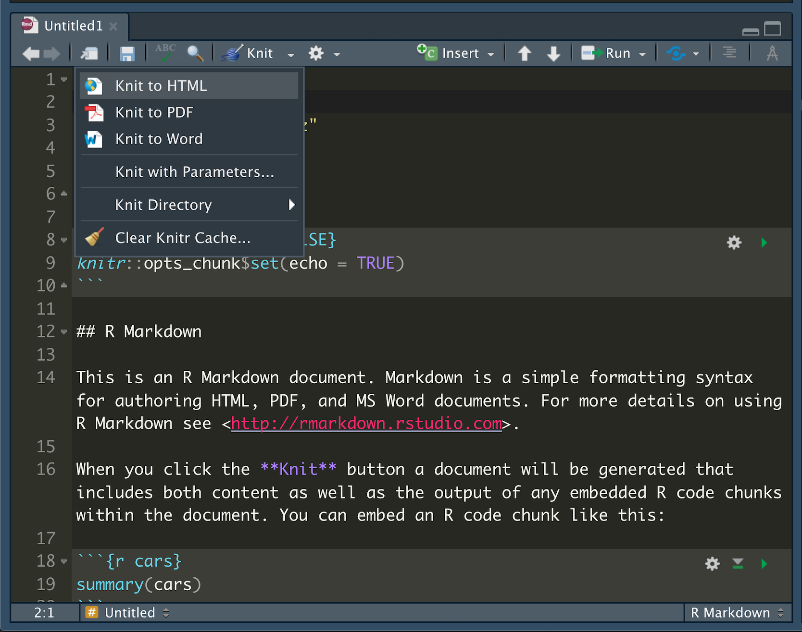]


---
# Appearance and style

- In HTML output, you can use `theme` or a custom **.css** style sheet

- `theme` options ([bootswatch.com](https://bootswatch.com/)) : *“cerulean”, “journal”, “flatly”, “darkly”, “readable”, “spacelab”, “united”, “cosmo”, “lumen”, “paper”, “sandstone”, “simplex”, “yeti”*

- You may also use LaTeX templates with R Markdown, and write [reproducible scientific paper](https://github.com/rstudio/rticles)

- You can also [use Word templates in R Markdown](http://rmarkdown.rstudio.com/articles_docx.html) (see also [this short video](https://vimeo.com/110804387))


---
# Managing bibliography

--
<ol>
<li> Put references in a plain text file with the extension **.bib**, in **BibTex** format (my advice: use [Zotero](https://www.zotero.org))
</ol>
```bibtex
*@article{Shea2014,
  author =        {Shea, Nicholas and Boldt, Annika},
  journal =       {Trends in Cognitive Sciences},
  pages =         {186--193},
  title =         {{Supra-personal cognitive control}},
  volume =        {18},
  year =          {2014},
  doi =           {10.1016/j.tics.2014.01.006},
}
```

--
<ol start = 2>
<li>Reference this file in your YAML header
</ol>
```yaml
---
title: "Citation test"
*bibliography: example.bib
output: html_document
---
```

---
# Citations
<ol start = 3>
<li>In your text, citations go inside brackets and separated by semicolons
</ol>

--
.pull-left[
### This...
Blah blah [@Shea2014; @Lottridge2012].
]

.pull-right[
### turns into this...

Blah blah (Shea et al. 2014; Lottridge et al. 2012).
]
---
class: larger-body
# Citations
<ol start = 3>
<li>In your text, citations go inside brackets and separated by semicolons
</ol>


.pull-left[
### This...
Blah blah [@Shea2014; @Lottridge2012].

@Shea2014 says blah.

Blah blah [see @Shea2014, pp. 33-35; also @Wu2016, ch. 1].
]

.pull-right[
### turns into this...

Blah blah (Shea et al. 2014; Lottridge et al. 2012).

Shea et al. (2014) says blah.

Blah blah (see Shea et al. 2014, 33–35; also Wu 2016, ch. 1).
]


---
class: larger-body
# Citations
<ol start = 3>
<li>In your text, citations go inside brackets and separated by semicolons
</ol>


.pull-left[
### This...
Blah blah [@Shea2014; @Lottridge2012].

@Shea2014 says blah.

Blah blah [see @Shea2014, pp. 33-35; also @Wu2016, ch. 1].
]

.pull-right[
### turns into this...

Blah blah (Shea et al. 2014; Lottridge et al. 2012).

Shea et al. (2014) says blah.

Blah blah (see Shea et al. 2014, 33–35; also Wu 2016, ch. 1).
]

- Add e.g `csl: my-style.csl` in the YAML header to change to other formats
- Browse through and download styles at [zotero.org/styles](https://www.zotero.org/styles)

---
# Citations

For an easy way to insert citations, try the [`citr`](https://github.com/crsh/citr) RStudio add-in.


```{r, out.width="75%", echo = FALSE}
knitr::include_graphics("https://raw.githubusercontent.com/crsh/citr/master/tools/images/addin_demo.gif")
```

---
# R Markdown Reference Guide

<https://rstudio.com/wp-content/uploads/2015/03/rmarkdown-reference.pdf>

.center[]


---

.center[]


---
class: inverse, center, middle
## What else can we reproduce with R Markdown?

---
# Let's have a tour

<div style="width:100%;height:0;padding-bottom:61%;position:relative;"><iframe src="https://awesome-rmarkdown-2019.netlify.app/imgs/gallery.gif" width="100%" height="100%" style="position:absolute" frameBorder="0"></iframe></div><p>

R Markdown gallery <https://rmarkdown.rstudio.com/gallery.html>


---
# Websites

- Use package `blogdown` <https://bookdown.org/yihui/blogdown/>

- Customize with Hugo <https://themes.gohugo.io/>

- Deploy via GitHub pages or Netlify


---
class: inverse, center, middle
# Live demo
## Build your own website in a few minutes


---
##

.center[]


---
class: inverse, center, middle
## To go further

---
# Books

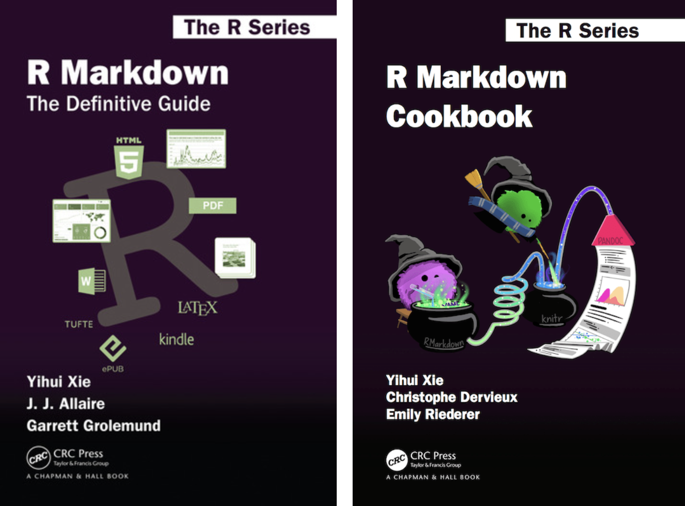


---
class: title-slide-final, middle
background-size: 55px
background-position: 9% 15%

# Thanks!

### I created these slides with [xaringan](https://github.com/yihui/xaringan) and [R Markdown](https://rmarkdown.rstudio.com/) using the [rutgers css](https://github.com/jvcasillas/ru_xaringan) that I slightly modified.

### Credit: I borrowed slides from [Garrett Grolemund](https://rstudio.com/speakers/garrett-grolemund/) and [Ulrik Lyngs](https://ulriklyngs.com/). I also used the beautiful illustrations shared by [Allison Horst](https://github.com/allisonhorst/stats-illustrations).


|                                                                                                            |                                   |
| :--------------------------------------------------------------------------------------------------------- | :-------------------------------- |
| `r icon::fa("envelope")` | **olivier.gimenez@cefe.cnrs.fr**       |
| `r icon::fa("home")` | [**https://oliviergimenez.github.io/**](https://oliviergimenez.github.io/) |
| `r icon::fa_twitter()` | [**@oaggimenez**](https://twitter.com/oaggimenez)                         |
| `r icon::fa_github()` | [**@oliviergimenez**](https://github.com/oliviergimenez)
