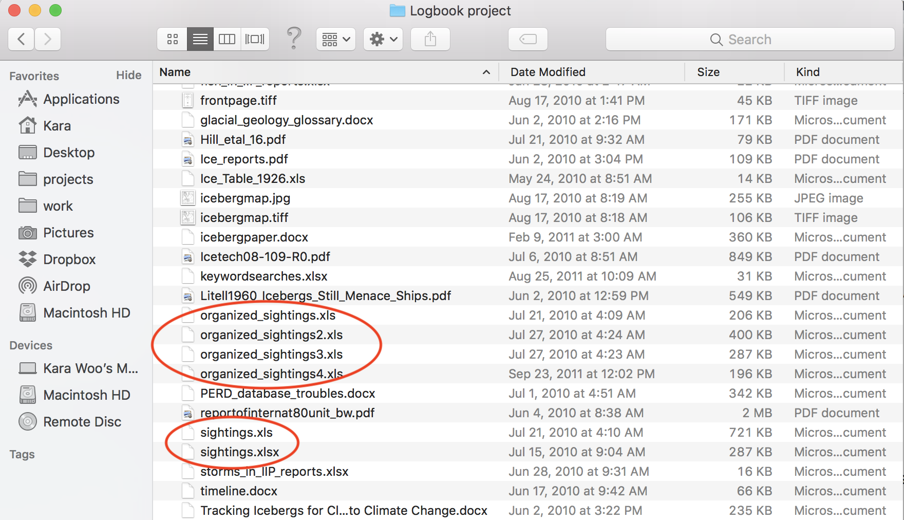

class: inverse, center, middle

# What is reproducible research?

---
**Reproducibility**: Given my data and code, you should be able to come to the same conclusions.

--

In contrast to **replicability**: re-doing an experiment and getting the same results

---
# Why practice reproducible research?

- "Uhhh which version of the data did I use, again?"

--

  - Verify results
  
--

- "Help! My collaborator joined the circus and left me to finish the manuscript."

--

  - Collaborate with others
  
--

- "My boss wants these figures updated ASAP and I have concert tickets tonight."

--

  - Save time in the long run

---
class: inverse, center, middle

# Have you experienced challenges reproducing someone's work (or your own)?

---

---
# Common barriers to reproducibility

- Data and/or code aren't available
- File path issues
- Versioning issues
- Missing steps between code and final output
- Licenses that don't allow reuse
- ...

---
# A common workflow:

- Write some code to analyze data
--

- Export figures
--

- Paste into Word/Google Docs/PowerPoint/etc.
--

- "Oh I need to change this one thing"

--

Rinse, repeat.

---
class: inverse, center, middle

# R Markdown

## an end to copy/paste purgatory

---
# R Markdown

- Combine code, results, figures, and text in the same place
--

- Easy to update data or tweak figures without needing to copy/paste results
--

- Document stays in sync with the push of a button

---
class: inverse, center, middle

# Let's fire up RStudio
