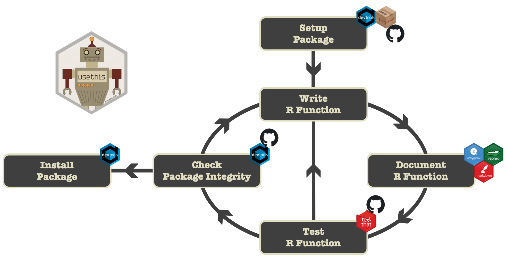
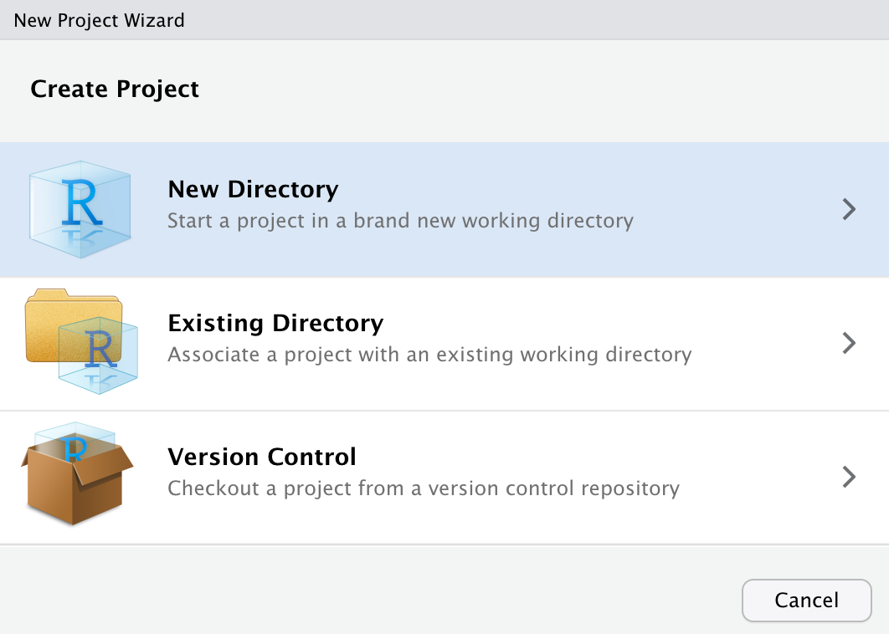
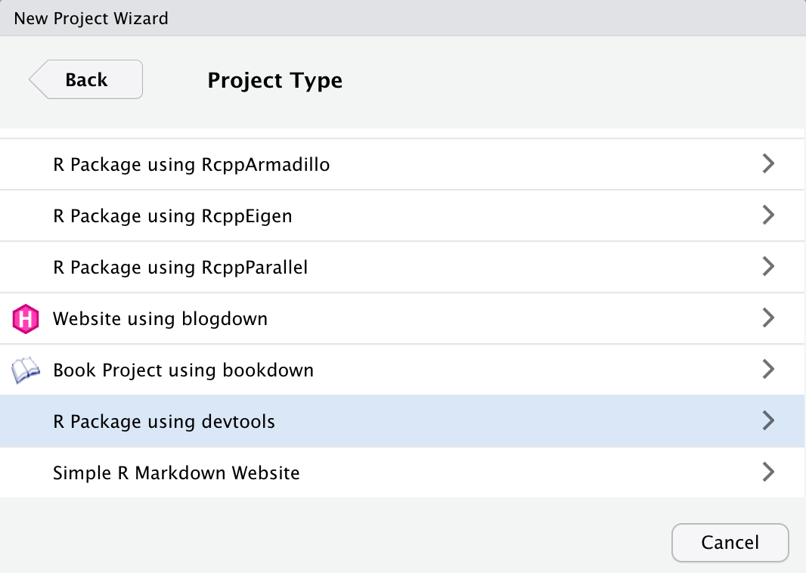
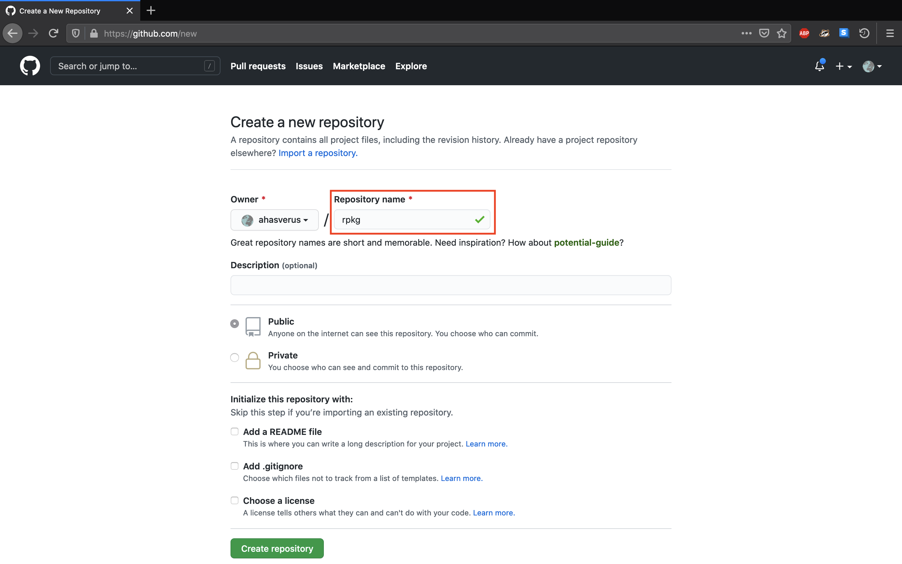
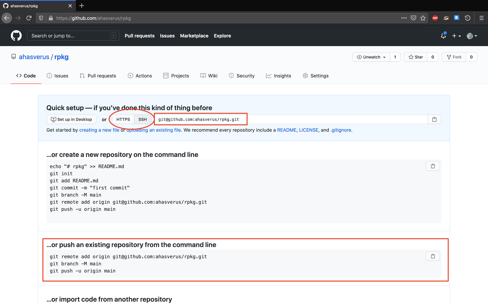
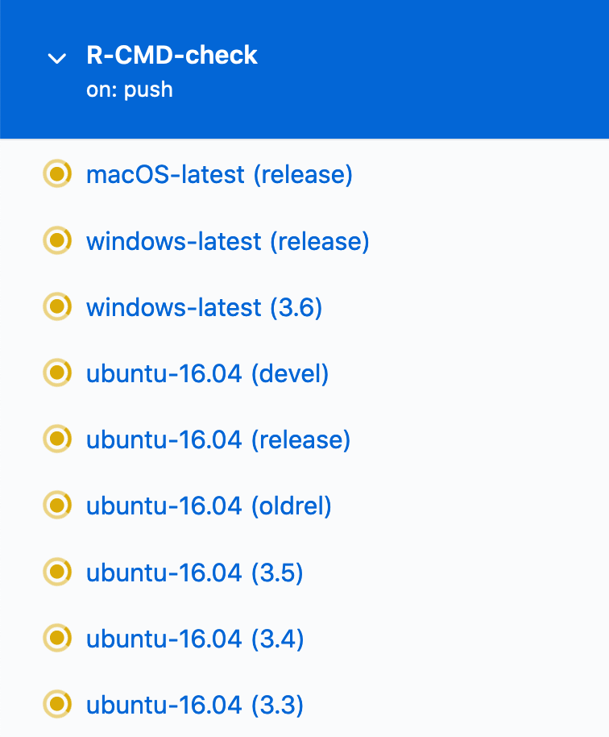
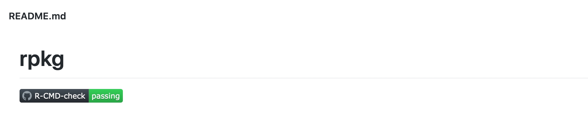

class: inverse, center, middle

## Everything's going to be okay

<br />


---

## What's an R Package?


`r icon::fa("quote-left", size = 1, color = "#3f3f3f")` &nbsp;_In R, the fundamental unit of
shareable code is the package. A package bundles together **code**, **data**,
**documentation**, and **tests**, and is easy to share with others_<br />&mdash;
&nbsp;&nbsp;**_Hadley Wickham_**

<br />

- An R package is a collection of **well-documented functions**
- It makes your work more **reproducible**
- It makes your code **useful** for (you and) others

---

## What's an R Package?

`r icon::fa("quote-left", size = 1, color = "#3f3f3f")` &nbsp;_In R, the fundamental unit of
shareable code is the package. A package bundles together **code**, **data**,
**documentation**, and **tests**, and is easy to share with others_<br />&mdash;
&nbsp;&nbsp;**_Hadley Wickham_**


<br />

- An R package is a collection of **well-documented functions**
- It makes your work more **reproducible**
- It makes your code **useful** for (you and) others
- It's a lot of `fun`!


.right[]

---

## What's an R Package?

- As of today (`r Sys.Date()`), **`r nrow(available.packages())`** packages are available on the [**CRAN**](https://cran.r-project.org). And many many more on GitHub and Bioconductor!

--

<br />

- Must-read resources:

.center[
[](https://r-pkgs.org/)
&nbsp;
[](https://www.taylorfrancis.com/books/9781315381305)
&nbsp;
[](https://cran.r-project.org/doc/manuals/r-release/R-exts.html)
]

---

## Recommended environment

<br />

.center[

]

.center[
&nbsp;&nbsp;&nbsp;
&nbsp;&nbsp;&nbsp;
&nbsp;&nbsp;&nbsp;
&nbsp;&nbsp;&nbsp;

&nbsp;&nbsp;&nbsp;

]

---

## Development workflow

<br />




---

class: inverse, center, middle

## Live coding session

<br />


---

## Session information

```{r, echo = TRUE, eval = FALSE}
devtools::session_info()
```

```
─ Session info ────────────────────────────────────────────────────────────────────
 Version  R version 4.0.3 (2020-10-10)
 OS       macOS Catalina 10.15.7
 System   x86_64, darwin17.0
 UI       RStudio
 Language English
 Collate  fr_FR.UTF-8
 CType    fr_FR.UTF-8
 TZ       Europe/Paris
 Date     2020-11-03

─ Packages ────────────────────────────────────────────────────────────────────────
 Package             Version       Date               Source
 devtools            2.3.2         2020-09-18         CRAN (R 4.0.2)
 knitr               1.30.0        2020-09-22         CRAN (R 4.0.2)
 pkgdown             1.6.1         2020-09-12         CRAN (R 4.0.2)
 remotes             2.2.0         2020-07-21         CRAN (R 4.0.2)
 rmarkdown           2.5.0         2020-10-21         CRAN (R 4.0.3)
 roxygen2            7.1.1         2020-06-27         CRAN (R 4.0.2)
 testthat            2.3.2         2020-03-02         CRAN (R 4.0.0)
 usethis             1.6.3         2020-09-17         CRAN (R 4.0.2)
```


---

class: inverse, center, middle

## Package skeleton

<br />


---

## Create the structure

<!-- - Using **RStudio** -->


.center[
&nbsp;

]

`r icon::fa("hand-point-right", color = "#3f3f3f")` &nbsp;Make sure to select `R Package using devtools`

<br />

`r icon::fa("exclamation-triangle", color = "#3f3f3f")` &nbsp;A package name can **only contain** letters and numbers (the dot is the only non-alphanumeric character allowed)

---


## Create the structure


- Using `r icon::fa("r-project")` directly (no IDE)


```{r, echo = TRUE, eval = FALSE}
usethis::create_package("/Users/nicolascasajus/Desktop/rpkg")
```

`r icon::fa("hand-point-right", color = "#3f3f3f")` &nbsp;Make sure to specify the `absolute path` to your package

--

```
✔ Creating '/Users/nicolascasajus/Desktop/rpkg'
✔ Setting active project to '/Users/nicolascasajus/Desktop/rpkg'
✔ Creating 'R/'
✔ Writing 'DESCRIPTION'
Package: rpkg
Title: What the Package Does (One Line, Title Case)
Version: 0.0.0.9000
Authors@R (parsed):
    * First Last <first.last@example.com> [aut, cre] (YOUR-ORCID-ID)
Description: What the package does (one paragraph).
License: `use_mit_license()`, `use_gpl3_license()` or friends
Encoding: UTF-8
LazyData: true
Roxygen: list(markdown = TRUE)
RoxygenNote: 7.1.1
✔ Writing 'NAMESPACE'
✔ Changing working directory to '/Users/nicolascasajus/Desktop/rpkg'
```

---


## Create the structure

- Let's take a look at the package structure


---

## `r icon::fa("exclamation-circle")` &nbsp;What about reproducibility?

--

- We will create an `r icon::fa("r-project")` script with all the command lines required to develop our package so we can reuse it in the future for new developments.

--

- This file will be named `_devhistory.R` and will be saved **at the root** of the project (and not in the **R/** folder).


```{r, echo = TRUE, eval = FALSE}
usethis::edit_file("_devhistory.R")
```

--


`r icon::fa("hand-point-right", color = "#3f3f3f")` &nbsp;From now, **all the command lines** will be written in this file.

--

<br />

`r icon::fa("exclamation-triangle", color = "#3f3f3f")` &nbsp;As this file is not part of a typical package structure, we need to tell R to ignore it when checking and installing the package. It's the purpose of the `.Rbuildignore` file.

```{r, echo = TRUE, eval = FALSE}
usethis::use_build_ignore("_devhistory.R")
```

```
✓ Adding '^_devhistory\\.R$' to '.Rbuildignore'
```

---


## Setup versioning

- Let's initialize the `r icon::fa("git")` versioning


```{r, echo = TRUE, eval = FALSE}
usethis::use_git(message = ":tada: Initial commit")
```

--

```
✓ Setting active project to '/Users/nicolascasajus/Desktop/rpkg'
✓ Initialising Git repo
✓ Adding '.Rhistory', '.RData' to '.gitignore'

There are 6 uncommitted files:
  '_devhistory.R'
  '.gitignore'
  '.Rbuildignore'
  'DESCRIPTION'
  'NAMESPACE'
  'rpkg.Rproj'
Is it ok to commit them?
(...)
● A restart of RStudio is required to activate the Git pane
Restart now?
(...)
```

`r icon::fa("hand-point-right", color = "#3f3f3f")` &nbsp;Commit changes and restart RStudio

---


## `r icon::fa("apple")` .DS_Store files

**.DS_Store** files are hidden files storing folder preferences on macOS computers. It's recommended to remove them from the versioning. Moreover these files are not part of standard package structure: we also need to ignore them during the check and installation of the package.

--


- Let's add it to `.gitignore` and `.Rbuildignore` files

```{r, echo = TRUE, eval = FALSE}
usethis::use_git_ignore(".DS_Store")
usethis::use_build_ignore(".DS_Store")
```

```
✓ Adding '.DS_Store' to '.gitignore'
✓ Adding '^\\.DS_Store$' to '.Rbuildignore'
```

--


- And let's commit changes

```{r, echo = TRUE, eval = FALSE}
usethis::use_git(message = ":see_no_evil: Ban .DS_Store files")
```

```
✓ Adding files
✓ Commit with message ':see_no_evil: Ban .DS_Store files'
```


---

class: inverse, center, middle

## Package metadata

<br />


---


## Package metadata

- Before we go any further, we will edit some informations about our package using the `DESCRIPTION` file

```{r, echo = TRUE, eval = FALSE}
usethis::edit_file("DESCRIPTION")
```

```
Package: rpkg
Title: What The Package Does (one line, title case required, no final period)
Authors@R:
    person(given   = "First",
           family  = "Last",
           role    = c("aut", "cre"),
           email   = "first.last@example.com",
           comment = c(ORCID = "YOUR-ORCID-ID"))
Description: What the package does (one paragraph). The description of a package
    is usually long, spanning multiple lines. The second and subsequent lines
    should be indented, usually with four spaces.
```

---

## Package metadata

- Before we go any further, we will edit some informations about our package using the `DESCRIPTION` file

```{r, echo = TRUE, eval = FALSE}
usethis::edit_file("DESCRIPTION")
```

```
Package: rpkg
Title: A Minimal But Complete R Package
Authors@R:
    person(given   = "Nicolas",
           family  = "Casajus",
           role    = c("aut", "cre"),
           email   = "nicolas.casajus@fondationbiodiversite.fr",
           comment = c(ORCID = "0000-0002-5537-5294"))
Description: The purpose of the \code{rpkg} package is to illustrate the main
    structure and components of an R Package with respect to the CRAN submission
    policies (<https://cran.r-project.org/>).
```


--


`r icon::fa("exclamation-triangle", color = "#3f3f3f")` &nbsp;The other fields will be added/modified automatically.

--

`r icon::fa("hand-point-right", color = "#3f3f3f")` &nbsp;Resources: [**R Package - Chap8**](https://r-pkgs.org/description.html)

--

```{r, echo = TRUE, eval = FALSE}
usethis::use_git(message = ":bulb: Edit package metadata")
```

---

## Package-level documentation

- What about converting the `DESCRIPTION` informations into a package-level documentation file? This file will be the homepage of the help section of our package accessible with `?pkg_name` or `??pkg_name`

--

```{r, echo = TRUE, eval = FALSE}
usethis::use_package_doc()
```

```
✓ Writing 'R/rpkg-package.R'
```

--

`r icon::fa("exclamation-triangle", color = "#3f3f3f")` &nbsp;A dummy file has been created in `R/`: **do not edit this file!**

--

<br />

- Now we need to generate the corresponding documentation file (`.Rd`)

```{r, echo = TRUE, eval = FALSE}
devtools::document()
```

```
✓ Writing 'NAMESPACE'
✓ Writing 'man/rpkg-package.Rd'
```

--

```{r, echo = TRUE, eval = FALSE}
usethis::use_git(message = ":bulb: Update documentation")
```

---

class: inverse, center, middle

## Package license

<br />


---


## Package license

- Choosing a license is important if you’re planning on releasing your package
- There is two families of open-source licenses: **permissive** (e.g. MIT, Apache) and **copyleft** (e.g. GPL)

--

<br />

`r icon::fa("hand-point-right", color = "#3f3f3f")` &nbsp;Resources: [**choosealicense.com**](https://choosealicense.com)

--

<br />

- Let's use the [**MIT**](https://choosealicense.com/licenses/mit/) license, a permissive one

```{r, echo = TRUE, eval = FALSE}
usethis::use_mit_license(name = "Nicolas Casajus")
```

```
✓ Setting License field in DESCRIPTION to 'MIT + file LICENSE'
✓ Writing 'LICENSE.md'
✓ Adding '^LICENSE\\.md$' to '.Rbuildignore'
✓ Writing 'LICENSE'
```

--

```{r, echo = TRUE, eval = FALSE}
usethis::use_git(message = ":page_facing_up: Add package license")
```


---

class: inverse, center, middle

## Function implementation

<br />


---

## A first R function

- Let's create a function called `moyenne()`, an equivalent of the R function `mean()`

---

## A first R function

- Let's create a function called `moyenne()`, an equivalent of the R function `mean()`
- We'll use `usethis::use_r()` to create a file with the same name<sup><b>*</b></sup>

```{r, echo = TRUE, eval = FALSE}
usethis::use_r("moyenne")
```

```
● Modify 'R/moyenne.R'
● Call `use_test()` to create a matching test file
```

.footnote[
***** You can also have several functions in one single R file (grouped by theme)
]

--

<br />

- Let's implement the core of the function

```{r, echo = TRUE, eval = FALSE}
moyenne <- function(x) sum(x) / length(x)
```

--


`r icon::fa("hand-point-right", color = "#3f3f3f")` &nbsp;Resources: [**Tidyverse style guide**](https://style.tidyverse.org/) and the R package `{styler}` (with its RStudio addin) to format your R code


---

## Let's try our function

`r icon::fa("hand-point-right", color = "#3f3f3f")` &nbsp;Before going any further we have to try our code. So we will load our package (and **NOT** sourcing the function)

```{r, echo = TRUE, eval = FALSE}
devtools::load_all()
```

--

Now we can use our function

```{r, echo = TRUE, eval = FALSE}
moyenne(1:10)
```

```
## [1] 5.5
```

--

Let's compare with the function `mean()`

```{r, echo = TRUE, eval = FALSE}
mean(1:10)
```

```
## [1] 5.5
```


`r icon::fa("beer", size = 1, color = "#3f3f3f")`
`r icon::fa("beer", size = 1, color = "#3f3f3f")`
`r icon::fa("beer", size = 1, color = "#3f3f3f")`
&nbsp; **Yeah!!!** &nbsp;
`r icon::fa("beer", size = 1, color = "#3f3f3f")`
`r icon::fa("beer", size = 1, color = "#3f3f3f")`
`r icon::fa("beer", size = 1, color = "#3f3f3f")`

--

```{r, echo = TRUE, eval = FALSE}
usethis::use_git(message = ":boom: New feature - moyenne()")
```


---

class: inverse, center, middle

## Time to document

<br />


---

## Time to document

.pull-leftt[
.center[[](https://cran.r-project.org/web/packages/roxygen2/vignettes/roxygen2.html)]
]

.pull-rightt[
- Specially-structured comments **preceding** each function definition
- Lightweight syntax easy to write and to read
- Syntax: `#' @field value`
- Keep function definition and documentation in the same file
- Automatically write `.Rd` files and **NAMESPACE**
]

--

Each **Roxygen2 header** will always start with these two fields:

```{r, echo = TRUE, eval = FALSE}
#' @title Short Title of the Function (One Line)
#'
#' @description A longer description of what the function does (several lines)
```

--

`r icon::fa("hand-point-right", color = "#3f3f3f")` &nbsp;Keywords `@title` and `@description` can be omitted

```{r, echo = TRUE, eval = FALSE}
#' Short Title of the Function (One Line)
#'
#' A longer description of what the function does (several lines)
```


---

## Time to document

`r icon::fa("hand-point-right", color = "#3f3f3f")` &nbsp;If your function has **parameters**, each one must be documented

```{r, echo = TRUE, eval = FALSE}
#' @param param_name param_description
```

--

For example with our function `moyenne()`

```{r, echo = TRUE, eval = FALSE}
#' @param x a numerical vector
```

--

<br />

`r icon::fa("hand-point-right", color = "#3f3f3f")` &nbsp;If your function **returns** an R object use the keyword `@return`

```{r, echo = TRUE, eval = FALSE}
#' @return What the function returns
```

--

For example with our function `moyenne()`

```{r, echo = TRUE, eval = FALSE}
#' @return The arithmetic mean of the values as a numeric vector of length one.
```

You can omit this field if your function returns nothing


---

## Time to document

`r icon::fa("hand-point-right", color = "#3f3f3f")` &nbsp;Add a section `@examples` to show how to use your function

```{r, echo = TRUE, eval = FALSE}
#' @examples
#' x <- 1:10
#' moyenne(x)
```

--

<br />

If you don't want your example to be executed use `\dontrun{}` (in case your example returns an error or in case of time consuming code)

```{r, echo = TRUE, eval = FALSE}
#' @examples
#' \dontrun{
#' x <- 1:10
#' moyenne(x)
#' }
```

--

<br />

`r icon::fa("hand-point-right", color = "#3f3f3f")` &nbsp;You can also add a reproducible example (dataset added to your package)


---

## Time to document

`r icon::fa("hand-point-right", color = "#3f3f3f")` &nbsp;Finally if you want your function to be used directly by user you need to add this tag

```{r, echo = TRUE, eval = FALSE}
#' @export
```

--

<br />

`r icon::fa("hand-point-right", color = "#3f3f3f")` &nbsp;Additional Roxygen2 tags

```{r, echo = TRUE, eval = FALSE}
#' @details
#' @author
#' @references
#' @seealso
#' @keywords
#' @section
#' @alias
#' @family
```

<br />

`r icon::fa("hand-point-right", color = "#3f3f3f")` &nbsp;Resources: [**R Package - Chap10**](https://r-pkgs.org/man.html) and [**R Package Primer**](https://kbroman.org/pkg_primer/pages/docs.html)

---

## Time to document

```{r, echo = TRUE, eval = FALSE}
#' Arithmetic Mean
#'
#' This function computes the arithmetic mean of a numerical vector.
#'
#' @param x a numerical vector
#'
#' @return The arithmetic mean of the values as a numeric vector of length one.
#'
#' @export
#'
#' @examples
#' x <- 1:10
#' moyenne(x)

moyenne <- function(x) sum(x) / length(x)
```

---

## Time to document

`r icon::fa("hand-point-right", color = "#3f3f3f")` &nbsp;It's time to generate the corresponding `.Rd` file (special file for R documentation) from this Roxygen2 header

```{r, echo = TRUE, eval = FALSE}
devtools::document()                                  # or roxygen2::roxygenize()
```

```
✓ Writing 'NAMESPACE'
✓ Writing 'man/moyenne.Rd'
```

--

- In addition to the creation of `man/moyenne.Rd` file, the `NAMESPACE` has been updated

```{r, eval = FALSE}
# Generated by roxygen2: do not edit by hand
export(moyenne)
```

`r icon::fa("hand-point-right", color = "#3f3f3f")` &nbsp;As we can see this file lists which functions need to be exported (accessible by the user when loading the package). But it also deals with external dependencies.

--

<br />

```{r, echo = TRUE, eval = FALSE}
usethis::use_git(message = ":bulb: Update documentation")
```

---

class: inverse, center, middle

## Checking package

<br />


---

## Checking package

`r icon::fa("hand-point-right", color = "#3f3f3f")` &nbsp;It's time to check the integrity of our package

```{r, echo = TRUE, eval = FALSE}
devtools::check()
```

```
── R CMD check ────────────────────────────────────────────────────────────────────
✓  checking package namespace information
✓  checking package dependencies (1.9s)
✓  checking DESCRIPTION meta-information ...
✓  checking index information
✓  checking package subdirectories ...
✓  checking R files for syntax errors ...
✓  checking dependencies in R code ...
✓  checking R code for possible problems (1.8s)
✓  checking Rd files ...
✓  checking Rd metadata ...
✓  checking Rd contents ...
✓  checking examples (526ms)

── R CMD check results ──────────────────────────────────── rpkg 0.0.0.9000 ───────
Duration: 10.8s

0 errors ✓ | 0 warnings ✓ | 0 notes ✓
```

--

`r icon::fa("beer", size = 1, color = "#3f3f3f")`
`r icon::fa("beer", size = 1, color = "#3f3f3f")`
`r icon::fa("beer", size = 1, color = "#3f3f3f")`
&nbsp; **Yeah!!!** &nbsp;
`r icon::fa("beer", size = 1, color = "#3f3f3f")`
`r icon::fa("beer", size = 1, color = "#3f3f3f")`
`r icon::fa("beer", size = 1, color = "#3f3f3f")`

---

## Installing package

`r icon::fa("hand-point-right", color = "#3f3f3f")` &nbsp;Finally we can install our package

```{r, echo = TRUE, eval = FALSE}
devtools::install()
```

```
DONE (rpkg)
```

--

<br />

```{r, echo = TRUE, eval = FALSE}
library("rpkg")
moyenne(1:1000)
```

```
## [1] 500.5
```

Or,

```{r, echo = TRUE, eval = FALSE}
rpkg::moyenne(1:1000)
```


---

class: inverse, center, middle

## Back to tests

<br />


---

## Test your code

- Testing is a vital part of package development
- But until now we just tried our code informally and on the fly
- Problem: it's time consuming, repetitive and it can break the code

--

`r icon::fa("hand-point-right", color = "#3f3f3f")` &nbsp;Package `{testthat}`

.pull-leftt[
.center[[](https://testthat.r-lib.org)]
]

.pull-rightt[
- Implements a lot of unit tests
- Formal automated testing
- Explicits how your code should behave
- Makes your code more robust
]


---

## Test your code

- Testing is a vital part of package development
- But until now we just tried our code informally and on the fly
- Problem: it's time consuming, repetitive and it can break the code


`r icon::fa("hand-point-right", color = "#3f3f3f")` &nbsp;Package `{testthat}`

.pull-leftt[
.center[[](https://testthat.r-lib.org)]
]

.pull-rightt[
- Implements a lot of unit tests
- Formal automated testing
- Explicits how your code should behave
- Makes your code more robust

Let's add `{testthat}` to our package
]


```{r, echo = TRUE, eval = FALSE}
usethis::use_testthat()
```

```
✓ Adding 'testthat' to Suggests field in DESCRIPTION
✓ Creating 'tests/testthat/'
✓ Writing 'tests/testthat.R'
● Call `use_test()` to initialize a basic test file and open it for editing.
```


---

## Test your code

`r icon::fa("hand-point-right", color = "#3f3f3f")` &nbsp;A new `r icon::fa("r-project")` file has been written: `tests/testthat.R`. It sets the testing environment


```{r, echo = TRUE, eval = FALSE}
library(testthat)
library(rpkg)
test_check("rpkg")
```

--

```{r, echo = TRUE, eval = FALSE}
usethis::use_git(message = ":white_check_mark: Setup testthat")
```

--

<br />

- Now we have to implement some unit tests. Let's create an `r icon::fa("r-project")` script for testing the function `moyenne()`


```{r, echo = TRUE, eval = FALSE}
usethis::use_test("moyenne")
```

```
✓ Writing 'tests/testthat/test-moyenne.R'
● Modify 'tests/testthat/test-moyenne.R'
```

--

`r icon::fa("hand-point-right", color = "#3f3f3f")` &nbsp;All tests files are stored in `tests/testthat/` and their names must start with `test-*`

---

## Test structure

Tests are organised hierarchically: **expectations** are grouped into **tests** which are organised in **files**

--

- An **expectation** is the atom of a test. It describes the expected result of a computation. Expectations are functions that start with `expect_*`.

--

- A **test** has multiple expectations and tests one unit of a functionality (output, parameters, etc.). A test is created with `test_that()`.

--

- A test file groups multiple tests and has a **context** providing a short description of its tests. The context is specified by `context()`.


--

`r icon::fa("hand-point-right", color = "#3f3f3f")` &nbsp;Let's add some tests in `tests/testthat/test-moyenne.R`

```{r, echo = TRUE, eval = FALSE}
context("Testing moyenne()")

test_that("check outputs", {
  expect_length(moyenne(1:3), 1)                        # Length of the output
  expect_equal(moyenne(1:3), 2)                         # Value of the output
})
```


---

## Run the test

`r icon::fa("hand-point-right", color = "#3f3f3f")` &nbsp;To run the test we will use `devtools::test()`

```{r, echo = TRUE, eval = FALSE}
devtools::test()
```


```
✓ |  OK F W S | Context
✓ |   2       | Testing moyenne()

══ Results ════════════════════════════════════════════════════════════════════════
OK:       2
Failed:   0
Warnings: 0
Skipped:  0
```

---

## Test your code

Let's add another test

```{r, echo = TRUE, eval = FALSE}
context("Testing moyenne()")

test_that("check outputs", {
  expect_length(moyenne(1:3), 1)                        # Length of the output
  expect_equal(moyenne(1:3), 2)                         # Value of the output
  expect_equal(moyenne(c(1:3, NA)), 2)                  # Check for NA #<<
})
```

--

```{r, echo = TRUE, eval = FALSE}
devtools::test()
```

```
✓ |  OK F W S | Context
x |   2 1     | Testing moyenne()
───────────────────────────────────────────────────────────────────────────────────
test-moyenne.R:8: failure: check outputs
moyenne(c(1:3, NA)) not equal to 2.
───────────────────────────────────────────────────────────────────────────────────

══ Results ════════════════════════════════════════════════════════════════════════
OK:       2
Failed:   1
Warnings: 0
Skipped:  0
```

---

## Hum...

Our function does not seem to work as expected.

`r icon::fa("hand-point-right", color = "#3f3f3f")` &nbsp;We need to change the code of the function `moyenne()` to deal with `NA` values.

```{r, echo = TRUE, eval = FALSE}
moyenne <- function(x) {
  x <- na.omit(x)
  sum(x) / length(x)
}

```

--

Let's test again

```{r, echo = TRUE, eval = FALSE}
devtools::test()
```


```
✓ |  OK F W S | Context
✓ |   3       | Testing moyenne()

══ Results ════════════════════════════════════════════════════════════════════════
OK:       3
Failed:   0
Warnings: 0
Skipped:  0
```

---

## That's better, but...

This is not a good practice. If user has `NA` values, this implementation will not inform him and makes the decision to remove `NA`. Instead we are going to let user choose to delete the `NA` or not.

--

`r icon::fa("hand-point-right", color = "#3f3f3f")` &nbsp;Let's add an additional parameter to our function: `na_rm` with a default value (`FALSE`). If `x` contains `NA` values and `na_rm = FALSE`, then an error will be returned. Otherwise (`na_rm = TRUE`) `NA` values will be removed and the computation can be done.

--

<br />

```{r, echo = TRUE, eval = FALSE}
moyenne <- function(x, na_rm = FALSE) {
  if (any(is.na(x))) {
    if (na_rm) {
      x <- na.omit(x)
    } else {
      stop("x contains NA values. Use na_rm = TRUE.")
    }
  }
  sum(x) / length(x)
}
```

---

## That's better, but...

Let's modify tests

```{r, echo = TRUE, eval = FALSE}
context("Testing moyenne()")

test_that("check outputs", {
  expect_length(moyenne(1:3), 1)
  expect_equal(moyenne(1:3), 2)
  expect_error(moyenne(c(1:3, NA)))                      #<<
  expect_equal(moyenne(c(1:3, NA), na_rm = TRUE), 2)     #<<
})
```

--

And test again


```{r, echo = TRUE, eval = FALSE}
devtools::test()
```

```
✓ |  OK F W S | Context
✓ |   4       | Testing moyenne()

══ Results ════════════════════════════════════════════════════════════════════════
OK:       4
Failed:   0
Warnings: 0
Skipped:  0
```
---

class: inverse, center, middle

## and so on... to finally...

<br />


---

## Final R function

```{r, echo = TRUE, eval = FALSE}
moyenne <- function(x, na_rm = FALSE) {

  # Check 'x' argument ----
  if (missing(x)) {
    stop("Missing x.")
  }
  if (is.null(x)) {
    stop("x must be a numerical vector.")
  }
  if (sum(is.na(x)) == length(x)) {
    stop("x cannot be NA.")
  }
  if (!is.vector(x)) {
    stop("x must be a numerical vector.")
  }
  if (!is.numeric(x)) {
    stop("x must be a numerical vector.")
  }
  if (length(x) < 2) {
    stop("x must be length > 1.")
  }

  # Check 'na_rm' argument [...] ----
  # Remove NA (if required) [...] ----
  # Compute mean [...] ----
}
```

---

## Final R function

```{r, echo = TRUE, eval = FALSE}
moyenne <- function(x, na_rm = FALSE) {

  # Check 'x' argument [...] ----

  # Check 'na_rm' argument ----
  if (is.null(na_rm)) {
    stop("na_rm must be TRUE or FALSE.")
  }
  if (sum(is.na(na_rm)) == length(na_rm)) {
    stop("na_rm cannot be NA.")
  }
  if (length(na_rm) > 1) {
    stop("na_rm must be TRUE or FALSE.")
  }
  if (!is.logical(na_rm)) {
    stop("na_rm must be TRUE or FALSE.")
  }

  # Remove NA (if required) [...] ----
  # Compute mean [...] ----
}
```

---

## Final R function

```{r, echo = TRUE, eval = FALSE}
moyenne <- function(x, na_rm = FALSE) {

  # Check 'x' argument [...] ----
  # Check 'na_rm' argument [...] ----

  # Remove NA (if required) ----
  if (any(is.na(x))) {
    if (na_rm) {
      x <- na.omit(x)
      if (length(x) < 2) {
        stop("x has < 2 non-NA values.")
      }
    } else {
      stop("x contains NA values. Use na_rm = TRUE.")
    }
  }

  # Compute mean ----
  sum(x) / length(x)
}
```

---

## Update documentation

```{r, echo = TRUE, eval = FALSE}
#' Arithmetic Mean
#'
#' This function computes the arithmetic mean of a numerical vector.
#'
#' @param x a numerical vector (can contain ‘NA’ values).
#' @param na_rm a logical value indicating whether ‘NA’ values should be
#' stripped before the computation proceeds.
#'
#' @return The arithmetic mean of the values as a numeric vector of length one.
#'
#' @details An error will be returned if ‘x’ contains ‘NA’ values and ‘na_rm’ is
#' set to ‘FALSE’ or if ‘x’ contains less than two values (after removing ‘NA’).
#'
#' @export
#'
#' @examples
#' \dontrun{
#' moyenne(c(1:10, NA)) # error
#' }
#' moyenne(c(1:10, NA), na_rm = TRUE)

moyenne <- function(x, na_rm = FALSE) { ... }
```

```{r, echo = TRUE, eval = FALSE}
devtools::document()
```

---

## Run new tests

```{r, echo = TRUE, eval = FALSE}
devtools::test()
```

```
✓ |  OK F W S | Context
✓ |  21       | Testing moyenne() [0.1 s]

══ Results ════════════════════════════════════════════════════════════════════════
Duration: 0.1 s

OK:       21
Failed:   0
Warnings: 0
Skipped:  0
```

<br />

`r icon::fa("hand-point-right", color = "#3f3f3f")` &nbsp;Complete tests file available [**here**](https://gist.github.com/ahasverus/7863a8ca598154af99a3fc490b649d31)

---

## Check package integrity


```{r, echo = TRUE, eval = FALSE}
devtools::check()
```

```
── R CMD check results ──────────────────────────────────── rpkg 0.0.0.9000 ───────
Duration: 11.6s

> checking R code for possible problems ... NOTE
  moyenne: no visible global function definition for ‘na.omit’
  Undefined global functions or variables:
    na.omit
  Consider adding
    importFrom("stats", "na.omit")
  to your NAMESPACE file.

0 errors ✓ | 0 warnings ✓ | 1 note x
```

--

<br />

`r icon::fa("hand-point-right", color = "#3f3f3f")` &nbsp;**One note:** Let's talk about package dependencies


---

class: inverse, center, middle

## Package dependencies

<br />


---

## NAMESPACE

`r icon::fa("hand-point-right", color = "#3f3f3f")` &nbsp;Usually a package depends on functions of others packages. So we need to tell `r icon::fa("r-project")` about that to ensure that 1) others packages are installed when your package is installed, and 2) that they are made available when your package is loaded<sup><b>*</b></sup>.

.footnote[
*****This is true for every package (except for the package `{base}`), even for packages `{utils}`, `{stats}` and `{graphics}` installed by default with `r icon::fa("r-project")`.
]


--

`r icon::fa("hand-point-right", color = "#3f3f3f")` &nbsp;It's the purpose of the `NAMESPACE`

--

`r icon::fa("hand-point-right", color = "#3f3f3f")` &nbsp;As said before, the `NAMESPACE` is automatically updated when `devtools::document()` is called. So we need to list these dependencies in the **Roxygen2** header with:

- `#' @import package`: will import all the functions of the dependency
- `#' @importFrom package function`: will only import the listed functions

---

## NAMESPACE

Previously we had the following note:

```
> checking R code for possible problems ... NOTE
  moyenne: no visible global function definition for ‘na.omit’
  Undefined global functions or variables:
    na.omit
  Consider adding
    importFrom("stats", "na.omit")
  to your NAMESPACE file.
```

--

`r icon::fa("hand-point-right", color = "#3f3f3f")` &nbsp;So we need to import this function of the package `{stats}`

--

```{r, echo = TRUE, eval = FALSE}
#' @import stats
```

or,

```{r, echo = TRUE, eval = FALSE}
#' @importFrom stats na.omit
```

We will use the latest but by doing that it's recommended to call the function `na.omit()` as follow:

```{r, echo = TRUE, eval = FALSE}
stats::na.omit()
```

---

## Package dependencies


```{r, echo = TRUE, eval = FALSE}
moyenne <- function(x, na_rm = FALSE) {

  # Check 'x' argument [...] ----
  # Check 'na_rm' argument [...] ----

  # Remove NA (if required) ----
  if (any(is.na(x))) {
    if (na_rm) {
      x <- stats::na.omit(x) #<<
      if (length(x) < 2) {
        stop("x has < 2 non-NA values.")
      }
    } else {
      stop("x contains NA values. Use na_rm = TRUE.")
    }
  }

  # Compute mean ----
  sum(x) / length(x)
}
```

--

`r icon::fa("hand-point-right", color = "#3f3f3f")` &nbsp;Note that the functions `any()`, `is.na()`, `sum()`, `length()` and `stop()` are in the package `{base}`


---

## Package dependencies

```{r, echo = TRUE, eval = FALSE}
#' Arithmetic Mean
#'
#' This function computes the arithmetic mean of a numerical vector.
#'
#' @param x a numerical vector (can contain ‘NA’ values).
#' @param na_rm a logical value indicating whether ‘NA’ values should be
#' stripped before the computation proceeds.
#'
#' @return The arithmetic mean of the values as a numeric vector of length one.
#'
#' @details An error will be returned if ‘x’ contains ‘NA’ values and ‘na_rm’ is
#' set to ‘FALSE’ or if ‘x’ contains less than two values (after removing ‘NA’).
#'
#' @export
#' @importFrom stats na.omit #<<
#'
#' @examples
#' \dontrun{
#' moyenne(c(1:10, NA)) # error
#' }
#' moyenne(c(1:10, NA), na_rm = TRUE)

moyenne <- function(x, na_rm = FALSE) { ... }
```

---

## Update NAMESPACE

```{r, echo = TRUE, eval = FALSE}
devtools::document()
```

```
✓ Writing NAMESPACE
```

Here is the content of the `NAMESPACE` file

```{r, echo = TRUE, eval = FALSE}
export(moyenne)
importFrom(stats,na.omit)
```

--

<br />

`r icon::fa("hand-point-right", color = "#3f3f3f")` &nbsp;The `NAMESPACE` controls what happens when our package is loaded but not when it's installed. This is the role of `DESCRIPTION` and we need to add dependencies to this file.

---

## Update DESCRIPTION


```{r, echo = TRUE, eval = FALSE}
usethis::use_package("stats")
```

```
✓ Adding 'stats' to Imports field in DESCRIPTION
● Refer to functions with `stats::fun()`
```

--

Here is a snippet of the `DESCRIPTION` file

```dcf
Package: rpkg
Title: A Minimal But Complete R Package
Version: 0.0.0.9000
(...)
Imports:
    stats
Suggests:
    testthat
```


---

## Dependencies types

- `Imports`: packages listed in this field are installed when your package is installed but are not attached when your package is attached (there are just loaded). **ALWAYS** use this method and refer to external functions using the syntax `package::function()`

- `Depends`: packages listed in this field are installed when your package is installed and are attached when your package is attached. **NEVER** use `Depends` and always use `Imports` (except for special cases)

- `Suggests`: packages listed in this field are **not** installed when your package is installed. Your package can use these packages, but doesn’t require them (e.g. to run tests, build vignettes, etc.)


`r icon::fa("hand-point-right", color = "#3f3f3f")` &nbsp;Resources: [**R Package - Chap8.1**](https://r-pkgs.org/description.html#dependencies) and [**R Package - Chap13.6**](https://r-pkgs.org/namespace.html#imports)

--

Always use the function `usethis::use_package()`

```{r, echo = TRUE, eval = FALSE}
usethis::use_package(package, type = "Imports")                        # Default
usethis::use_package(package, type = "Suggests")
```

---

## Let's check

```{r, echo = TRUE, eval = FALSE}
devtools::check()
```

```
── R CMD check results ──────────────────────────────────── rpkg 0.0.0.9000 ───────
Duration: 11.9s

0 errors ✓ | 0 warnings ✓ | 0 notes ✓
```

<br />

.right[]

---

class: inverse, center, middle

## Version and Release

<br />


---

## Version number

- Our package has the version number `0.0.0.9000`: this means that it's under development. But we think our package is enough stable to be released so we want to upgrade its version number

--

- A version number has four components: `major.minor.patch.dev`
  - `major` is reserved for changes that are not backward compatible
  - `minor` is reserved for changes introducing new features
  - `patch` is reserved for changes fixing bugs
  - When releasing a package the `dev` number must be deleted

<br />

`r icon::fa("hand-point-right", color = "#3f3f3f")` &nbsp;Resources: [**R Package - Chap20**](https://r-pkgs.org/release.html)

--

<br />

```{r, echo = TRUE, eval = FALSE}
usethis::use_version(which = "minor")
```

```
✓ Setting Version field in DESCRIPTION to '0.1.0'
```

---

## Inform users &mdash; NEWS

`r icon::fa("hand-point-right", color = "#3f3f3f")` &nbsp;Inform existing users of changes in each release of your package with the `NEWS.md`


```{r, echo = TRUE, eval = FALSE}
usethis::use_news_md()
```

```
✓ Writing 'NEWS.md'
● Modify 'NEWS.md'
```

--

- For instance

```
# rpkg 0.1.0

- Add new feature: `rpkg::moyenne()` computing the arithmetic mean of a
    numerical vector.
```

--


`r icon::fa("hand-point-right", color = "#3f3f3f")` &nbsp;Try to keep this file updated after each version incrementation

--

<br />

```{r, echo = TRUE, eval = FALSE}
usethis::use_git(message = ":package: Release v0.1.0")
```

---

class: inverse, center, middle

## Share on GitHub

<br />


---

## Connecting to GitHub

Here we opted for creating a local versioned `r icon::fa("r-project")` project: this workflow is called [**GitHub last**](https://happygitwithr.com/existing-github-last.html).

--

`r icon::fa("hand-point-right", color = "#3f3f3f")` &nbsp;So we need to:

1. Create an new empty repository on our GitHub account (or organization)
2. Add the remote (GitHub repository URL) to our local `r icon::fa("git")` project
3. Push our versioned `r icon::fa("r-project")` project to this new repository

--

<br />

There is two way of doing that:
- On the GitHub website, then on a terminal
- Directly from `r icon::fa("r-project")` in one command line

---

## Connecting to GitHub - Option 1

`r icon::fa("hand-point-right", color = "#3f3f3f")` &nbsp;Log in on your GitHub account and create a new empty repository (click on the **+** on the top-right)

.center[]

---

## Connecting to GitHub - Option 1

`r icon::fa("hand-point-right", color = "#3f3f3f")` &nbsp;Give a name to the new repository and let other options to their defaults values (no README, no LICENSE, no .gitignore)

.center[]

---

## Connecting to GitHub - Option 1

`r icon::fa("hand-point-right", color = "#3f3f3f")` &nbsp;Choose your protocol with which you communicate with GitHub (HTTPS or SSH if you have generated SSH keys)

.center[]

---

## Connecting to GitHub - Option 1

`r icon::fa("hand-point-right", color = "#3f3f3f")` &nbsp;To connect a local git project to a GitHub repository, run the following command line under the RStudio terminal<sup>*****</sup>:

```sh
git remote add origin git@github.com:ahasverus/rpkg.git
```

or, if you prefer directly on the `r icon::fa("r-project")` console:

```{r, eval = FALSE}
system("git remote add origin git@github.com:ahasverus/rpkg.git")
```

.footnote[
***** `ahasverus` is my GitHub account and `rpkg` my package/repository name
]

--

Since October 2020, GitHub has decided to replace the 'master' branch with 'main' in order to remove unnecessary references to slavery and replace them with more inclusive terms (see [**here**](https://www.techrepublic.com/article/github-to-replace-master-with-main-starting-in-october-what-developers-need-to-know/) and [**here**](https://www.zdnet.com/article/github-to-replace-master-with-main-starting-next-month/)).

--

`r icon::fa("hand-point-right", color = "#3f3f3f")` &nbsp;So we need to rename our local 'master' branch in 'main'


```sh
git branch -M main
```

---

## Connecting to GitHub - Option 1

`r icon::fa("hand-point-right", color = "#3f3f3f")` &nbsp;Before pushing our local project we will add two lines in the `DESCRIPTION` file:

```
URL: https://github.com/ahasverus/rpkg
BugReports: https://github.com/ahasverus/rpkg/issues
```

--

<br />

Let's commit our changes and push our project on GitHub


```{r, eval = FALSE}
usethis::use_git(message = ":bulb: Update package metadata")
system("git push -u origin main")
```

--

.center[


]


---

## Connecting to GitHub - Option 2

An alternative to previous steps is the function `usethis::use_github()`. This function will:

  1. Create a new repository
  2. Add the remote locally
  3. Edit the `DESCRIPTION`

All in one command line. Pretty cool, isn't it!

--

<br />

`r icon::fa("hand-point-right", color = "#3f3f3f")` &nbsp;**BUT** first we need to get a [**GitHub Personal Access Token**](https://docs.github.com/en/free-pro-team@latest/github/authenticating-to-github/creating-a-personal-access-token) (PAT) which will allow `r icon::fa("r-project")` to control GitHub (only once)

--

```{r, eval = FALSE}
usethis::browse_github_token()
```

Generate your token and copy its value

---

## Connecting to GitHub - Option 2

Once our new GitHub PAT is generated, it is common to store it as an environment variable in the file `.Renviron`

--

- Let's open this `.Renviron` file

```{r, eval = FALSE}
usethis::edit_r_environ()
```

--

- And add the following line:

```
GITHUB_PAT=999999zzz99zz9z9zzzz9zzz99999z9z9z9zzz99
```

`r icon::fa("hand-point-right", color = "#3f3f3f")` &nbsp;Make sure to replace `999999zzz...` by your token and make sure `.Renviron` ends with a newline!

--

Verification (after restarting RStudio):

```{r, eval = FALSE}
usethis::github_token()
```

```
## [1] "999999zzz99zz9z9zzzz9zzz99999z9z9z9zzz99"
```

--

`r icon::fa("hand-point-right", color = "#3f3f3f")` &nbsp;Resources: [**Managing secrets**](https://cran.r-project.org/web/packages/httr/vignettes/secrets.html)

---

## Connecting to GitHub - Option 2

We are ready to connect our local project to new Github repository

```{r, eval = FALSE}
usethis::use_github(protocol = "ssh")
usethis::use_github(protocol = "https")      # If you haven't generated SSH keys
```

```
✓ Checking that current branch is 'master'
✓ Creating GitHub repository
✓ Setting remote 'origin' to 'git@github.com:ahasverus/rpkg.git'
✓ Adding GitHub links to DESCRIPTION
✓ Setting URL field in DESCRIPTION to 'https://github.com/ahasverus/rpkg'
✓ Setting BugReports field in DESCRIPTION to 'https://github.com/ahasverus/rpkg/issues'
✓ Pushing 'master' branch to GitHub and setting remote tracking branch
● Failed to push and set tracking branch.
```

--

`r icon::fa("hand-point-right", color = "#3f3f3f")` &nbsp;This function will also try to push project but it will fail. We need to run:

```{r, eval = FALSE}
system("git push --set-upstream origin master")
```

--

<br />

Now our local project and Github are linked and synchronized (for now). After committing future changes we will be able to push normally (using RStudio git panel or `git push`)

---

class: inverse, center, middle

## Add a README

<br />


---

## Add a README

`r icon::fa("hand-point-right", color = "#3f3f3f")` &nbsp;It's time to add a **README** to our repository: in a glance user will know more about our project (what it does, how to install it, and how to use it).

```{r, eval = FALSE}
usethis::use_readme_rmd()
```

```
✓ Writing 'README.Rmd'
✓ Adding '^README\\.Rmd$' to '.Rbuildignore'
● Modify 'README.Rmd'
```

--

<br />

You can find an example of the `README.Rmd` of our package [**here**](https://gist.github.com/ahasverus/1ab87dba3a4e473817fe6835139022f6)

We are creating a `.Rmd` because our project is an `r icon::fa("r-project")` package. After editing the file we'll need to compile it into a `.md` file.

```{r, eval = FALSE}
rmarkdown::render("README.Rmd")
```

```
✓ Preview created: README.html
✓ Output created: README.md
```

---

## Add a README

Two files have been created. The `.md` will be used by GitHub and the CRAN, but the `.html` will not be used by `r icon::fa("r-project")` during the build of our package.

--

Let's add it to the `.Rbuildignore` (and the `.gitignore`)

```{r, eval = FALSE}
usethis::use_build_ignore("README.html")
usethis::use_git_ignore("README.html")
```

--

<br />

```{r, eval = FALSE}
usethis::use_git(message = ":pencil: Edit README")
system("git push")
```

<br />

`r icon::fa("exclamation-triangle", color = "#3f3f3f")` &nbsp;Each time you edit the `README.Rmd` you will have to update the `.md` with `rmarkdown::render("README.Rmd")`


---

class: inverse, center, middle

## The Wonderful world of the <br />GitHub Actions

<br />


---

## GitHub Actions

And if we were able to trigger automated tasks after we push to GitHub?

--

`r icon::fa("hand-point-right", color = "#3f3f3f")` &nbsp;This is where  `GitHub Actions`
come in. They can trigger actions that will automate our workflow under a CI/CD framework allowing us to build (check), test and
deploy our `r icon::fa("r-project")` package after each interaction with GitHub.

.center[]

`r icon::fa("hand-point-right", color = "#3f3f3f")` &nbsp;Resources: [**Official website**](https://github.com/features/actions)

---

## GH Actions - Checks & Tests

`r icon::fa("hand-point-right", color = "#3f3f3f")` &nbsp;Instead of locally (and each time we make changes) checking our `r icon::fa("r-project")` package with `devtools::check()` and running
unit tests with `devtools::test()`, we can delegate these tasks to GitHub with the functions of the family: `usethis::use_github_action_check_*()`

--

<br />

You can replace `*` by one of:
- `release`: this will build our package on macOS with the latest release of `r icon::fa("r-project")`;
- `standard`: this will build our package on three OS (linux, macOS and Windows) and the release and devel version of `r icon::fa("r-project")`;
- `full`: this will build our package on the same three OS and multiple versions of `r icon::fa("r-project")`.

---

## GH Actions - Checks & Tests

`r icon::fa("hand-point-right", color = "#3f3f3f")` &nbsp;Let's check and test our package in a robust way (cross-platform and multiple versions of `r icon::fa("r-project")`)


```{r, eval = FALSE}
usethis::use_github_action_check_full()
```

```
✓ Creating '.github/'
✓ Adding '*.html' to '.github/.gitignore'
✓ Creating '.github/workflows/'
✓ Writing '.github/workflows/R-CMD-check.yaml'
✓ Adding R build status badge to 'README.Rmd'
● Re-knit 'README.Rmd'
```

The configuration file for this GH Actions has been stored in
`.github/workflows/` (a `YAML` file): it will trigger the check and test our package once we have committed and pushed changes.

--

<br />

`r icon::fa("hand-point-right", color = "#3f3f3f")` &nbsp;Our `README.Rmd` has been modified: a badge has been added. So we need to re-knit it:


```{r, eval = FALSE}
rmarkdown::render("README.Rmd")
```

---

## GH Actions - Checks & Tests

`r icon::fa("hand-point-right", color = "#3f3f3f")` &nbsp;Let's commit changes and push to our repository

```{r, eval = FALSE}
usethis::use_git(message = ":octocat: Configure gh-actions (checks & tests)")
system("git push")
```

.pull-left[.center[

]]

.pull-right[.center[

]]

--

`r icon::fa("hand-point-right", color = "#3f3f3f")` &nbsp;After a few minutes our package has been cheked and tested by GitHub servers!

---

## GH Actions - Checks & Tests

`r icon::fa("hand-point-right", color = "#3f3f3f")` &nbsp;And we've got a green badge. **Yeah!!!**

.center[]

--

<br />

`r icon::fa("hand-point-right", color = "#3f3f3f")` &nbsp;Resources: [**GH Actions for R**](https://ropenscilabs.github.io/actions_sandbox)


`r icon::fa("hand-point-right", color = "#3f3f3f")` &nbsp;And the complete `_devhistory.R` for this package: [**here**](https://gist.github.com/ahasverus/1ba2280bad8726d810791c0cc893a8b4)

---

class: inverse, center, middle

## To go further...

<br />


---

## To go further...

.pull-left[
`r icon::fa("hand-point-right", color = "#3f3f3f")` &nbsp;A website for your package

`r icon::fa("hand-point-right", color = "#3f3f3f")` &nbsp;Add badges to your repository

`r icon::fa("hand-point-right", color = "#3f3f3f")` &nbsp;Add a DOI with Zenodo

`r icon::fa("hand-point-right", color = "#3f3f3f")` &nbsp;Create a logo for you packages

`r icon::fa("hand-point-right", color = "#3f3f3f")` &nbsp;Add Data to your package

`r icon::fa("hand-point-right", color = "#3f3f3f")` &nbsp;Add a vignette (tutorial)

`r icon::fa("hand-point-right", color = "#3f3f3f")` &nbsp;Add a code coverage
]

.pull-right[
.btn-xs[[**Lien**](https://pkgdown.r-lib.org/)]

.btn-xs[[**Lien**](https://usethis.r-lib.org/reference/badges.html)]

.btn-xs[[**Lien**](https://zenodo.org)]

.btn-xs[[**Lien**](https://github.com/GuangchuangYu/hexSticker)]

.btn-xs[[**Lien**](https://r-pkgs.org/data.html)]

.btn-xs[[**Lien**](https://r-pkgs.org/vignettes.html)]

.btn-xs[[**Lien**](https://github.com/r-lib/covr)]
]

<br/ >
### That's all folks!

---

class: inverse, center, middle


