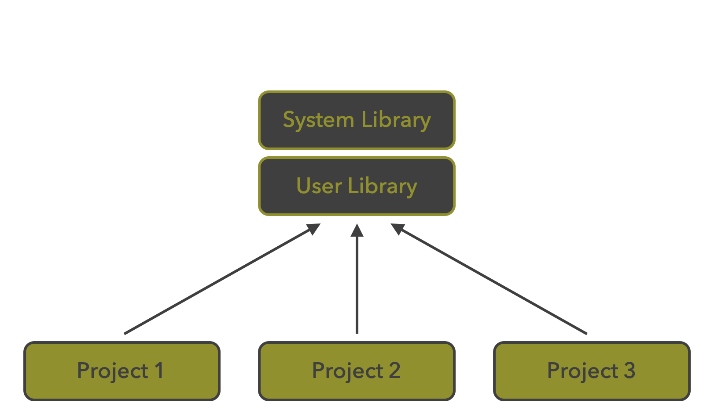
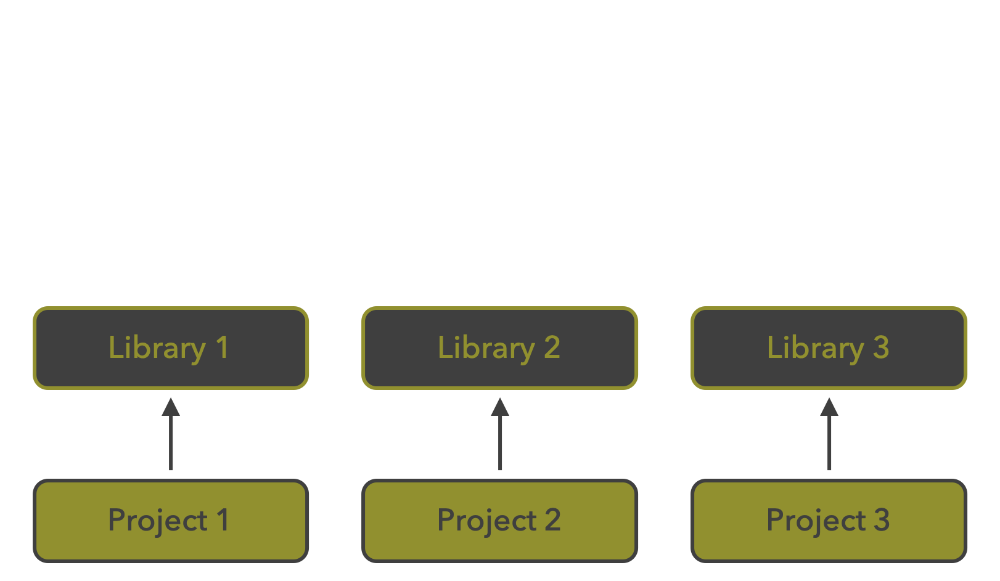
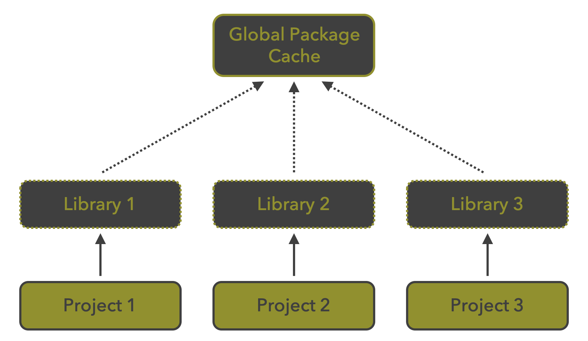
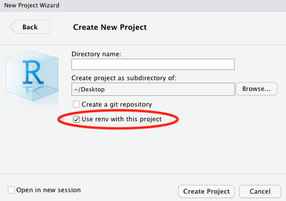

## Degrees of Reproducibility

`r fontawesome::fa_i("thumbs-up", class = "emph")` &nbsp;Research compendium<br/>
`r fontawesome::fa_i("thumbs-up", class = "emph")` &nbsp;Version control<br/>
`r fontawesome::fa_i("thumbs-up", class = "emph")` &nbsp;Literate programming<br/>
`r fontawesome::fa_i("thumbs-up", class = "emph")` &nbsp;Code refactoring

--

<br/>

What about R packages (and their versions)&nbsp;`r fontawesome::fa_i("question-circle")`

--

  - What are the packages versions used for my project?
  - Will my project be usable on other system or in the future?
  - How to deal with projects requiring different versions of a package?
  


---

## The package `renv`

.pull-leftt[
.center[[](https://rstudio.github.io/renv/articles/renv.html)]
]

.pull-rightt[
- Developed by [**Kevin Ushey**](https://kevinushey.github.io/), also maintainer of the package [`reticulate`](https://rstudio.github.io/reticulate/)
- [`renv`](https://rstudio.github.io/renv/articles/renv.html) is a toolkit used to manage project-local libraries of `r fontawesome::fa_i("r-project")` packages
- `renv` is the successor of [`packrat`](https://rstudio.github.io/packrat/)
]

--

`renv` makes your project more:

`r fontawesome::fa_i("hand-point-right", class = "emph")` &nbsp;**Isolated**: 
each project has its own library of `r fontawesome::fa_i("r-project")` packages.

`r fontawesome::fa_i("hand-point-right", class = "emph")` &nbsp;**Portable** and **reproducible**: 
`renv` captures the state of your `r fontawesome::fa_i("r-project")` packages 
within a _lockfile_.

--

<br/>

Inspired from `r fontawesome::fa_i("python")` and the `venv` module.

---

## Libraries _vs_ packages

--

`r fontawesome::fa_i("hand-point-right")` &nbsp;`Package` - a 
collection of `r fontawesome::fa_i("r-project")` functions, data, and compiled 
code in a well-defined format. 

`r fontawesome::fa_i("hand-point-right")` &nbsp;`Library` - the 
directory into which packages are installed.


--

<br />

By default, `r fontawesome::fa_i("r-project")` has two (or more) libraries:

```{r eval=FALSE}
.libPaths()
## [1] "/Users/nicolascasajus/Library/R/4.1/library"
## [2] "/Library/Frameworks/R.framework/Versions/4.1/Resources/library"
```

The first is the **user** library and the second the **system** library.

--

<br/>

```{r eval=FALSE}
find.package("rmarkdown")
## [1] "/Users/nicolascasajus/Library/R/4.1/library/rmarkdown"

find.package("base")
## [1] "/Library/Frameworks/R.framework/Resources/library/base"
```

---

## The `r fontawesome::fa_i("r-project")` system

.center[

]

All projects share the same versions of installed packages

---

## With `renv`

.pull-left[
.center[]
The `r fontawesome::fa_i("r-project")` system
]
.pull-right[
.center[]
The `renv` system
]


---

## With `renv` - Global package cache

.pull-left[
.center[]
The `r fontawesome::fa_i("r-project")` system
]
.pull-right[
.center[]
The `renv` system
]


---

## Initialization

- Installation

```{r eval=FALSE}
## Install renv ----
install.package("renv")
```

<br />

--

- Initialization from command line

```{r eval=FALSE}
## Initiate renv for the project ----
renv::init()
```

--

- Initialization with RStudio

.center[]

---

## Initialization

When you open the project you will see this welcome message:

```
R version 4.1.2 (2021-11-01) -- "Bird Hippie"
Copyright (C) 2021 The R Foundation for Statistical Computing
Platform: x86_64-apple-darwin17.0 (64-bit)

* Project '~/Desktop/myproject' loaded. [renv 0.14.0]
>
```

This means that the project is currently using the `renv` system

---

## Infrastructure

What happened?

```
.
├── (.git)
├── (.gitignore)
│
├── (myproject.Rproj)
│
├── .Rprofile
│
├── renv
│   ├── .gitignore
│   ├── activate.R
│   ├── library
│   └── settings.dcf
│
└── renv.lock
```

---

## Infrastructure

What happened?

```
.
├── (.git)             # Git files
└── (.gitignore)       # Untracked files by git
```


---

## Infrastructure

What happened?

```
.
├── (.git)             # Git files
├── (.gitignore)       # Untracked files by git
│
└── (myproject.Rproj)  # RStudio files
```

---

## Infrastructure

What happened?

```
.
├── (.git)             # Git files
├── (.gitignore)       # Untracked files by git
│
├── (myproject.Rproj)  # RStudio files
│
└── .Rprofile          # Activate renv on project opening
```


---

## Infrastructure

What happened?

```
.
├── (.git)             # Git files
├── (.gitignore)       # Untracked files by git
│
├── (myproject.Rproj)  # RStudio files
│
├── .Rprofile          # Activate renv on project opening
│
└── renv
    ├── .gitignore     # Ignore large renv files (e.g. packages)
    ├── activate.R     # R script to launch renv
    ├── library        # R packages
    └── settings.dcf   # renv settings
```


---

## Infrastructure

What happened?

```
.
├── (.git)             # Git files
├── (.gitignore)       # Untracked files by git
│
├── (myproject.Rproj)  # RStudio files
│
├── .Rprofile          # Activate renv on project opening
│
├── renv
│   ├── .gitignore     # Ignore large renv files (e.g. packages)
│   ├── activate.R     # R script to launch renv
│   ├── library        # R packages
│   └── settings.dcf   # renv settings
│
└── renv.lock          # Packages metadata
```


---

## The lockfile `renv.lock`

```
{
  "R": {
    "Version": "4.1.2",
    "Repositories": [
      {
        "Name": "CRAN",
        "URL": "https://cloud.r-project.org"
      }
    ]
  },
  "Packages": {
    "renv": {
      "Package": "renv",
      "Version": "0.14.0",
      "Source": "Repository",
      "Repository": "CRAN",
      "Hash": "30e5eba91b67f7f4d75d31de14bbfbdc"
    }
  }
}
```

This is a simple **JSON** file that specifies metadata on the `r fontawesome::fa_i("r-project")` version and all packages used for the project

--

- With this _lockfile_ you freeze (and document) your `r fontawesome::fa_i("r-project")` environment

- To collaborate with others you **only** need to share this file

`r fontawesome::fa_i("hand-point-right", class = "emph")` &nbsp;Reproducibility

---

## Installing packages

To install packages with `renv`, use the function `renv::install()`

You can install the latest version of a package, a specific version of a package,
a package from GitHub, GitLab...

```{r eval = FALSE}
## Install the latest version ----
renv::install("devtools")

## Install a specific version ----
renv::install("devtools@2.3.0")

## Install the development version from GitHub ----
renv::install("r-lib/devtools")
```

--

<br />

If you have a `DESCRIPTION` file you can install all required packages as follow:

```{r eval = FALSE}
## Install (latest versions) of packages listed in DESCRIPTION ----
renv::install()
```

--

Using `renv::install()` without argument will also screen `R` and `Rmd` files and
install packages mentioned as `library(pkg)`, `require(pkg)`, and `pkg::fun()`


---

## Removing packages


---

## Cleaning the local environment


---

## Collaborating with `renv`


---

## Saving the local environment


---

## Restoring the local environment


---

## Resources

- https://environments.rstudio.com/docker
- https://kevinushey-2020-rstudio-conf.netlify.app/slides.html
- https://elise.maigne.pages.mia.inra.fr/2021_package_renv/presentation.html
- https://rstudio.github.io/renv/articles/renv.html
- https://maxmasnick.com/kb/rlang/package-management/
- https://6chaoran.wordpress.com/2020/07/20/introduction-of-renv-package/
- https://rpubs.com/glennwithtwons/reproducible-r-toolbox


---

## Other features


---

## Wrap-up

```{r eval=FALSE}
## Initiate renv for the project ----
renv::init()

## Install < pkg_name > for the project ----
renv::install("pkg_name")

## Install packages listed in the DESCRIPTION file ----
renv::install()   # or, remotes::install_deps()

## Remove unnecessary packages ----
renv::remove("pkg_name")

## Check renv status ----
renv::status()

## Update list of required packages ----
renv::clean()

## Save local environment ----
renv::snapshot()

## Restore local environment ----
renv::restore()

## Deactivate local environment ----
renv::deactivate()

## (Re)activate local environment ----
renv::activate()
```
