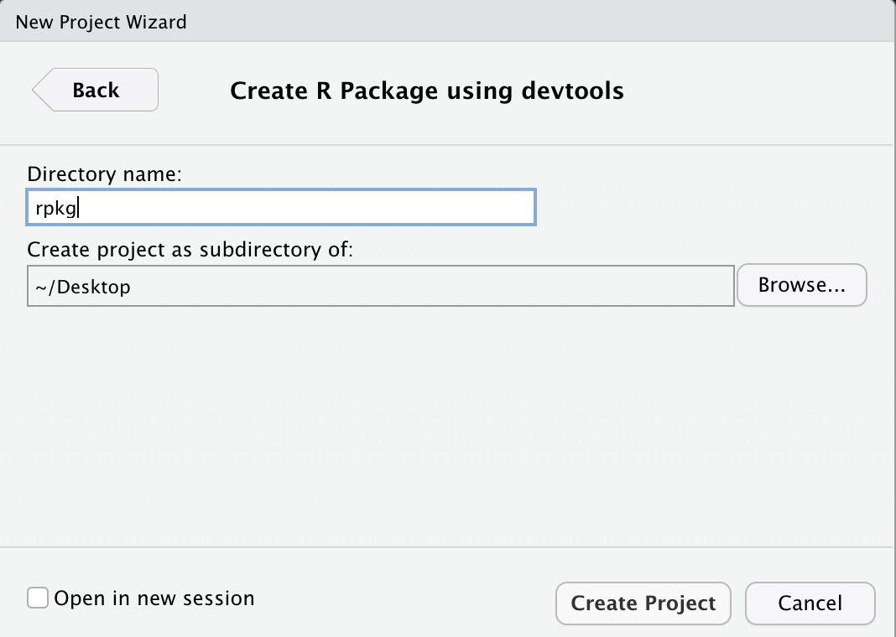
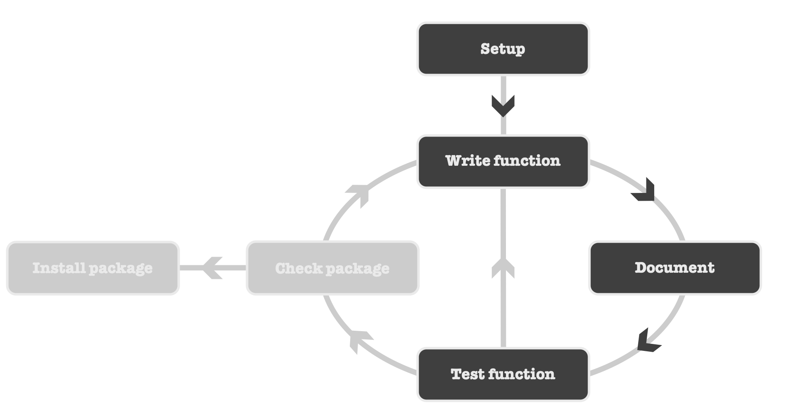
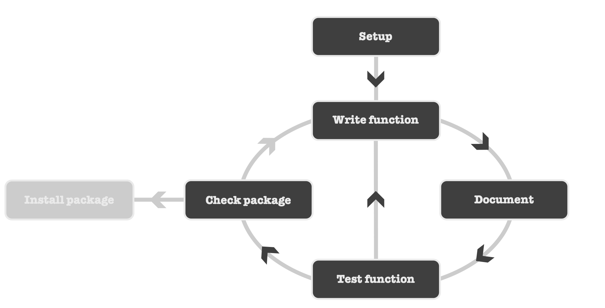

## What's an R Package?

--

`r fontawesome::fa_i("quote-left")` &nbsp;
In `r fontawesome::fa_i("r-project")`, the fundamental unit of shareable code is 
the package. 
A package bundles together `code`, `data`, `documentation`, and `tests`, 
and is easy to share.

.right[&mdash;&nbsp;&nbsp;**_Hadley Wickham_**]

--

<br />

An `r fontawesome::fa_i("r-project")` package:

- is a collection of `well-documented functions`
- makes your work more `reproducible`
- makes your code `useful` for you and for others


---

## What's an R Package?

- As of today (`r Sys.Date()`), **`r nrow(available.packages())`** packages are 
available on the [`CRAN`](https://cran.r-project.org)
- And many more on `GitHub` and `Bioconductor`

--

<br />

- Must-read resources:

.center[
[](https://r-pkgs.org/)
&nbsp;
[](https://cran.r-project.org/doc/manuals/r-release/R-exts.html)
&nbsp;
[](https://www.taylorfrancis.com/books/9781315381305)
]


---

## Recommended environment

<br />

.center[

]

.center[


]


---

## Development workflow

<br />


---

## Creating the structure

<br />


---


## Creating the structure

<!-- - Using **RStudio** -->


.center[
&nbsp;
&nbsp;

]

`r fontawesome::fa_i("hand-point-right")` &nbsp;Make sure to select &nbsp;`Create R Package using devtools`

`r fontawesome::fa_i("hand-point-right")` &nbsp;A **package name**
can only contain `letters`, `numbers`, and the `.`

--

<br />

```{r echo = TRUE, eval = FALSE}
## Alternatively ----
usethis::create_package("/absolute/path/to/the/package/name")
```


---

## Package structure

```
.
├── (.git)              # Git files system
├── (.gitignore)        # Untracked files by git
│
├── (mypkg.Rproj)       # RStudio files
│
├── .Rbuildignore       # List of non-standard package files
│
├── R/                  # Folder to store (only) R functions
│   ├── myfun-1.R       # A first R function 
│   └── myfun-2.R       # A second R function
│
├── man/                # R functions documentation folder (automatically edited)
│   ├── my_fun_1.Rd
│   └── my_fun_2.Rd
│
├── DESCRIPTION         # Package metadata
│
└── NAMESPACE           # Automatically edited
```


---

## Writing an R function

<br />


---

## Writing an R function

`r fontawesome::fa_i("hand-point-right")` &nbsp;
Let's create a first function `moyenne()`


--

<br />

- First, we will create a new `r fontawesome::fa_i("r-project")` file in the folder **R/**

```{r, echo = TRUE, eval = FALSE}
usethis::use_r("moyenne")
```


--

<br />

- Now we can implement our function `moyenne()`

```{r, echo = TRUE, eval = FALSE}
moyenne <- function(x) sum(x) / length(x)
```

`r fontawesome::fa_i("hand-point-right")` &nbsp;
Resources: [`Tidyverse style guide`](https://style.tidyverse.org/)


---

## Time to document

<br />


---

## Time to document

.pull-leftt[
.center[[](https://cran.r-project.org/web/packages/roxygen2/vignettes/roxygen2.html)]
]

.pull-rightt[
- Specially-structured comments **preceding** each function definition
- Lightweight syntax easy to write and to read
- Syntax: `#' @field value`
- Keep function definition and documentation in the same file
- Automatically write `.Rd` files and **NAMESPACE**
]

--

Each `roxygen` header will always start with these two fields:

```{r, echo = TRUE, eval = FALSE}
#' @title Short title of the function (one line)
#'
#' @description A longer description of what the function does (several lines)
```

--

`r fontawesome::fa_i("hand-point-right")` &nbsp;
Keywords `@title` and `@description` can be omitted

```{r, echo = TRUE, eval = FALSE}
#' Short title of the function (one line)
#'
#' A longer description of what the function does (several lines)
```


---

## Time to document

`r fontawesome::fa_i("hand-point-right")` &nbsp;
If your function has `parameters`, each one must be documented

```{r, echo = TRUE, eval = FALSE}
#' @param param_1 description
#' @param param_2 description
```

--

For example with our function `moyenne()`

```{r, echo = TRUE, eval = FALSE}
#' @param x a numeric vector
```

--

<br />

`r fontawesome::fa_i("hand-point-right")` &nbsp;
If your function `returns` an `r fontawesome::fa_i("r-project")` object, 
use the keyword `@return`

```{r, echo = TRUE, eval = FALSE}
#' @return What the function returns.
```

--

For example with our function `moyenne()`

```{r, echo = TRUE, eval = FALSE}
#' @return A `numeric` representing the arithmetic mean of `x`.
```

--

If your function returns nothing, use the keyword `@return` as follow:

```{r, echo = TRUE, eval = FALSE}
#' @return No return value.
```


---

## Time to document

`r fontawesome::fa_i("hand-point-right")` &nbsp;
Add a section `@examples` to show how to use your function

```{r, echo = TRUE, eval = FALSE}
#' @examples
#' x <- 1:10
#' moyenne(x)
```

--

<br />

If you don't want your example to be executed use `\dontrun{}` 
(**only** in case your example returns an error or in case of time consuming code)

```{r, echo = TRUE, eval = FALSE}
#' @examples
#' \dontrun{
#' x <- 1:10
#' moyenne(x)
#' }
```

--

<br />

`r fontawesome::fa_i("hand-point-right")` &nbsp;
You can also add a reproducible example (stored in `data/`)


---

## Time to document

`r fontawesome::fa_i("hand-point-right")` &nbsp;
Finally if you want your function to be used directly by user you need to add this tag

```{r, echo = TRUE, eval = FALSE}
#' @export
```


---

## Time to document

Back to our function

```{r, echo = TRUE, eval = FALSE}
#' Compute the arithmetic mean
#'
#' This function computes the arithmetic mean of a numeric variable.
#'
#' @param x a numeric vector
#'
#' @return A `numeric` representing the arithmetic mean of `x`.
#'
#' @export
#'
#' @examples
#' x <- 1:10
#' moyenne(x)

moyenne <- function(x) sum(x) / length(x)
```


---

## Generating the doc

`r fontawesome::fa_i("hand-point-right")` &nbsp;
It's time to generate the corresponding `.Rd` file from this `roxygen` header

```{r echo = TRUE, eval = FALSE}
devtools::document()
```

```
✓ Writing 'man/moyenne.Rd'
✓ Writing 'NAMESPACE'
```

--

<br />

In addition to the creation of `man/moyenne.Rd` file, the `NAMESPACE` has been updated

```{r, eval = FALSE}
# Generated by roxygen2: do not edit by hand
export(moyenne)
```

`r fontawesome::fa_i("hand-point-right")` &nbsp;
As we can see this file lists which functions need to be exported, i.e. directly
usable when loading the package (this file also deals with external dependencies).


---

## Testing the function


<br />



---

## Testing the function


`r fontawesome::fa_i("hand-point-right")` &nbsp;
Before going any further we have to try our function. So we will load our package 
(and **NOT** sourcing the function)

```{r, echo = TRUE, eval = FALSE}
devtools::load_all()
```

--

<br />

Now we can use our function

```{r, echo = TRUE, eval = FALSE}
moyenne(c(1, 2))
```

```
## [1] 1.5
```

--

<br />

What about `NA`?


```{r, echo = TRUE, eval = FALSE}
moyenne(c(1, 2, NA))
```

```
## [1] NA
```

***Hum...***


---

## Modifying the function


Our function does not seem to work properly

`r fontawesome::fa_i("hand-point-right", class = "dark")` &nbsp;
We need to change the code to deal with `NA` values.

--

```{r, echo = TRUE, eval = FALSE}
moyenne <- function(x) {
  x <- na.omit(x)
  sum(x) / length(x)
}
```

--

<br />

Let's test the function again:

```{r, echo = TRUE, eval = FALSE}
## Reload the function ----
devtools::load_all()

## Testing the function ----
moyenne(c(1, 2))
## [1] 1.5

## Testing the function (with NA) ----
moyenne(c(1, 2, NA))
## [1] 1.5
```


---

## Modifying the function

That's better, but...

If user has `NA` values, this implementation will not inform him and will make the 
decision to remove `NA`. Instead we are going to let user choose to delete the 
`NA` or not.

--

<br />

`r fontawesome::fa_i("hand-point-right")` &nbsp;
Let's add an additional parameter to our function: `na_rm` with a default value 
(`FALSE`). If `x` contains `NA` values and `na_rm = FALSE`, then an error will 
be returned. Otherwise (`na_rm = TRUE`) `NA` values will be removed and the 
computation can be done.

--


```{r, echo = TRUE, eval = FALSE}
moyenne <- function(x, na_rm = FALSE) {
  if (any(is.na(x))) {
    if (na_rm) {
      x <- na.omit(x)
    } else {
      stop("Argument 'x' contains NA values. Use 'na_rm = TRUE' to remove missing values.")
    }
  }
  sum(x) / length(x)
}
```

---

## Modifying the function

Let's test the function again

```{r, echo = TRUE, eval = FALSE}
## Reload the function ----
devtools::load_all()

## Testing the function ----
moyenne(x = c(1, 2))
## [1] 1.5

moyenne(x = c(1, 2, NA))
## Error in moyenne(x = c(1, 2, NA)):
## Argument 'x' contains NA values. Use 'na_rm = TRUE' to remove missing values.

moyenne(x = c(1, 2, NA), na_rm = TRUE)
## [1] 1.5
```


---

## Update documentation


<br />


---

## Update documentation

```{r, echo = TRUE, eval = FALSE}
#' Compute the arithmetic mean
#'
#' This function computes the arithmetic mean of a numeric variable.
#'
#' @param x a numeric vector (can contain `NA` values).
#' 
#' @param na_rm a logical value indicating whether `NA` values should be
#' stripped before the computation proceeds. Default is `FALSE`.
#'
#' @return A `numeric` representing the arithmetic mean of `x`.
#'
#' @details An error will be returned if `x` contains `NA` values and `na_rm` 
#' is `FALSE` (default behaviour).
#'
#' @export
#'
#' @examples
#' moyenne(x = c(1, 2))
#' 
#' \dontrun{
#' moyenne(x = c(1, 2, NA))               # error
#' }
#' 
#' moyenne(x = c(1, 2, NA), na_rm = TRUE)

moyenne <- function(x, na_rm = FALSE) { ... }
```


---

## And so on...


<br />


---

## Package metadata

Before we go any further, we need to edit some information about our package 
using the `DESCRIPTION` file

```{r, echo = TRUE, eval = FALSE}
usethis::edit_file("DESCRIPTION")
```

```
Package: mypkg
Title: A Minimal but Complete R Package
Version: 0.0.0.9000
Authors@R:
    person(given   = "Nicolas",
           family  = "Casajus",
           role    = c("aut", "cre", "cph"),
           email   = "nicolas.casajus@fondationbiodiversite.fr",
           comment = c(ORCID = "0000-0002-5537-5294"))
Description: Illustrates the main structure and components of an R Package with
    respect to the CRAN submission policies <https://cran.r-project.org/>.
License: GPL (>= 2)
Encoding: UTF-8
Roxygen: list(markdown = TRUE)
RoxygenNote: 7.1.2
```

--

<br />

`r fontawesome::fa_i("hand-point-right")` &nbsp;
Resources: [`Documentation file`](https://r-pkgs.org/description.html)
and [`Choose a license`](https://choosealicense.com)


---

## Check package


<br />




---

## Check package

```{r, echo = TRUE, eval = FALSE}
devtools::check()
```

```
── R CMD check results ─────────────────────────────────── mypkg 0.0.0.9000 ───────
Duration: 11.6s

> checking R code for possible problems ... NOTE
  moyenne: no visible global function definition for ‘na.omit’
  Undefined global functions or variables:
    na.omit
  Consider adding
    importFrom("stats", "na.omit")
  to your NAMESPACE file.

0 errors ✓ | 0 warnings ✓ | 1 note x
```


--

<br />

`r fontawesome::fa_i("hand-point-right")` &nbsp;
**One note:** Let's talk about package dependencies!

---

## Package dependencies

`r fontawesome::fa_i("hand-point-right")` &nbsp;
Previously we had the following note:

```
> checking R code for possible problems ... NOTE
  moyenne: no visible global function definition for ‘na.omit’
  Undefined global functions or variables:
    na.omit
  Consider adding
    importFrom("stats", "na.omit")
  to your NAMESPACE file.
```

--

`r fontawesome::fa_i("hand-point-right")` &nbsp;
So we need to import the function `na.omit()` from the package `{stats}`

--

<br />

There is three ways:

```{r, echo = TRUE, eval = FALSE}
## Import the whole package - In roxygen header
@import stats

## Import only a specific function from a package - In roxygen header
@importFrom stats na.omit

## Call the function as follow - In R code
stats::na.omit()
```

---

## Package dependencies

`r fontawesome::fa_i("hand-point-right")` &nbsp;
Prefer calling external function as `package::function()` for clarity<br />
For instance: `stats::na.omit()`


---

## Package dependencies

`r fontawesome::fa_i("hand-point-right")` &nbsp;
Prefer calling external function as `package::function()` for clarity<br />
For instance: `stats::na.omit()`

```{r, echo = TRUE, eval = FALSE}
moyenne <- function(x, na_rm = FALSE) {
  if (any(is.na(x))) {
    if (na_rm) {
      x <- stats::na.omit(x)
    } else {
      stop("Argument 'x' contains NA values. Use 'na_rm = TRUE' to remove missing values.")
    }
  }
  sum(x) / length(x)
}
```

---

## Package dependencies

`r fontawesome::fa_i("hand-point-right")` &nbsp;
Prefer calling external function as `package::function()` for clarity<br />
For instance: `stats::na.omit()`


<br />

`r fontawesome::fa_i("hand-point-right")` &nbsp;
Use `roxygen` tag `@importFrom` (or `@import`) if you need to call functions many times
(i.e. `ggplot2`)


---

## Package dependencies

`r fontawesome::fa_i("hand-point-right")` &nbsp;
Prefer calling external function as `package::function()` for clarity<br />
For instance: `stats::na.omit()`


<br />

`r fontawesome::fa_i("hand-point-right")` &nbsp;
Use `roxygen` tag `@importFrom` (or `@import`) if you need to call functions many times
(i.e. `ggplot2`)


```{r, echo = TRUE, eval = FALSE}
#' Compute the arithmetic mean
#'
#' This function computes the arithmetic mean of a numeric variable.
#'
#' @param x a numeric vector (can contain `NA` values).
#' @param na_rm a logical value indicating whether `NA` values should be
#' stripped before the computation proceeds. Default is `FALSE`.
#'
#' @return A `numeric` representing the arithmetic mean of `x`.
#'
#' @export
#' 
#' @importFrom stats na.omit
#'
#' @examples
#' [...]

moyenne <- function(x, na_rm = FALSE) { ... }
```


---

## Package dependencies

`r fontawesome::fa_i("hand-point-right")` &nbsp;
Prefer calling external function as `package::function()` for clarity<br />
For instance: `stats::na.omit()`


<br />

`r fontawesome::fa_i("hand-point-right")` &nbsp;
Use `roxygen` tag `@importFrom` (or `@import`) if you need to call functions many times
(i.e. `ggplot2`)


<br />

**Do not forget** to update the `NAMESPACE` with `devtools::document()`


```
export(moyenne)
importFrom(stats,na.omit)
```

--

<br />

**NB.** The `NAMESPACE` controls what happens when our package is loaded but 
not when it's installed. This is the role of `DESCRIPTION` and we need to add 
dependencies to this file.


---

## Package dependencies

Let's add the dependency `stats` in the `DESCRIPTION` file.


```{r, echo = TRUE, eval = FALSE}
usethis::use_package("stats", type = "Imports")
```

--

<br/>

```
Package: mypkg
Title: A Minimal but Complete R Package
Version: 0.0.0.9000
Authors@R:
    person(given   = "Nicolas",
           family  = "Casajus",
           role    = c("aut", "cre", "cph"),
           email   = "nicolas.casajus@fondationbiodiversite.fr",
           comment = c(ORCID = "0000-0002-5537-5294"))
Description: Illustrates the main structure and components of an R Package with
    respect to the CRAN submission policies <https://cran.r-project.org/>.
License: GPL (>= 2)
Encoding: UTF-8
Roxygen: list(markdown = TRUE)
RoxygenNote: 7.1.2
Imports:
    stats
```


---

## Dependencies types

- `Depends`: packages listed in this field are `installed` when your package is 
installed and are `attached` when your package is attached. 
**NEVER** use `Depends` and always use `Imports` (except for special cases)

--

- `Imports`: packages listed in this field are `installed` when your package is 
installed but are `not attached` when your package is attached (there are just loaded). 
**ALWAYS** use this method

--

- `Suggests`: packages listed in this field are `not installed` when your 
package is installed. Your package can use these packages, but doesn't require 
them (e.g. to run tests, build vignettes, etc.)

--

<br/>

`r fontawesome::fa_i("hand-point-right", )` &nbsp;
Resources: Wickham - R Package
[**Chap 8.1**](https://r-pkgs.org/description.html#dependencies) and 
[**Chap 13.6**](https://r-pkgs.org/namespace.html#imports)


---

## Check package


<br />


---

## Check package


```{r, echo = TRUE, eval = FALSE}
devtools::check()
```

```
── R CMD check results ─────────────────────────────────── mypkg 0.0.0.9000 ───────
Duration: 11.6s

0 errors ✓ | 0 warnings ✓ | 0 notes ✓
```

---

## Install package


<br />


---

## Install package


```{r, echo = TRUE, eval = FALSE}
## Install package ----
devtools::install()
```

--

<br />

`r fontawesome::fa_i("hand-point-right", )` &nbsp;
Now we can use our package

```{r, echo = TRUE, eval = FALSE}
## Load and attach the package ----
library("mypkg")

## Use the package ----
moyenne(c(1, 2))
```

```{r, echo = TRUE, eval = FALSE}
## Use the package (without attaching it) ----
mypkg::moyenne(c(1, 2))
```


---

class: inverse, center, middle

## To go further...


---

## Advanced tests

- Testing is a vital part of package development
- But until now we just tried our code informally and on the fly
- Problem: it's time consuming, repetitive and it can break the code


`r fontawesome::fa_i("hand-point-right")` &nbsp;
Package `{testthat}`

.pull-leftt[
.center[[](https://testthat.r-lib.org)]
]

.pull-rightt[
- Implements a lot of unit tests
- Formal automated testing
- Explicits how your code should behave
- Makes your code more robust
]


```{r, echo = TRUE, eval = FALSE}
usethis::use_testthat()
```

<br />

`r fontawesome::fa_i("hand-point-right")` &nbsp;
Resources: 
[**R Package Chap 12**](https://r-pkgs.org/tests.html)


---

## Add a vignette


.pull-leftt[
.center[[](https://rmarkdown.rstudio.com/)]
]

.pull-rightt[
- A tutorial for your package
- Shows how to use your package
- Uses the syntax `Rmarkdown`
]


```{r, echo = TRUE, eval = FALSE}
usethis::use_vignette("mypkg")
```

<br />

`r fontawesome::fa_i("hand-point-right")` &nbsp;
Resources: 
[**R Package Chap 11**](https://r-pkgs.org/vignettes.html)


---

## And...

- Deploy on **GitHub** - `usethis::use_github()`
- Add a **README** (and badges) - `usethis::use_readme_rmd()`
- Add a **Website** with `pkgdown`
- Add a **Logo** with `hexSticker`
- CI/CD with **GitHub Actions** - `usethis::use_github_action_*()`
- Check your package with `rhub`
- Add a **DOI** with Zenodo
- Add a **NEWS** file - `usethis::use_news_md()`

<br />

- Submit to CRAN - `devtools::submit_cran()`

<br />

The ultimate resource: [**https://r-pkgs.org**](https://r-pkgs.org)

--

<br />

`r fontawesome::fa_i("hand-point-right")` &nbsp;Now your turn!

