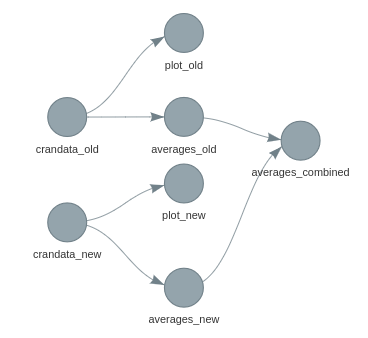
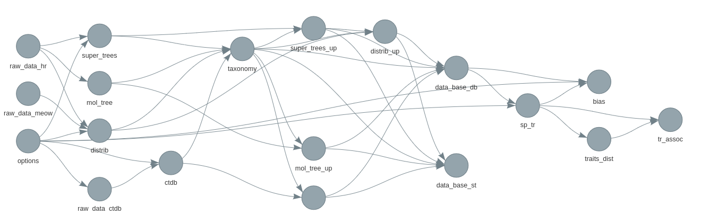
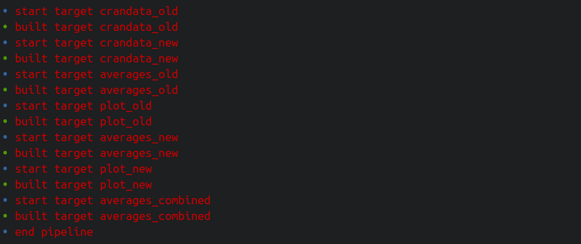
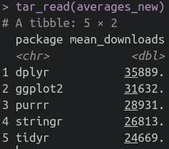
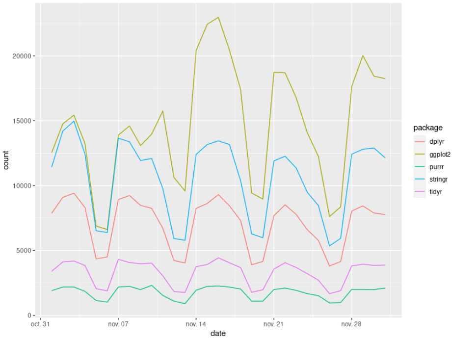
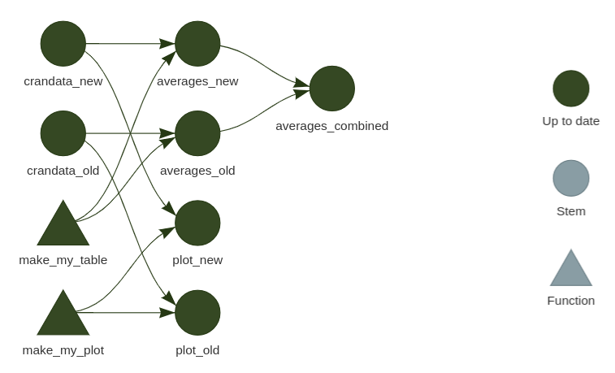
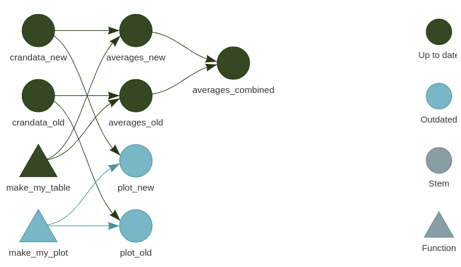
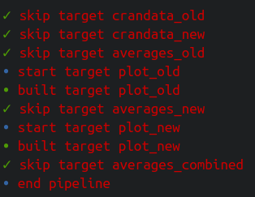
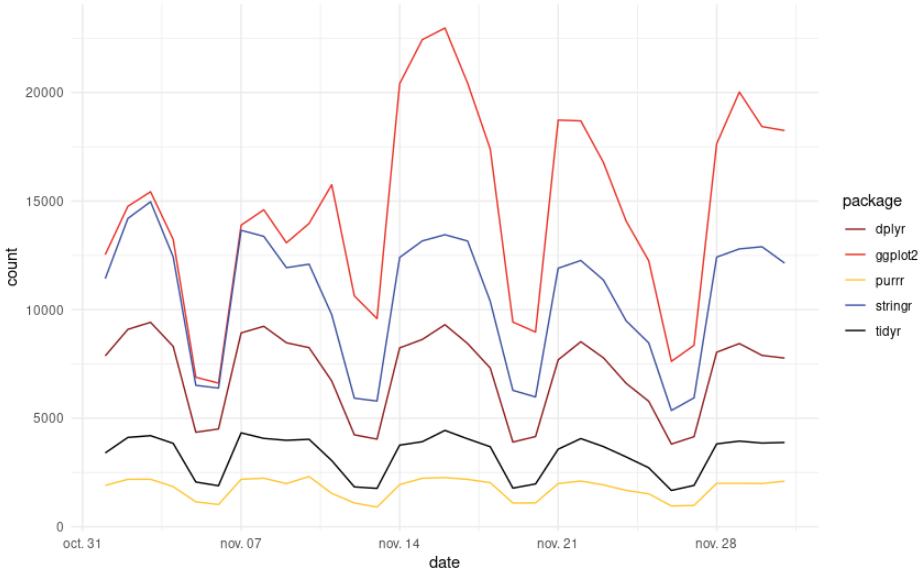
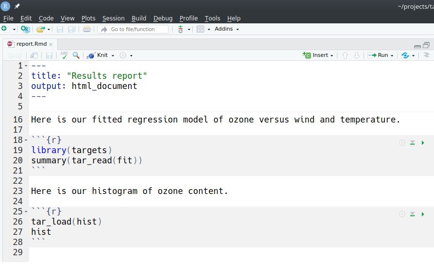

---
class: inverse, center, middle

# What is targets?

```{r setup, include=FALSE}
knitr::opts_chunk$set(
  fig.path   = 'assets/chunks/',
  cache.path = "assets/cache/"
)
options(htmltools.dir.version = FALSE)
```


---
# Large data science project struggles

1) Long runtimes

2) Many tasks

3) Interconnected tasks


.center[]

---
# The Sisyphean workflow

1) Launch the code

2) Wait while it runs

3) Discover an issue

4) Restart from scratch

.center[]
---


# targets to the rescue

**targets** is a workflow manager for your R code

.pull-left[

- Keeps track of interconnected elements

- Automatically launches the parts that changed since last time and skips the rest

- Tangible evidence of reproducibility

- Big data efficiency

- Readibility and transparancy
]


.pull-right[.center[]]

---
# Use functions


```{r, eval = FALSE}
mydata     <- read.csv("mydata.csv")
data2      <- clean(mydata)
data3      <- transform(data2)
data4      <- erase_na(data3)
data_clean <- transform(data_4)
```

```{r, eval=FALSE}
mydata <- read.csv("mydata.csv")
wrangle <- function(data){
  data2      <- clean(data)
  data3      <- transform(data2)
  data4      <- erase_na(data3)
  data_clean <- transform(data_4)
  return(data_clean)
}
data_clean <- wrangle(mydata)
```


---

class: inverse, center, middle

# How does it work?

---
# Targets

In targets, a data analysis pipeline is a collection of target objects that express the individual steps of the workflow

- a target is a step of your pipeline (can also be an input file or an Rmd report)

- each target is defined using the function 'tar_target', providing the name of the target as first argument and the function to create it as a second argument, there is a third optional argument to specify the 'type' of the target

- dependencies between targets are exposed because upstream targets are arguments of the functions used to build downstream targets

- this allow to visualize the pipeline as a dependency graph

---
# Key functions

-  tar_target(): create a target

-  tar_make(): run the pipeline

-  tar_load(): load one built target into your R session (tar_load(a_target))

-  tar_read(): read and return a built target (a <- tar_read(a_target))

-  tar_glimpse(): show targets inter-dependencies

-  tar_visnetwork(): show a complete visual network representation of your workflow


---
# Creating the pipeline (the _targets.R file)

The pipeline is written in a special `_targets.R` file located at the root of your project.


```{r, eval=FALSE}
# _targets.R file
library(targets)
source("R/functions.R")

list(
  tar_target(raw_data_file, "data/raw_data.csv", format = "file"
  ), #make the workflow depends on the raw data file
  tar_target(raw_data, read_csv(raw_data_file)
  ), #read the data, return a data.frame
  tar_target(data,
    raw_data %>% filter(!is.na(Ozone))
  ), #transform the data
  tar_target(hist, create_plot(data)), #explore the data (custom function)
  tar_target(fit, lm(Ozone ~ Wind + Temp, data)) #model the data
)

```

---
# Visualizing the pipeline




---
# Creating the pipeline

All target script files have these requirements.

1. Load the [`targets`](https://github.com/ropensci/targets) package itself.  
1. Load your custom functions and global objects into the R session :`source("R/functions.R")`.  
1. Define individual targets with the `tar_target()` function. Each target is an intermediate step of the workflow. At minimum, a target must have a name and an R expression.  
1. Every target script must end with a list of your `tar_target()` objects.

---
# Targets storage

Targets (when they success to run) are all stored in `_targets/objects`, this allow their examination and sharing outside of the project.

That's very cool !
---
# Example long project

---
# Workflow

1) Write a function

2) Add a target to the pipeline

3) visualize the pipelie

4) Make the pipeline

5) Check the results

6) Write a function
...
...
---
# Example: analysis R package downloads

```{r}
crandata <- cranlogs::cran_downloads(
  packages = c("dplyr", "ggplot2", "purrr", "tidyr", "stringr"),
  when = "last-month")
head(crandata)
```
---

## Some custom functions

```{r, eval=FALSE}

# R/my_functions.R

# packages
library(ggplot2)
library(targets)
library(dplyr)
library(cranlogs)

# functions
make_my_table <- function(downloads){
  group_by(downloads, package) %>%
    summarize(mean_downloads = mean(count))
}


make_my_plot <- function(downloads){
  ggplot(downloads) +
    geom_line(aes(x = date, y = count, group = package,
                  color = package))
}
```
---

## The pipeline

```{r, eval = FALSE}
library(targets)
source("R/my_functions.R")
list(
  # load data
  tar_target(crandata_new, cran_downloads(
    packages = c("dplyr", "ggplot2", "purrr", "tidyr", "stringr"),
    from = "2019-11-01", to = "2019-12-01")),
  tar_target(crandata_new, cran_downloads(
    packages = c("dplyr", "ggplot2", "purrr", "tidyr", "stringr"),
    from = "2016-11-01", to = "2016-12-01")),
  # make tables
  tar_target(averages_new, make_my_table(crandata_new)),
  tar_target(averages_old, make_my_table(crandata_old)),
  # make plots
  tar_target(plot_new, make_my_plot(crandata_new)),
  tar_target(plot_old, make_my_plot(crandata_old)),
  # combine
  tar_target(averages_combined, left_join(averages_old, averages_new, by = "package"))
)
```
---
## Make the pipeline
```{r, eval = FALSE}
library(targets)
tar_make()
```



---
## Read or load results
```{r, fig.height=3, eval = FALSE}
a <- tar_read(averages_new)
tar_load(averages_new)
```




---
## Read or load results
```{r, fig.height=3, eval = FALSE}
tar_read(plot_old)
```





---
## Vizualize the workflow
```{r, eval = FALSE}
tar_visnetwork()
```



---
## targets loves changes

```{r, eval = FALSE}
library(fishualize)
make_my_plot <- function(downloads){
  ggplot(downloads) +
    geom_line(aes(x = date, y = count, group = package, color = package)) +
    scale_color_fish_d() +
    theme_minimal()
}
```

---
## targets loves changes

```{r, eval = FALSE}
tar_visnetwork()
```


---
## targets loves changes
```{r, fig.height=3, eval = FALSE}
tar_make()
```



---
## targets loves changes
```{r, fig.height=3, eval = FALSE}
tar_read(plot_old)
```



---
# External input files

To reproducibly track an external input file, you need to define a new target that has

1. A command that returns the file path as a character vector, and 
2. `format = "file"` in `tar_target()`.

When the target runs in the pipeline, the returned character vector gets recorded, and `targets` watches the data file and invalidates the target when that file changes. To track multiple files this way, simply define a multi-element character vector where each element is a path. Each element can also be a directory, but this directory must not be empty at the time the target runs.

---
# External input files

```{r, eval = FALSE, echo = TRUE}
# _targets.R
library(targets)
path_to_data <- function() {
  "data/raw_data.csv"
}
list(
  tar_target(
    raw_data_file, path_to_data(), format = "file"
  ),
  tar_target(raw_data, read_csv(raw_data_file, col_types = cols())
  )
)
```

---
# External output files

Output files have the same mechanics as input files. The target uses `format = "file"`, and the return value is a character value of paths to existing files. The only difference here is that the target's R command writes to storage before it returns a value. For example, here is an output file target that saves a visualization.

```{r, eval = FALSE}
tar_target(plot_file, save_plot_and_return_path(), format = "file")
```

Here, our custom `save_plot_and_return_path()` function does exactly what the name describes.

```{r, eval = FALSE}
save_plot_and_return_path <- function() {
  plot <- ggplot(mtcars) +
    geom_point(aes(x = wt, y = mpg))
  ggsave("outputs/plot_file.png", plot, width = 7, height = 7)
  return("outputs/plot_file.png")
}
```

---
# Literate programming

If you render an R Markdown report as part of a target, the report should be lightweight: mostly prose, minimal code, fast execution, and no output other than the rendered HTML/PDF document. In other words, R Markdown reports are just targets that document prior results. The bulk of the computation should have already happened upstream, and the most of the code chunks in the report itself should be terse calls to `tar_read()` and `tar_load()`.

---
# Literate programming

---
# Literate programming

The report depends on targets `fit` and `hist`. The use of `tar_read()` and `tar_load()` allows us to run the report outside the pipeline.  As long as `_targets/` folder has data on the required targets from a previous `tar_make()`, you can open the RStudio IDE, edit the report, and click the Knit button like you would for any other R Markdown report.

---
# Literate programming

The target definition looks like this.

```{r, eval = FALSE}

tar_render(report, "report.Rmd") # Just defines a target object.

```

Because symbols `fit` and `hist` appear in the command, `targets` knows that `report` depends on `fit` and `hist`. When we put the `report` target in the pipeline, these dependency relationships show up in the graph.

---
# Literate programming

```{r, eval = FALSE}
# _targets.R
library(targets)
library(tarchetypes)
source("R/functions.R")
list(
  tar_target(
    raw_data_file,
    "data/raw_data.csv",
    format = "file"
  ),
  tar_target(
    raw_data,
    read_csv(raw_data_file, col_types = cols())
  ),
  tar_target(
    data,
    raw_data %>%
      mutate(Ozone = replace_na(Ozone, mean(Ozone, na.rm = TRUE)))
  ),
  tar_target(hist, create_plot(data)),
  tar_target(fit, biglm(Ozone ~ Wind + Temp, data)),
  tar_render(report, "report.Rmd") # Here is our call to tar_render().
)
```

---
# Recap: Why use targets?

- Optimize your workflow

--
- Reproducible for others and your future self

--
- 100% sure to be reproducible

--
- You can count on **targets**'s brain and work in a clean environment

--
- Package is well maintained and documented with a great [manual](https://books.ropensci.org/targets/)


---

class: inverse, center, middle

# Coding time!
