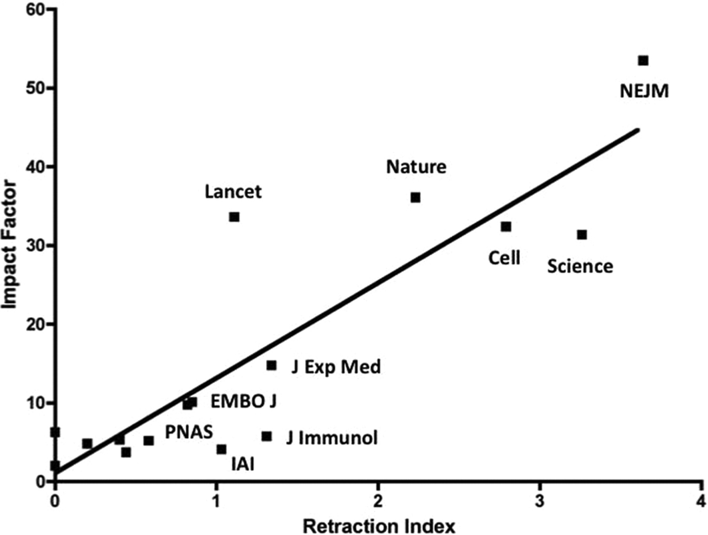

# C'est quoi ?

## Un exemple 

{width=40%}

Galileo Galilei, par Peter Paul Rubens (circa 1630) 
wikimedia commons

## Un exemple

{width=70%}

Figure 1. Two pages (scan) from Galilei's Sidereus Nuncius (“The Starry Messenger” or “The Herald of the Stars”), Venice, 1610.

Goodman et al. (2014) PLoS Comput Biol 10(4): e1003542. doi:10.1371/journal.pcbi.1003542

## Un exemple

{width=100%}

  

Les notes de Galilée intègrent:
  

> - Données (dessins)
  
> - Méta-données (date, météo, carac. lunette)
  
> - Texte (description des méthodes, analyses et conclusions)

## Recherche reproductible
   
données + méta-données + matériel & méthodes

# Pourquoi ? {data-background-video="assets/Bubbles_Animation.mp4" data-background-video-loop="true" data-background-size="cover"}

##

{width=60%}

## Pourquoi on en parle ?

## Pourquoi on en parle ?

{width=100%}

## Pourquoi on en parle ?

{width=100%}

## Pourquoi on en parle ?

{width=60%}

Ferric C. Fang, and Arturo Casadevall Infect. Immun. 2011;79:3855-3859

## Pourquoi on en parle ?

 

{width=100%}

Causes de rétractation
  

> - 40% honest error or nonreplicable findings
  
> - 28% research misconduct
  
> - 17% redundant publication
  
> - 15% other or unstated reasons

## Pourquoi on en parle ?

{width=100%}

# Comment ?

## Recherche reproductible
 

{width=40%}

depuis Galilée le concept a un peut évolué ...

## Recherche reproductible

 

Un article publié n'est que le sommet de l'iceberg que représente le processus de recherche.

 

<blockquote>
"An article about computational results is advertising, not scholarship. The actual scholarship is the full software environment, code and data, that produced the result."
</blockquote>

Claerbout and Karrenbach 1992.  http://sepwww.stanford.edu/doku.php?id=sep:research:reproducible:seg92

"[...] reproducible computational research is to expose more of the research workflow to our audience."

https://ropensci.github.io/reproducibility-guide/sections/introduction/

## Recherche reproductible

 

> - Data Management: saving both raw and intermediate forms; documenting all
steps; creating tidy data amenable to analysis.

> - Software: writing, organizing, and sharing scripts and programs used in an
analysis.

> - Tracking Changes: recording how various components of your project change
over time.

> - Collaboration: making it easy for existing and new collaborators to understand
and contribute to a project.

> - Project Organization: organizing the digital artifacts of a project to ease
discovery and understanding.

> - Manuscripts: writing manuscripts in a way that leaves an audit trail and
minimizes manual merging of conflict.

Wilson et al. 2016. Plos Comp Biol. https://arxiv.org/pdf/1609.00037.pdf

## Data Management

 

Saving both raw and intermediate forms; documenting all
steps; creating tidy data amenable to analysis.

## Data Management

 

> - Sauvegarder les données initiales en l'état.

 

> - Les mettre en lecture seule si possible.

 

> - Scripter l'acquisition des données au maximum (API), surtout si elles sont volumineuses.

 

> - Toute transformation sera scriptée, cela devient un résultat.

 

> - Générer les données que vous voudriez recevoir (tidy)

## Software

 

Writing, organizing, and sharing scripts and programs used in an
analysis.

## Software

Le code, les scripts

> - Respecter au maximum les conventions de code de votre communauté, https://style.tidyverse.org/

 

> - Peut importe la convention adoptée, rester constant !

 

> - Chemins relatifs ! Toujours !

 

> - Pas d'espaces, d'accents dans les noms !

 

> - Commenter/documenter (les fonctions, les scripts)

## Software

L'environnement logiciel.

 

> - Les packages (version) : packrat

 

> - quid des bibliothèques système, de la version de R, de la version de l'OS ?

 

> - Docker (Rocker pour R), permet de créer une image de l'environnement de travail (OS, bibliothèques, R, packages) (https://colinfay.me/docker-r-reproducibility/ ; https://journal.r-project.org/archive/2017/RJ-2017-065/RJ-2017-065.pdf)

## Software

Le "workflow" (echaînement des scripts, des logiciels).

D'une manière générale automatiser au maximum

> - il existe des outils pour ça (pseudo makefile en R, makefile shell, pipeline toolkits [Remake, Drake])

## Tracking Changes

 

Recording how various components of your project change
over time.

## Tracking Changes

Utiliser un logiciel de gestion de versions (Git).

## Collaboration

Making it easy for existing and new collaborators to understand
and contribute to a project.

## Collaboration

 

> - conventions de code

 

> - documentaiton de l'archive de recherche (Readme, License, code de contribution)

 

> - Plateforme de collaboration en ligne (intègre Git !) : github, gitlab

## Project Organization

 

Organizing the digital artifacts of a project to ease
discovery and understanding.

## Project Organization

 

## Project Organization

 

> - Research compendium : organisation du répertoire de travail

 

> - Pipeline toolkit (Drake) : gère les dépendances entre données, scripts et résultats

## Manuscripts

 

Writing manuscripts in a way that leaves an audit trail and minimizes manual merging of conflict.

## Manuscripts

 

Utiliser la programmation lettrée (literate programming)

 

<blockquote> au lieu de considérer que notre tâche principale est de dire à un ordinateur ce qu'il doit faire, appliquons-nous plutôt à expliquer à des êtres humains ce que nous voulons que l'ordinateur fasse.
</blockquote>

Donald Knuth, années 70

## Manuscripts

Rmarkdown (https://rmarkdown.rstudio.com/)

## Manuscripts

 
 

Comment ça marche Rmarkdown ?

En markdown le texte est formaté en utilisant des balises très simples comme les _ ou les *

## Manuscripts

Formats d'export de Rmarkdown (pandoc)

{width=50%}

# On y va ?