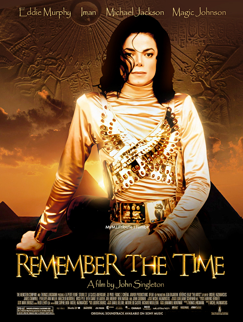

class: inverse, center, middle
## Introduction


---
.center[]
---

## Science is a long and step-by-step procedure

.center[
.img-source-tiny[https://images.slideplayer.com/27/8939519/slides/slide_4.jpg]
]

---
## Remember the time
.pull-right[

.center[]
]
---
## Remember the time

.pull-left[
Track the changes in a project:

- Data gathering: **Lab notebook**
- Data analysis: **Versioning**
- Article writing: **Versioning**
]

.pull-right[

.center[]

]
---
## Remember the time

.pull-left[
Track the changes in a project:

- Data gathering: **Lab notebook**
- Data analysis: **Versioning**
- Article writing: **Versioning**


.center[
.img-source-tiny[https://miro.medium.com/max/472/1*B0Ykkbhw5bzhHkY79cYrWg.jpeg]]

]

.pull-right[

.center[]

]
---
## An example

.center[https://github.com/sdray/ade4/]

---

class: inverse, center, middle

## Introduction to git

---
## git

There are several tools for versioning. This course focuses on `git`.

`git` is a program that takes **snapshots** of a directory tree and helps navigating between those snapshots.
- archiving/documentation of development steps
- backtracking to previous versions
- handling of multiple versions
- collaborative development
- backup (using external servers)

Especially useful when developing software, writing papers. . .
---

## Some definitions

- **repository**: a directory including with a `.git` directory
- **commit**: a snapchot of the repository (a date, an author, a description, a parent)
- **working copy**: a version of the files of the repository on your computer
- **index**: a temporary space including the modficiations to be commited 

<br>

All git commands follow the same pattern:

```{bash, eval = FALSE}
git SUBCMD ARGS ∗
```

---
class: inverse, center, middle

## Starting with git
---
## Create a repository

```{bash, eval = FALSE}
git init
```
<br>

**Demo**
- Create a directory
- Move to the directory
- Initialize the repostitory

---
## Checking the state of the repository

```{bash, eval = FALSE}
git status
```
<br>

**Demo**
- Check the status of your repository

---
## Put a file under version control

```{bash, eval = FALSE}
git add FILE
```
<br>

Files in the directory are ignored by git unless they are explicitly added to the repository

**Demo**
- Create a text file
- Check the status of your repository
- Add the file to your repository
- Check the status of your repository

---
## Take a snapshot

```{bash, eval = FALSE}
git commit -a -m MSG
```
<br>

A snapshot in git is called a commit. The -m option introduces a message describing the changes in the new snapshot.

**Demo**
- Take a snaphsot of your repository
- Check the status of your repository

---
## Print commit history

```{bash, eval = FALSE}
git log
```
<br>


**Demo**
- Display the history


## Print an old version of a file

```{bash, eval = FALSE}
git show COMMIT ID:PATH
```
<br>

You can retrieve commit id using git log. Only the 6-8 letters of the id are generally enough

**Demo**
- Display the content of your text file at the previous commit

---
## Summary

Here are the basic commands to archive your work in a git repo:

| I want to | I use |
|---------------------------------|
|Initialize a new (empty) git repo| git init|
|Put files under version control| git add file1 file2 ...|
|Take a snapshot| git commit -a -m "commit descr"|
|See commit history| git log |
|See previous version of a file| git show aazef345:src/foo.c|

---
class: inverse, center, middle
## Using a distant server
---
class: inverse, center, middle
## Starting a new project on GitHub
---
class: inverse, center, middle
## Dealing with branches
---
class: inverse, center, middle
##Work with others
---
class: inverse, center, middle
## Git and RStudio
---
## Acknowledgments
This presentation is strongly inspired from the slides of Philippe Veber (LBBE)

<br>

A good summary:

.center[
https://github.github.com/training-kit/downloads/fr/github-git-cheat-sheet.pdf]

