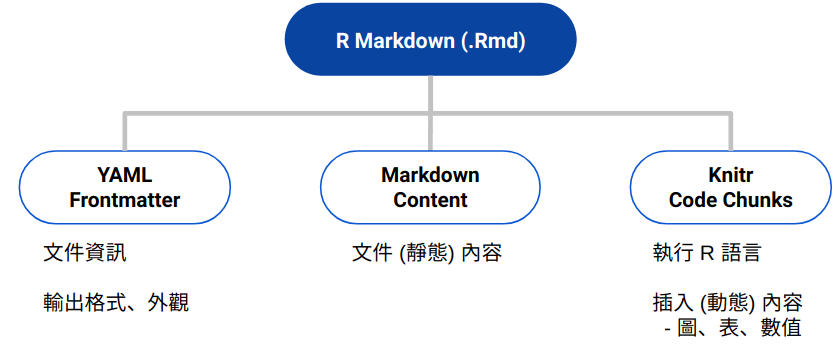

class: inverse, center, middle

## Introduction


---
## Why you should not use Word (or other WYSIWYG editors)

** Demo **
- Create a document with Word
- Put the file under versioning
- Update the file and commit
- Perform a regression model using the `iris` dataset (available in `MASS`)
---
## What we need
- Something that can be easily used in versioning tools
- Something able to integrate text and analysis
- Something that is dynamic

--

.center[]

---
## Literate Programming

- Text in human language (English)
- Code snippet (separated by a primitive markup) included (chunk)
- Text and code are compiled to produce the final document (tangle, sweave)

<br>
In R

- Sweave (.Rnw) = Latex and R -> .pdf 
- Rmarkdown (.Rmd) = Mardown and R -> .pdf, .html, etc.

---
## RMarkdown
.center[
https://stateofther.github.io/finistR2018/atelier3_advancedrmd.html
]
---
## Strucutre of a RMarkdown document
.center[
https://yongfu.name/2019-fju-rmd-talk/slide/#1
]

<br>
** Demo **
- create a new Rmd file with RStudio
- Identify the three parts

---
class: inverse, center, middle
## The YAML metadata
---
## Titre d'une page classique

```md
    Ce _mot_ sera écrit en italique. *Celui-ci* aussi...
```
--
Ce _mot_ sera écrit en italique. *Celui-ci* aussi
    
- Du Markdown **classique**...

Une image rescalée : 

--

Et une image centrée :

.center[]

<br />

Et des icones : `r icon::fa("r-project", color = "#3f3f3f")` avec le package `{icon}`

--
  
```{r echo=TRUE, eval=TRUE}
(x <- 1:10)
```

---

## Page à deux colonnes


.pull-left[
.center[
Contenu de gauche centré


]

<br />

#### Input

(aligné à gauche)

```{r echo=TRUE, eval=FALSE}
(x <- 1:10)
```
]

.pull-right[
.center[
Contenu de droite centré


]

<br />

.right[
#### Output

(aligné à droite)

```{r echo=FALSE, eval=TRUE}
(x <- 1:10)
```
]
]


---

## Et une figure générée par `r icon::fa("r-project")`

```{r chunkname, echo=TRUE, eval=TRUE, dpi=300, fig.path="assets/chunks/", fig.width=6, fig.height=6, out.width="50%", fig.align="center"}
par(bg = "transparent")
hist(rnorm(500), col = "#49847b", border = "#294557")
```
