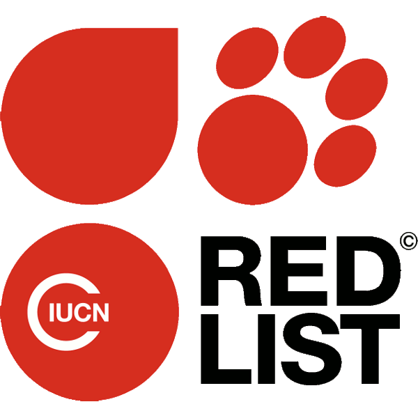

class: inverse, center, middle

# Introduction


---

## Une révolution numérique

Nous vivons une époque formidable...

avec des vidéos de chats...


<br />

--

mais pas que...


---

## Un accès à la connaissance universelle

.pull-left[
  .center[[](https://www.wikipedia.org)]
  <br /><br /><br />
  .center[[](https://www.gutenberg.org)]
]

.pull-right[
  .center[[](https://www.openstreetmap.org/)]

  .center[[](https://github.com/)]
]
Encylopedia of Life


---

## Dans le domaine de la biodiversité

- Accès aux données d'articles

- Nombreuses bases de données disponibles (IUCN Spatial data, WorldClim, GIEC)

- Open science

- Métadonnées

- L'intiative [**rOpenSci**](https://ropensci.org)

- Données de science participative

- Exemple `download.file()` = reproductibilité

---
class: inverse, center, middle

# Les API


---

## Qu'est-ce qu'une API ?

- Définition

- Termes et conditions

- Code de bonne conduite

- Les **token**

- Limites quantité de résultats

- Limites nombres de requêtes


https://www.lafabriquedunet.fr/blog/definition-api/
https://openclassrooms.com/fr/courses/3449001-utilisez-des-api-rest-dans-vos-projets-web/3449008-quest-ce-quune-api
https://medium.com/@mercier_remi/c-est-quoi-une-api-f37ae350cb9
https://developer.mozilla.org/fr/docs/Web/HTTP/Méthode
https://www.supinfo.com/articles/single/5642-qu-est-ce-qu-une-api-rest-restful

---

## Accès via des Packages R

Package           | Type de données
------------------|------------------
`{taxize}`        | Taxonomie
`{spocc}`         | Occurrences d'espèces
`{rcites}`        | Espèces protégées mondiales
`{rfishbase}`     | Informations sur les poissons
`{rredlist}`      | Accès à IUCN liste rouge
`{treebase}`      | Données phylogénétiques
`{traits}`        | Traits d'espèces
`{rnaturalearth}` | Données vectorielles spatiales
`{raster}`        | Données climatiques, altitude, etc.

<br />

Pour aller plus loin :
&nbsp;&nbsp;&nbsp;&nbsp;&nbsp;
[**rOpenSci**](https://ropensci.org/packages/)
&nbsp;&nbsp;&nbsp;&nbsp;&nbsp;
[**Open Data**](https://github.com/ropensci/opendata/blob/master/README.md)


---

## Cas d'étude : le package `{taxize}`

- Exemple : `{taxize}`


---

## Construction d'un client R

_Que faire si aucun package R n'a été développé mais qu'il existe une API ?_

--

`r icon::fa("hand-point-right")` &nbsp;Construire soi-même un client R (c.-à-d. écrire soi-même les requêtes à envoyer à l'API)

--

<br />

Sous `r icon::fa("r-project")` il existe de nombreux packages pour communiquer
avec les services Web (`{httr}`, `{curl}`, etc.)

--

<br />

`r icon::fa("hand-point-right")` &nbsp;
[**Getting started with httr**](https://cran.r-project.org/web/packages/httr/vignettes/quickstart.html)

`r icon::fa("hand-point-right", color = "#e1ddc0")` &nbsp;
[**Best practices for API packages**](https://cran.r-project.org/web/packages/httr/vignettes/api-packages.html)

`r icon::fa("hand-point-right", color = "#e1ddc0")` &nbsp;
[**Managing secrets**](https://cran.r-project.org/web/packages/httr/vignettes/secrets.html)

--

<br />

Voyons deux exemples illustrant l'utilisation de `{httr}`


---

## IUCN Red list API

.center[[](https://apiv3.iucnredlist.org/api/v3/docs)]

`r icon::fa("hand-point-right")` &nbsp;Conditions d'utilisation disponibles [**ici**](https://www.iucnredlist.org/terms/terms-of-use)

<br />

Cette API permet d'obtenir différentes informations sur les espèces en danger
- Listes d'espèces par catégorie IUCN
- Listes d'espèces par pays
- Les habitats, menaces pour chaque espèce
- _et bien d'autres..._

Elle requière un [**token**](https://apiv3.iucnredlist.org/api/v3/token)


---

## IUCN Red list API

Pour la démonstration, nous utiliserons le token fourni dans la documentation de l'API

<br />

.center[`r icon::fa("universal-access", color = "#3f3f3f", size = 5)`]

<br />

`r icon::fa("hand-point-right")` &nbsp;Si vous voulez utiliser cette API, **SVP** obtenez votre propre [**token**](https://apiv3.iucnredlist.org/api/v3/token)


---

## IUCN Red list API

- Stockons le token comme variable d'environnement dans le fichier `.Renviron`

```{r echo=TRUE, eval=FALSE}
usethis::edit_r_environ()                       # Ouverture du fichier `.Renviron`
```

- Et ajoutons cette ligne (en adaptant la valeur)

```{r echo=TRUE, eval=FALSE}
IUCN_KEY=9bb4facb6...
```

--

<br />

- Vérifions que le PAT est bien stocké (après un redémarrage de `r icon::fa("r-project")`)

```{r echo=TRUE, eval=FALSE}
Sys.getenv("IUCN_KEY")
```

```
## [1] "9bb4facb6..."
```


---

## IUCN Red list API

`r icon::fa("question-circle")` &nbsp;Combien d'espèces de chaque catégorie IUCN y a-t-il en France ?

--

- Ecrivons la requête

```{r echo=TRUE, eval=TRUE}
api_url    <- "https://apiv3.iucnredlist.org/api/v3/"
query      <- "country/getspecies/"
country    <- "FR"
iucn_token <- Sys.getenv("IUCN_KEY")

request <- paste0(
  api_url,
  query,
  country,
  "?token=",
  iucn_token
)
```
```
## [1] "https://apiv3.iucnredlist.org/api/v3/country/getspecies/FR?token=9bb4fac...
```


---

## IUCN Red list API

- Envoyons la requête à l'API et récupérons le résultat

```{r echo=TRUE, eval=TRUE}
response <- httr::GET(request)
```

--

- Affichons le statut de la réponse

```{r echo=TRUE, eval=TRUE}
httr::http_status(response)
```

--

- Sous quel format sont retournées les données ?

```{r echo=TRUE, eval=TRUE}
httr::http_type(response)
```


---

## IUCN Red list API

- Accédons au contenu de la réponse (données)

```{r echo=TRUE, eval=TRUE}
datas <- httr::content(response, as = "text")
```

```
{
  "count":3897,
  "country":"FR",
  "result":[
    {
      "taxonid":190498,
      "scientific_name":"Abida ateni",
      "subspecies":null,
      "subpopulation":null,
      "category":"VU"
    },
    {
      "taxonid":156905,
      "scientific_name":"Abida attenuata",
      "subspecies":null,
      "subpopulation":null,
      "category":"LC"
    }
    ...
  ]
}
```


---

## IUCN Red list API

- Convertissons (_parse_) ce format JSON en objet R

```{r echo=TRUE, eval=TRUE}
results <- jsonlite::fromJSON(datas)
```

--

<br />

- Quel est le format retourné ?

```{r echo=TRUE, eval=FALSE}
str(results)
```

```
## List of 3
##  $ count  : int 3897
##  $ country: chr "FR"
##  $ result :'data.frame':	3897 obs. of  6 variables:
##   ..$ taxonid        : int [1:3897] 190498 156905 156761 156390 156989  ...
##   ..$ scientific_name: chr [1:3897] "Abida ateni" "Abida attenuata"     ...
##   ..$ subspecies     : chr [1:3897] NA NA NA NA ...
##   ..$ rank           : chr [1:3897] NA NA NA NA ...
##   ..$ subpopulation  : chr [1:3897] NA NA NA NA ...
##   ..$ category       : chr [1:3897] "VU" "LC" "LC" "LC" ...
```


---

## IUCN Red list API

- Extrayons les données qui nous intéressent

```{r echo=TRUE, eval=TRUE}
species_fr <- results$result
head(species_fr)
```

--

- Nombre d'espèces par catégorie listées par l'IUCN

```{r echo=TRUE, eval=TRUE}
table(species_fr[ , "category"])
```

--

.right[`r icon::fa("hand-point-right")` &nbsp; Package R ` {rredlist}`]


---

## OpenStreetMap Nominatim

.center[[](http://nominatim.openstreetmap.org/search/)]


---
class: inverse, center, middle

# Web scraping


---

# Quésaco ?

- Définition

https://fr.wikipedia.org/wiki/Web_scraping

- Robot => Légalité

- Blocage notamment Google
Le bannissement d’ip, La création d’un compte utilisateur, Captchas
- Brutal : https://en.wikipedia.org/wiki/

- Regular expressions


- Intelligent : le package {`rvest`} et FAO


---
class: inverse, center, middle

# Bonus


---

## RSelenium

- Une petite révolution

.right[**Démo**]
