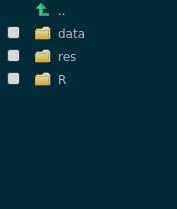
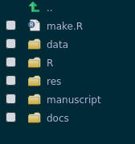

class: inverse, center, middle

## Research Compenkoi ?

--

"A collection of concise but detailed information about a particular subject"

---

## Research Compendium (ressources)

- Marwick B, Boettiger C, Mullen L. 2018. Packaging data analytical work reproducibly using R (and friends). PeerJ Preprints 6:e3192v2 https://doi.org/10.7287/peerj.preprints.3192v2

- https://research-compendium.science/

- https://zenodo.org/communities/research-compendium/about/

--

- Quelques règles simples pour organiser son répertoire de travail

--

- Et pouvoir s'y retrouver (ou que les autres s'y retrouvent)

--

- Un jour vous allez partager votre code, vos données (autant se préparer depuis le début plutôt que de devoir tout refaire ou risquer la honte internationale)

---

## Une définition formelle

.center[.big["The goal of a research compendium is to provide a standard and easily recognisable way
for organising the digital materials of a project to enable others to inspect, reproduce, and
extend the research."]]

---

## Principes

--

- Should organize its files according to the [...] conventions of (your) community (discipline or a lab). Following these conventions will help other people recognize the structure of the project, and also support tool building which takes advantage of the shared structure.

- Respectez les conventions de votre domaine si elles existent !

---

## Principes

--

- Should maintain a clear separation of .big[data, method, and output]. This means data files must be separate from code files. Keeping data and method separate treats the data as “read-only,” so that the original data is untouched and all modifications are transparently documented in the code. The output files should be considered as disposable, with a mindset that one can always easily regenerate the output using the code and data.

.center[]

---

## Principes

- Le flux d'analyses doit être séparé en étapes courtes (ou pas trop longues) et homogènes

--

- Numérotez les scripts, placez-y des entêtes

 

---

## Principes

- The relationship between which code operates on which data in which order to produce which outputs
must be specified as well.

--

Utilisez un script "master" (make.R) qui donne et execute les étapes dans l'ordre (c'est le SEUL script R à la racine !)

.center[ ]

---

## Principes

- The relationship between which code operates on which data in which order to produce which outputs
must be specified as well.

--

Chaque script écrit ses résultats dans son sous-répertoire éponyme.

.center[]

---

## Principes

- The relationship between which code operates on which data in which order to produce which outputs
must be specified as well.

--

Chaque script écrit ses résultats dans son sous-répertoire éponyme.

----> 00_setup.R

---

## Principes

--

-  Should specify the computational environment that was used for the original analysis. At its most basic, this could be a plain text file that includes a short list of the names and version numbers of the software and other critical tools used for the analysis. In more complex approaches, described below, the computational environment can be automatically preserved or reproduced as well.

--

Placez un README à la racine du projet

.center[]

---

## Principes

--

-  Should specify the computational environment that was used for the original analysis. At its most basic, this could be a plain text file that includes a short list of the names and version numbers of the software and other critical tools used for the analysis. In more complex approaches, described below, the computational environment can be automatically preserved or reproduced as well.

--

Utilisez docker (voir liens session d'intro)

.center[`r icon::fa("docker", color = "#3f3f3f", size = 5)`]

---

## Principes

- Séparons aussi le(s) documents de synthèse (papier, présentation, ...)

.center[]

---

## Principes

- Séparons aussi le(s) ressources utiles (biblio, etc ...)

.center[]

---

## Limites

--

- Il est compliqué, lorsque l'analyse n'est pas linéaire, de se souvenir de toutes les dépendances ... 

.center[]

