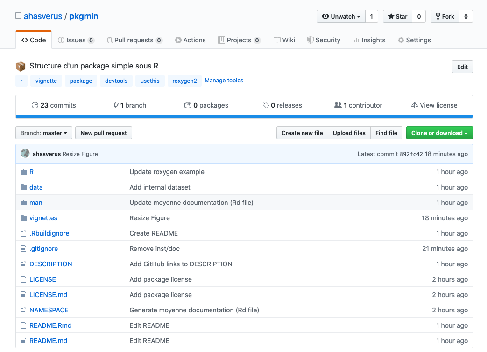

## Création d'une vignette


.pull-leftt[
.center[[](https://rmarkdown.rstudio.com)]
]

.pull-rightt[
- Une [**vignette**](http://r-pkgs.had.co.nz/vignettes.html) est un guide du package
- C'est un complément aux documentations des fonctions
- Cela peut également être une analyse complète reposant sur ce package
]

--

<br />

De nombreux packages proposent des vignettes

```{r echo=TRUE, eval=FALSE}
browseVignettes()                                   # Pour les packages installés
```

.center[]


---

## Création d'une vignette

- Créons une vignette pour notre package

```{r echo=TRUE, eval=FALSE}
usethis::use_vignette("pkgmin")
```

```{r echo=FALSE, eval=TRUE}
setwd(path)
usethis::use_vignette("pkgmin")
setwd(opath)
```

--

```{r echo=TRUE, eval=FALSE}
list.files(recursive = TRUE)
```

```{r echo=FALSE, eval=TRUE}
setwd(path)
list.files(recursive = TRUE)
setwd(opath)
```

--

`r icon::fa("hand-point-right")` &nbsp;Il peut arriver qu'après une installation
du package depuis GitHub, la vignette soit absente. Dans ce cas-là, il faudra
enlever le dossier `inst/doc/` du `.gitignore`.

---

## Création d'une vignette

- La vignette est préconfigurée avec un YAML

```{r echo=TRUE, eval=FALSE}
---
title: "pkgmin"
output: rmarkdown::html_vignette
vignette: >
  %\VignetteIndexEntry{pkgmin}
  %\VignetteEngine{knitr::rmarkdown}
  %\VignetteEncoding{UTF-8}
---
```

- Il ne reste plus qu'à l'éditer...

--

<br />

`r icon::fa("hand-point-right")` &nbsp;Lors de l'installation du package avec
`{devtools}`, il faudra spécifier explicitement la construction de la vignette au
format HTML

```{r echo=TRUE, eval=FALSE}
devtools::install(..., build_vignettes = TRUE)
devtools::install_github(..., build_vignettes = TRUE)
```


---

## Déploiement sur GitHub

.pull-leftt[
.center[]
]

.pull-rightt[
- Le package `{usethis}` est une véritable boîte à outils : il permet notamment
de créer un dépôt distant sur GitHub et de l'associer au dépôt local
- Deux prérequis :
  1. Le dépôt local doit être versionné et à jour
  2. Vous devez avoir un [**Token GitHub**](https://help.github.com/en/github/authenticating-to-github/creating-a-personal-access-token-for-the-command-line)
]

<br />

Commençons par obtenir un token ou PAT (_GitHub Personal Access Token_) pour utiliser GitHub en ligne de commande
(ici avec `r icon::fa("r-project")`)

```{r echo=TRUE, eval=FALSE}
usethis::browse_github_token()
```


---

## Déploiement sur GitHub

Une fois, le GitHub PAT généré, il est courant de le stocker comme variable
d'environnement dans le fichier `.Renviron`

--

- Ouvrons le fichier `.Renviron` avec la commande

```{r echo=TRUE, eval=FALSE}
usethis::edit_r_environ()
```

- Et ajoutons cette ligne (en adaptant la valeur)

```{r echo=TRUE, eval=FALSE}
GITHUB_PAT=999999zzz99zz9z9zzzz9zzz99999z9z9z9zzz99
```

--

- Vérifions que le PAT est bien stocké (après un redémarrage de `r icon::fa("r-project")`)

```{r echo=TRUE, eval=FALSE}
usethis::github_token()                             # ou Sys.getenv("GITHUB_PAT")
```

```
## [1] "999999zzz99zz9z9zzzz9zzz99999z9z9z9zzz99"
```

--

Ces étapes ne sont à faire qu'une seule fois

`r icon::fa("hand-point-right")` &nbsp;Ressource sur la gestion des clés/tokens : [**Managing secrets**](https://cran.r-project.org/web/packages/httr/vignettes/secrets.html)


---

## Déploiement sur GitHub

- Avant de déployer notre package sur GitHub, nous pouvons ajouter un `README`
qui sera la page d'accueil de notre dépôt GitHub.


```{r echo=TRUE, eval=FALSE}
usethis::use_readme_rmd()
```

--

- Il ne reste plus qu'à l'éditer, puis à compiler la version `markdown` du fichier
(nécessaire à chaque modification du `Rmd`)

```{r echo=TRUE, eval=FALSE}
rmarkdown::render("README.Rmd")
```

```
## processing file: README.Rmd
## Preview created: README.html
## Output created: README.md
```

--

<br />

- Nous pouvons enfin indiquer à `git` de ne pas suivre l'aperçu `html`

```{r echo=TRUE, eval=FALSE}
usethis::use_git_ignore("README.html")
```


---

## Déploiement sur GitHub

- Après avoir mis à jour le dépôt `git` local (`git add` + `git commit`), nous pouvons
déployer notre dépôt local sur GitHub

```{r echo=TRUE, eval=FALSE}
usethis::use_github(protocol = "https")          # Crée un dépôt sur votre compte

usethis::use_github(
  protocol     = "https",
  organisation = "org_name"               # Crée un dépôt dans votre organisation
)
```

`r icon::fa("hand-point-right")` &nbsp;Si vous avez généré des clés de chiffrement
et déposé la clé publique sur GitHub, vous pouvez opter pour le protocole `ssh`

--

<br />

`r icon::fa("lightbulb", color = "#3f3f3f")` &nbsp; Pour utiliser les commandes `r icon::fa("git")` directement sous `r icon::fa("r-project")`, nous pouvons utiliser la fonction `system()`

```{r echo=TRUE, eval=FALSE}
system("git add -A")
system("git commit -m 'Commit message'")
```


---

## Déploiement sur GitHub

Et voilà, le package est en ligne : [**https://github.com/ahasverus/pkgmin**](https://github.com/ahasverus/pkgmin)

.center[]


---

## Déploiement sur GitHub

Si le versioning a été correctement fait, n'importe qui peut voir les différentes étapes du développement du package

.center[]

Résultat obtenu avec la commande : `git log --oneline`

Accessible aussi à : [https://github.com/ahasverus/pkgmin/commits/master](https://github.com/ahasverus/pkgmin/commits/master)


---

## Intégration continue - Travis CI

.pull-leftt[
  .center[[](https://travis-ci.org)]
]

.pull-rightt[
- [**Travis CI**](https://travis-ci.org) est un service d'intégration continue
- Exécute automatiquement le code d'un dépôt GitHub après chaque _push_
- Serveur GNU/Linux (Ubuntu)
- Son fichier de configuration est écrit en YAML

&nbsp;&nbsp;&nbsp;&nbsp;
]

--

<br />

Après vous être enregistré sur [**Travis CI**](https://travis-ci.org) avec vos
identifiants GitHub, nous pouvons configurer le dépôt GitHub pour qu'il communique
avec ce service d'intégration continue

```{r echo=TRUE, eval=FALSE}
usethis::use_travis()
```

```
✔ Writing '.travis.yml'
✔ Adding '^\\.travis\\.yml$' to '.Rbuildignore'
● Turn on travis for your repo at https://travis-ci.org/profile/ahasverus
✔ Adding Travis build status badge to 'README.Rmd'
● Re-knit 'README.Rmd'
```


---

## Intégration continue - Travis CI

- Dans les paramètres de votre compte Travis CI, vous devez activer le dépôt `{pkgmin}` pour que l'intégration soit effective

.center[]

--

<br />

- Plusieurs choses se sont passées après l'exécution de la commande `usethis::use_travis()`

  - Le fichier de configuration de Travis CI (`.travis.yml`) a été ajouté
  - Le badge de statut Travis du dépôt a été ajouté au `README.Rmd`

--

<br />

- Avant d'oublier, recompilons le `README.Rmd` en `README.md`

```{r echo=TRUE, eval=FALSE}
rmarkdown::render("README.Rmd")
```


---

## Intégration continue - Travis CI

- Modifions le fichier de configuration `.travis.yml`

```
  language: r
  warnings_are_errors: false
  sudo: required
  cache: packages

  notifications:
    email:
      recipients:
        - nicolas.casajus@fondationbiodiversite.fr

  r_packages:
    - magrittr
```

--

<br />

- Nous sommes prêt :

```{r echo=TRUE, eval=FALSE}
system("git add -A")
system("git commit -m 'Setup Travis CI'")
system("git push")
```


---

## Intégration continue - Travis CI

.center[]

.center[]


---

## Intégration continue - Travis CI

Côté Travis CI, un code de sortie 0 est bon signe,

.center[]

<br />

ce qui nous permet d'obtenir notre premier badge

.center[]


---

## Intégration continue - Travis CI

.center[]

.center[]


---

## Intégration continue - Appveyor

.pull-leftt[
.center[[](https://www.appveyor.com)]
]

.pull-rightt[
- Similaire à Travis CI
- Service d'intégration continue
- Serveur déployé sous Windows
- Son fichier de configuration est aussi écrit en YAML

&nbsp;&nbsp;&nbsp;&nbsp;
]

--

<br />

Après vous être enregistré sur [**appveyor**](https://www.appveyor.com) avec vos
identifiants GitHub, nous pouvons configurer le dépôt GitHub pour qu'il communique
avec ce service d'intégration continue

```{r echo=TRUE, eval=FALSE}
usethis::use_appveyor()
```

```
✔ Writing 'appveyor.yml'
✔ Adding '^appveyor\\.yml$' to '.Rbuildignore'
● Turn on AppVeyor for this repo at https://ci.appveyor.com/projects/new
✔ Adding AppVeyor build status badge to 'README.Rmd'
● Re-knit 'README.Rmd'
```


---

## Intégration continue - Appveyor

- Dans les paramètres de votre compte Appveyor, vous devez activer le dépôt `{pkgmin}` pour que l'intégration soit effective

.center[]

--

<br />

- Plusieurs choses se sont passées après l'exécution de la commande `usethis::use_appveyor()`

  - Le fichier de configuration de Appveyor (`appveyor.yml`) a été ajouté
  - Le badge de statut Appveyor du dépôt a été ajouté au `README.Rmd`

--

<br />

- Avant d'oublier, recompilons le `README.Rmd` en `README.md`

```{r echo=TRUE, eval=FALSE}
rmarkdown::render("README.Rmd")
```


---

## Intégration continue - Appveyor

- Le fichier de configurartion d'Appveyor se base sur celui de Travis CI, donc pas besoin de le modifier

- Nous sommes prêt à tester l'intégration :

```{r echo=TRUE, eval=FALSE}
system("git add -A")
system("git commit -m 'Setup Appveyor'")
system("git push")
```


---

## Intégration continue - Appveyor

.center[]

.center[]

.center[]

---

## Création d'un site web

.pull-left[
.center[]
]

.pull-right[
Lorem ipsum dolor sit amet, consectetur adipisicing elit, sed do eiusmod tempor
incididunt ut labore et dolore magna aliqua.
Lorem ipsum dolor sit amet, consectetur adipisicing elit, sed do eiusmod tempor
incididunt ut labore et dolore magna aliqua.
]

<br />

```{r echo=TRUE, eval=FALSE}
usethis::use_pkgdown_travis()
```

---

## Ajout de tests unitaires

.pull-left[
.center[]
]

.pull-right[
Lorem ipsum dolor sit amet, consectetur adipisicing elit, sed do eiusmod tempor
incididunt ut labore et dolore magna aliqua.
Lorem ipsum dolor sit amet, consectetur adipisicing elit, sed do eiusmod tempor
incididunt ut labore et dolore magna aliqua.
]

<br />

```{r echo=TRUE, eval=FALSE}
usethis::use_testthat()
usethis::use_test()
```


---

## Code coverage

.pull-left[
.center[]
]

.pull-right[
Lorem ipsum dolor sit amet, consectetur adipisicing elit, sed do eiusmod tempor
incididunt ut labore et dolore magna aliqua.
Lorem ipsum dolor sit amet, consectetur adipisicing elit, sed do eiusmod tempor
incididunt ut labore et dolore magna aliqua.
]

<br />

```{r echo=TRUE, eval=FALSE}
usethis::use_coverage("codecov")
```


---

## DOI et Zenodo

.pull-left[
.center[[](https://zenodo.org)]
]

.pull-right[
Lorem ipsum dolor sit amet, consectetur adipisicing elit, sed do eiusmod tempor
incididunt ut labore et dolore magna aliqua.
Lorem ipsum dolor sit amet, consectetur adipisicing elit, sed do eiusmod tempor
incididunt ut labore et dolore magna aliqua.
]


---

## Soumettre au CRAN

```{r echo=TRUE, eval=FALSE}
devtools::build()                  # Crée une archive du package au format tar.gz
```

.pull-left[
[**CRAN submission**](https://cran.r-project.org/submit.html)
]

.pull-right[
.right[
[**CRAN policies**](https://cran.r-project.org/submit.html)
]
]


.center[]
